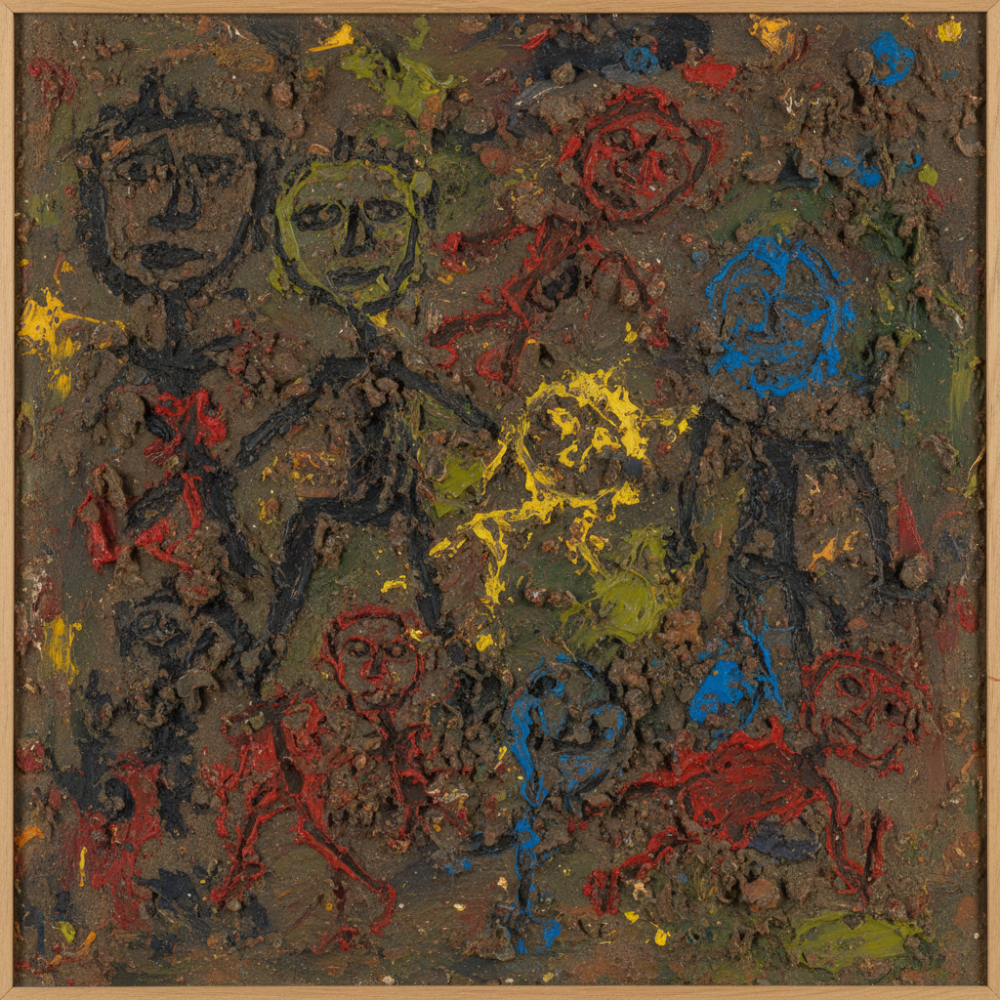

# Art Brut Painting 原生艺术绘画

> **时期：** 1945年–至今  
> **关键词：** 让·杜布菲、反文化、原始表达、精神病艺术、反美学

## 概述

Art Brut（原生艺术）由法国画家让·杜布菲于1945年提出，指那些未受文化污染的"生"的创作——精神病患者、通灵者、隐士和儿童的作品。杜布菲本人也刻意模仿这种"未经训练"的粗糙美学，用泥土、沙子和厚重的颜料创造出一种反对一切精致和学院传统的绘画语言。

## 风格特征

- **粗糙表面**：厚重的材料和粗犷的质感
- **儿童般的**：刻意的笨拙和天真
- **反美学**：拒绝美的传统标准
- **原始力量**：未经驯化的创作能量
- **混合材料**：泥土、沙子、碎片混入颜料

## 代表人物与作品

- 让·杜布菲《灵魂之体》系列
- 阿洛伊兹·科尔巴兹 彩色幻想
- 奥古斯丁·勒萨热 宇宙建筑
- 斯科蒂·威尔逊 图案绘画

## 概念图

