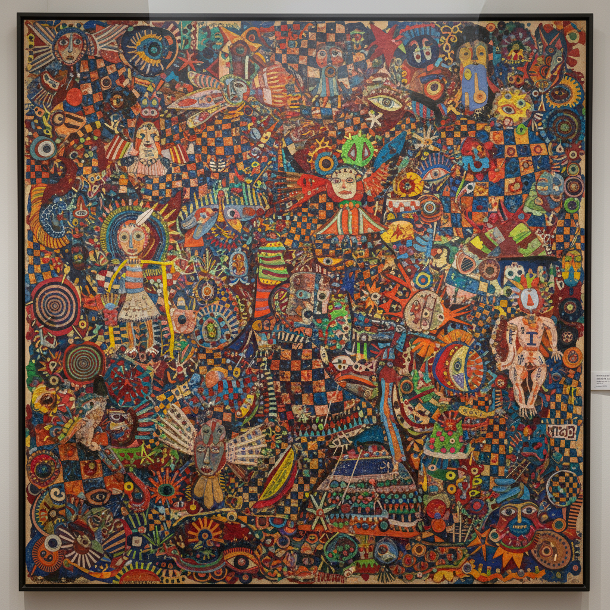

# Art Brut 原生艺术



> **"那些出于孤独、纯粹和真实的冲动而创作出来的作品——不受竞争、赞誉和社会晋升的影响。"**

## 概述

原生艺术（Art Brut，直译"粗野艺术"/"生艺术"）是法国艺术家让·杜布菲（Jean Dubuffet）于1945年提出的概念，指游离于传统艺术世界之外、未经正式训练的自学艺术家所创作的作品。这些创作者多处于社会边缘——精神病患者、囚犯、孤独者——他们的作品自成体系，不预设外部评判标准。

## 时代背景

| 维度 | 内容 |
|------|------|
| 提出 | 1945年，让·杜布菲（Jean Dubuffet） |
| 英文对应 | Outsider Art（1972年Roger Cardinal提出） |
| 收藏机构 | 洛桑原生艺术博物馆（1976年开放，5000件藏品） |
| 思想源头 | Hans Prinzhorn《精神病人的绘画》(1922) |

## 视觉特征

- **非学院技法**：不遵循透视、比例、解剖等规则
- **强迫性重复**：密集的图案填充、恐怖真空
- **原始符号**：类似儿童画或史前岩画的直觉表达
- **非常规材料**：面包屑、树叶、碎布、药片包装
- **强烈色彩**：不受色彩理论约束的直觉用色
- **叙事性**：个人神话、幻觉世界的视觉化

## 核心理念

### 杜布菲的定义

> "那些出于孤独、纯粹和真实的冲动而创作出来的作品，不受竞争、赞誉和社会晋升等因素的影响——因为这些事实，比专业更珍贵。"

### Art Brut vs Outsider Art

| Art Brut（杜布菲原义） | Outsider Art（广义） |
|------|------|
| 严格定义：完全隔绝于艺术界 | 更宽泛：包括民间艺术、自学艺术 |
| 创作者不知"艺术"为何物 | 创作者可能有意识地创作 |
| 法语语境 | 英语国际化扩展 |

## 代表人物

| 艺术家 | 背景 | 特征 |
|------|------|------|
| Adolf Wölfli | 精神病院患者 | 密集图案、音乐符号、自传宇宙 |
| Henry Darger | 芝加哥清洁工 | 15000页手稿《非现实王国》 |
| Aloïse Corbaz | 精神病院患者 | 彩色蜡笔的华丽女性形象 |
| Augustin Lesage | 法国矿工 | 通灵状态下的对称建筑画 |
| Madge Gill | 英国灵媒 | 墨水线条的无尽图案 |

## 与其他运动的关系

```
原始主义(19世纪末) ──→ 超现实主义(1920s) ──→ Art Brut(1945)
                              ↓                       ↓
儿童艺术研究 ──→ 杜布菲的发现 ──→ Outsider Art(1972)
                                          ↓
                              当代：Raw Vision杂志、威尼斯双年展纳入
```

## 杜布菲自身的创作

杜布菲不仅是Art Brut的理论家和收藏家，他自己的绘画也深受影响：
- **厚重肌理**：沥青、碎石、沙子混入颜料
- **刻意稚拙**：模仿儿童画和涂鸦的笔法
- **Hourloupe系列**（1962–1974）：圆珠笔线条的联锁图案
- **巴黎马戏团系列**：捕捉城市日常的"疯狂舞蹈"

## 当代影响

- 威尼斯双年展等主流展览开始纳入Outsider Art
- Raw Vision杂志（1989年创刊）持续推广
- 当代艺术市场对Outsider Art的持续升温
- 对"什么是艺术"边界的持续挑战
- 艺术疗愈（Art Therapy）运动的理论基础之一

## 多语言名称

| 语言 | 名称 |
|------|------|
| 法语 | Art Brut（原生艺术） |
| 英语 | Outsider Art / Raw Art |
| 中文 | 原生艺术 / 粗野艺术 / 局外人艺术 |
| 德语 | Außenseiterkunst |
| 日语 | アール・ブリュット |

## 延伸阅读

- Jean Dubuffet《Cahiers de l'Art Brut》
- Roger Cardinal《Outsider Art》(1972)
- Colin Rhodes《Outsider Art: Spontaneous Alternatives》
- 洛桑原生艺术博物馆 Collection de l'Art Brut

---

*最后更新：2026-07-26*
