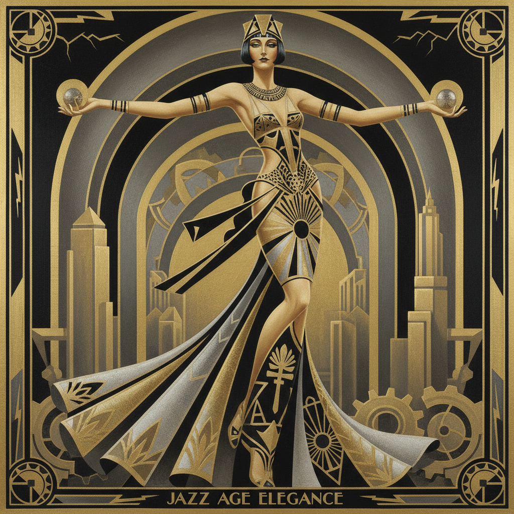

# Art Deco Painting 装饰艺术绘画

> **时期：** 1920年代–1930年代  
> **关键词：** 几何优雅、机械美学、爵士时代、奢华现代、摩天大楼

## 概述

Art Deco（装饰艺术）是两次世界大战之间的奢华现代风格——它融合了立体主义的几何、未来主义的速度、埃及和阿兹特克的异域元素，创造出一种既现代又华丽的视觉语言。塔玛拉·德·兰碧嘉的光滑人物、让·杜南的漆器屏风——Art Deco是机器时代的贵族美学，用几何线条和金属光泽庆祝现代生活的速度与奢华。

## 风格特征

- **几何化**：锐利的角度和对称图案
- **金属光泽**：金、银、铬的闪亮质感
- **流线型**：速度和运动的暗示
- **奢华材料**：象牙、乌木、漆器
- **异域元素**：埃及、非洲、东方的融合

## 代表人物与作品

- 塔玛拉·德·兰碧嘉 光滑肖像
- 让·杜南 漆器屏风
- 埃尔特 时尚插画
- 乔治·巴比尔 舞台设计

## 概念图

