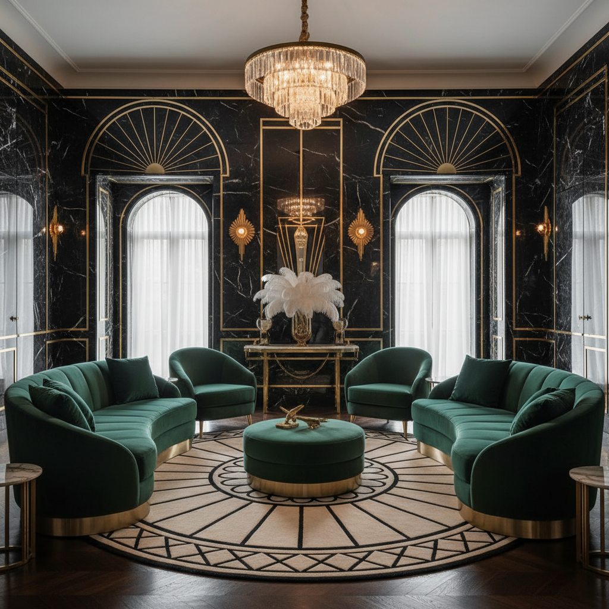

# Art Deco Revival 装饰艺术复兴



> **"金色几何线条、黑色大理石、对称的奢华——1920年代的优雅永远不会过时。"**

## 概述

| 维度 | 描述 |
|------|------|
| 时期 | 1920s 原始 / 2010s–至今 复兴 |
| 别名 | Art Deco Revival, Neo-Deco, Gatsby Style |
| 核心色彩 | 金色、黑色、深绿、海军蓝、象牙白 |
| 关键元素 | 几何图案、扇形、金色线条、对称构图 |
| 代表人物 | The Great Gatsby (2013)、Baz Luhrmann |
| 关联风格 | Old Money, Dieselpunk, Vintage Americana, Dark Romantic |

---

## 历史脉络

### 原版 Art Deco (1920s–1930s)

| 维度 | 描述 |
|------|------|
| 起源 | 1925年巴黎国际装饰艺术博览会 |
| 精神 | 现代+奢华+几何 |
| 建筑 | 克莱斯勒大厦、帝国大厦 |
| 设计 | 几何图案、金属材质、对称 |
| 终结 | 二战后被现代主义取代 |

### 2010s–至今：复兴浪潮

| 驱动力 | 表现 |
|------|------|
| 《了不起的盖茨比》(2013) | 电影带动 1920s 美学热潮 |
| 《Peaky Blinders》(2013) | 1920s 英国黑帮美学 |
| 鸡尾酒文化复兴 | Speakeasy 酒吧遍地开花 |
| 奢侈品牌 | Gucci、Versace 的 Deco 元素 |
| 室内设计 | 金色+大理石+几何的"轻奢"风 |

### 核心吸引力

Art Deco 的永恒魅力在于它是**"有规则的奢华"**：
- 不是巴洛克的过度装饰
- 不是极简主义的冷淡
- 而是用几何和对称创造的优雅
- 金色 + 黑色 = 永恒的奢华配色

---

## 视觉语法

### 色彩系统

```
主色：
  金色 (#D4AF37) — 奢华、装饰
  黑色 (#000000) — 优雅、对比
  深绿 (#006400) — 翡翠、大理石
  海军蓝 (#000080) — 深邃、高贵
  象牙白 (#FFFFF0) — 珍珠、丝绸

辅色：
  铜色 (#B87333) — 金属装饰
  酒红 (#722F37) — 天鹅绒
  银色 (#C0C0C0) — 铬合金

质感：
  大理石 — 地板、台面
  黄铜/金属 — 装饰线条
  天鹅绒 — 家具、窗帘
  玻璃 — 镜面、水晶
  几何图案 — 壁纸、地砖
```

### 标志性元素

| 类别 | 元素 |
|------|------|
| 图案 | 扇形、人字纹、阶梯形、放射线 |
| 线条 | 金色细线、对称框架、几何边框 |
| 材质 | 大理石、黄铜、水晶、天鹅绒 |
| 建筑 | 阶梯形轮廓、垂直线条、装饰浮雕 |
| 字体 | 几何无衬线、装饰衬线、金色描边 |
| 空间 | 对称布局、中轴线、镜面反射 |

---

## 与千禧怀旧的关系

### 《了不起的盖茨比》效应
- 2013年电影让整个世界重新爱上 1920s
- "Gatsby Party" 成为全球派对主题
- 金色+黑色+爵士乐 = 千禧一代的"优雅"想象

### 与 Old Money 的交叉
- Old Money 强调"低调奢华"
- Art Deco Revival 强调"高调优雅"
- 两者共享"经典"和"品质"的价值观

---

## 中国语境

- "轻奢风"/"Art Deco风"室内设计
- 上海外滩建筑群的 Art Deco 遗产
- 和平饭店、国际饭店等历史建筑
- 新开的"禁酒令"风格鸡尾酒吧
- 小红书上的"复古奢华"/"老上海"标签

---

## 设计应用

| 场景 | 应用方式 |
|------|----------|
| 品牌 | 金色+黑色+几何图案+装饰字体 |
| 空间 | 大理石+黄铜+天鹅绒+对称布局 |
| 包装 | 金色烫印+几何线条+黑色底 |
| 活动 | Gatsby主题+爵士乐+鸡尾酒 |

---

## 相关风格

← [Old Money 老钱风](old-money.md) | [Dieselpunk 柴油朋克](dieselpunk.md) →

↑ [返回千禧怀旧目录](README.md) | [返回总目录](../README.md)
