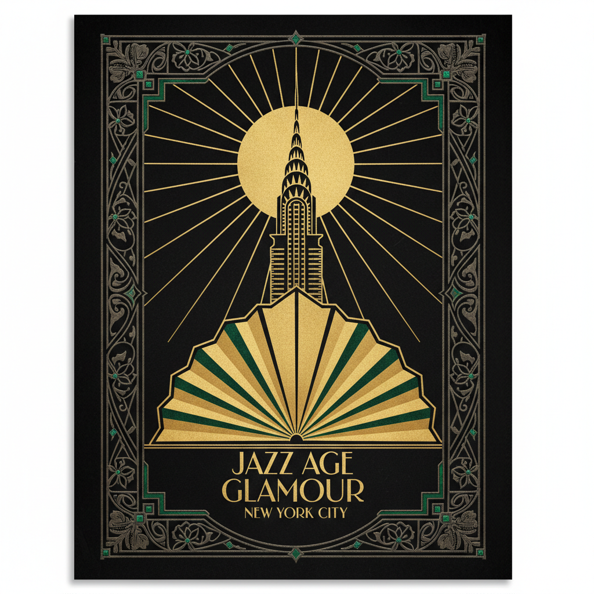

# Art Deco 装饰艺术



> **"金色几何、摩天大楼、爵士时代——当奢华遇上机器美学。"**

## 概述

| 维度 | 描述 |
|------|------|
| 时期 | 1920–1940 原版 / 2010s 复兴 |
| 别名 | Art Deco, Deco, Jazz Age Style |
| 核心色彩 | 金色、黑色、翡翠绿、深蓝、象牙白 |
| 关键元素 | 几何对称、扇形图案、金属装饰、摩天大楼 |
| 代表人物 | Chrysler Building、Tamara de Lempicka、Erté |
| 关联风格 | Art Nouveau, Bauhaus, Gatsby, Retro Futurism |

---

## 历史脉络

### 从巴黎博览会到好莱坞黄金时代

| 年份 | 事件 |
|------|------|
| 1925 | 巴黎国际装饰艺术博览会——Art Deco 正式命名 |
| 1928 | Chrysler Building 开工——Art Deco 建筑巅峰 |
| 1930 | Empire State Building |
| 1930s | 好莱坞黄金时代——Art Deco 布景 |
| 1935 | 上海外滩——Art Deco 在中国 |
| 2013 | 《了不起的盖茨比》电影推动复兴 |
| 2020s | Art Deco 元素在品牌设计中复兴 |

### 核心哲学

Art Deco 的精神是**"现代性 + 奢华 = 机器时代的装饰"**：
- 拥抱机器、速度、摩天大楼
- 几何 = 现代（vs Art Nouveau 的有机曲线）
- 奢华不是罪——是对进步的庆祝
- "我们活在一个伟大的时代"
- 对称、秩序、精确

---

## 视觉语法

### 色彩系统

```
主色：
  金色 (#FFD700) — 奢华、装饰
  黑色 (#000000) — 对比、优雅
  翡翠绿 (#50C878) — 宝石、财富
  深蓝 (#191970) — 夜晚、深邃
  象牙白 (#FFFFF0) — 优雅

辅色：
  银色 (#C0C0C0) — 金属、现代
  酒红 (#722F37) — 奢华
  珊瑚 (#FF7F50) — 点缀

质感：
  金属 — 黄铜、铬、金
  大理石 — 地板、墙面
  漆面 — 光滑、反射
  玻璃 — 透明、现代
  丝绒 — 奢华、触感
```

### 标志性元素

| 类别 | 元素 |
|------|------|
| 图案 | 扇形、锯齿形、阶梯形、太阳光芒 |
| 建筑 | 摩天大楼、阶梯式退缩、尖顶 |
| 材料 | 黄铜、铬、大理石、漆面 |
| 字体 | 几何衬线、装饰性大写 |
| 符号 | 鹰、太阳、喷泉、闪电 |
| 构图 | 严格对称、放射状、垂直线条 |

---

## 与千禧怀旧的关系

### 《了不起的盖茨比》效应
- 2013年电影 = Art Deco 复兴的催化剂
- "Gatsby 派对"成为流行主题
- 金色+黑色+几何 = 当代"高级感"
- 婚礼、品牌、包装中的 Art Deco 元素

### 为什么持续吸引人？
- 代表"黄金时代"的想象
- 几何+奢华 = 永恒的高级感
- 与当代极简主义形成互补
- "过去的未来"= 永远迷人

---

## 中国语境

- 上海外滩 = 中国最大的 Art Deco 建筑群
- "老上海风"= 中国版 Art Deco 怀旧
- 和平饭店、国际饭店等经典建筑
- 当代中国品牌中的 Art Deco 元素
- 与"海派文化"的深度关联

---

## 设计应用

| 场景 | 应用方式 |
|------|----------|
| 品牌 | 金色+几何+对称+装饰字体 |
| 空间 | 大理石+黄铜+几何图案+对称 |
| 包装 | 金箔+黑色+扇形图案+高级感 |
| 活动 | Gatsby主题+金色+爵士+鸡尾酒 |

---

## 相关风格

← [Art Nouveau 新艺术运动](art-nouveau.md) | [Retro Futurism 复古未来主义](retro-futurism.md) →

↑ [返回千禧怀旧目录](README.md) | [返回总目录](../README.md)
