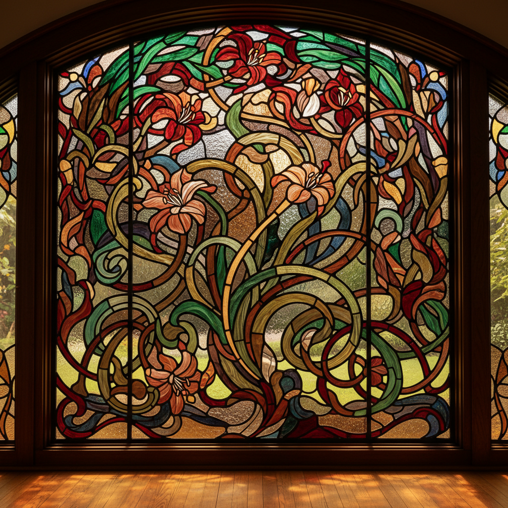

# Art Glass 艺术玻璃

> **时期：** 1880年代–至今  
> **关键词：** 新艺术玻璃、彩色镶嵌、灯工、窑铸、光影诗学

## 概述

艺术玻璃（Art Glass）涵盖从新艺术运动时期的蒂芙尼彩色玻璃到当代玻璃雕塑的广阔领域。它将玻璃视为一种独特的艺术材料——既能捕捉光线又能塑造空间，既脆弱又永恒。从教堂彩窗到当代装置，艺术玻璃始终在探索光、色彩和透明度的诗学。

## 风格特征

- **彩色镶嵌**：铅条分隔的彩色玻璃拼图
- **灯工技术**：火焰中塑造精细的玻璃形态
- **窑铸**：在模具中熔铸大型玻璃雕塑
- **光影互动**：作品随光线变化而改变面貌
- **材料对话**：玻璃与金属、木材等材料的结合

## 代表人物与作品

- Louis Comfort Tiffany 彩色玻璃灯
- René Lalique 新艺术玻璃器
- Émile Gallé 法国艺术玻璃
- Klaus Moje 窑铸玻璃盘

## 概念图

