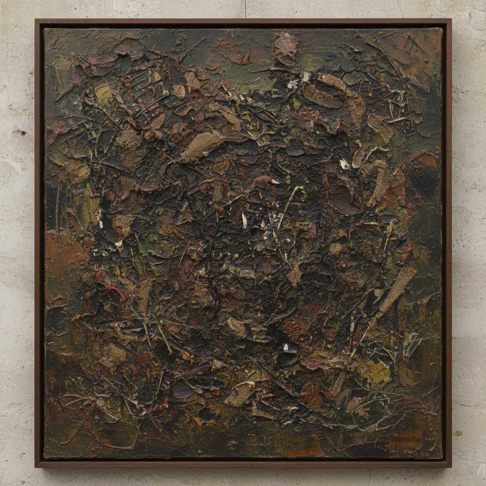

# Art Informel 非形式艺术



> **"形式已死——让材料自己说话，让手势自由流动。"**

## 概述

| 维度 | 描述 |
|------|------|
| 时期 | 1940s–1960s |
| 别名 | Art Informel, Tachisme, 非形式艺术, 不定形艺术, 塔希主义 |
| 核心色彩 | 土色、黑色、暗红——材料的本色+手势的痕迹 |
| 关键元素 | 无预设形式、材料质感、手势痕迹、厚涂、即兴 |
| 代表人物 | Jean Fautrier, Jean Dubuffet, Wols, Antoni Tàpies, Hans Hartung |
| 关联风格 | Abstract Expressionism, Action Painting, Arte Povera, Lyrical Abstraction |

---

## 历史脉络

| 年份 | 事件 |
|------|------|
| 1945 | 二战结束——欧洲艺术家的精神废墟 |
| 1945 | Fautrier "人质"系列——厚涂的暴力 |
| 1946 | Dubuffet提出"Art Brut"——原始表达 |
| 1951 | 评论家Michel Tapié命名"Art Informel" |
| 1952 | Tachisme(塔希主义)——斑点/污渍绘画 |
| 1950s | Art Informel成为欧洲主导抽象运动 |

### 核心哲学

非形式艺术的精神是**"二战之后——一切形式都是谎言——只有材料和手势是真实的"**：
- "几何抽象太理性——世界已经证明理性是骗局"
- "不要形式——要物质本身——泥土、沙子、沥青"
- "手势不是表达——是存在的证据"
- "Tachisme = 污渍——最不'艺术'的东西才是艺术"
- "在废墟上——不需要建筑——只需要痕迹"

---

## 视觉语法

### 材料系统

```
材料：
  厚涂颜料 — 像泥土一样堆积
  沙子/石膏 — 物质性、重量
  沥青/焦油 — 黑暗、工业
  布/纸 — 撕裂、拼贴

技法：
  Tachisme — 斑点、污渍、滴落
  Matiérisme — 材料质感为主
  手势 — 快速、即兴、身体
  刮擦 — 在厚涂上刻画

色彩：
  土色 (#8B7355) — 大地、物质
  黑色 (#1A1A1A) — 深渊、战后
  暗红 (#800000) — 血、伤口
  白色 (#F5F5DC) — 石膏、骨

规则：
  - 没有预设形式
  - 材料质感 > 色彩
  - 手势 > 构图
  - 厚 > 薄
  - 粗糙 > 光滑
```

### 标志性元素

| 类别 | 元素 |
|------|------|
| 质感 | 厚涂、粗糙、裂缝、层叠 |
| 手势 | 快速、暴力、即兴 |
| 材料 | 混合媒介、非传统材料 |
| 形式 | 无形式、有机、偶然 |
| 态度 | 战后创伤、存在主义、反理性 |

---

## 与Abstract Expressionism的区别

| 维度 | Art Informel (欧洲) | Abstract Expressionism (美国) |
|------|---------------------|-------------------------------|
| 背景 | 战后废墟、创伤 | 战后繁荣、英雄主义 |
| 态度 | 悲观、内省 | 乐观、扩张 |
| 尺寸 | 通常较小 | 通常巨幅 |
| 材料 | 强调物质性 | 强调手势 |
| 精神 | 存在主义 | 个人英雄 |

---

## 设计应用

| 场景 | 应用方式 |
|------|----------|
| 空间 | 质感墙面+材料装饰 |
| 品牌 | 手工质感+原始感+真实 |
| 时尚 | 材料实验+质感面料 |
| 陶艺 | 不规则+手工痕迹+Wabi-Sabi |

---

## 相关风格

← [Abstract Expressionism 抽象表现主义](abstract-expressionism.md) | [Arte Povera 贫穷艺术](arte-povera.md) →

↑ [返回千禧怀旧目录](README.md) | [返回总目录](../README.md)
