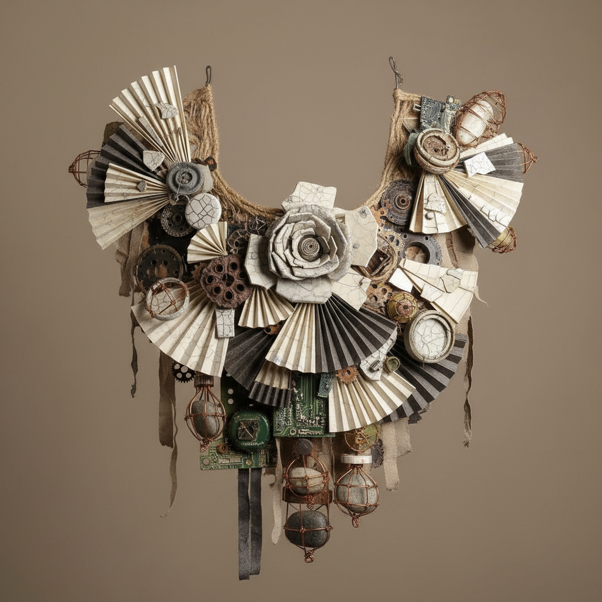

# Art Jewelry 艺术首饰

> **时期：** 1960年代–至今  
> **关键词：** 概念首饰、可穿戴雕塑、材料实验、身体关系、反奢侈

## 概述

Art Jewelry（艺术首饰）是将首饰从装饰品和奢侈品提升为独立艺术表达的运动。与商业珠宝不同，艺术首饰不以贵金属和宝石的价值为核心，而是探索首饰与身体的关系、材料的可能性、概念的表达。它可以用纸、塑料、废弃物等任何材料制作，重要的是思想和工艺的结合。

## 风格特征

- **材料实验**：突破贵金属宝石的限制
- **概念驱动**：思想先于装饰
- **身体关系**：探索佩戴与身体的互动
- **工艺精湛**：手工制作的精密技艺
- **反奢侈**：价值来自创意而非材料

## 代表人物与作品

- 赫尔曼·容格尔（德国艺术首饰先驱）
- 吉斯·巴克（荷兰概念首饰）
- 大卫·沃特金斯（英国新首饰运动）
- 周尚仪（当代亚洲艺术首饰）

## 概念图

