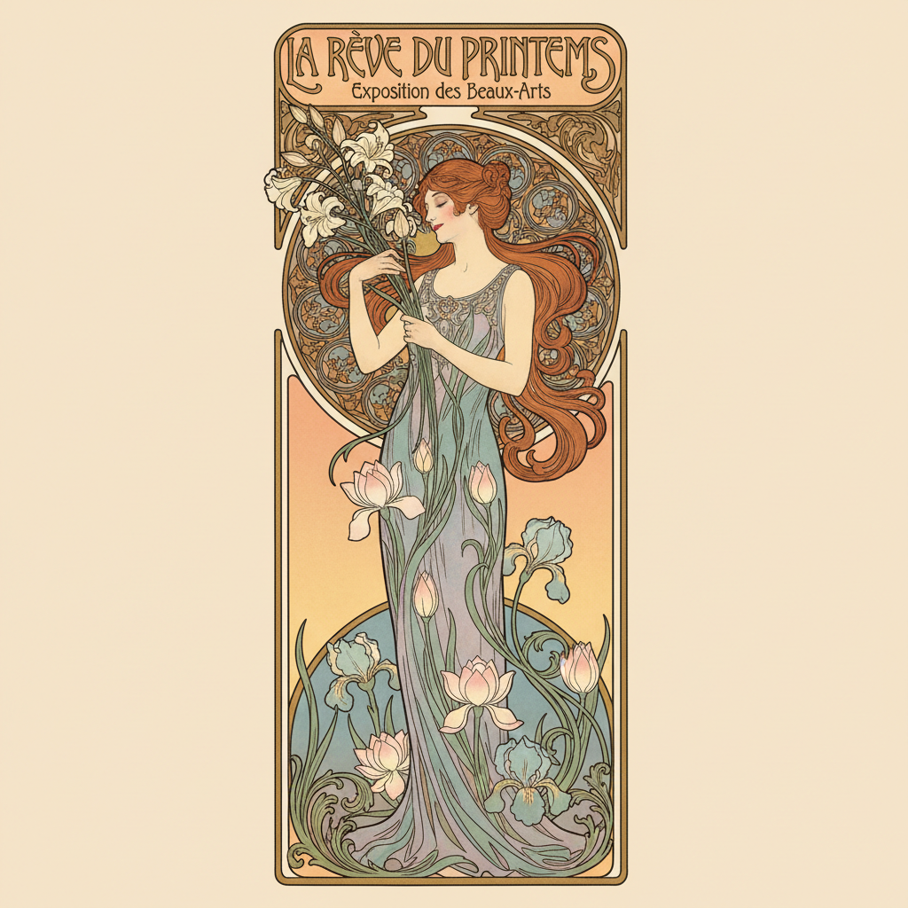

# Art Nouveau Painting 新艺术运动绘画

> **时期：** 1890年代–1910年代  
> **关键词：** 有机曲线、自然形态、装饰性、穆夏、总体艺术

## 概述

Art Nouveau（新艺术运动）是19世纪末席卷欧洲的装饰艺术革命——画家和设计师从自然界的有机形态中提取灵感，用流动的曲线、缠绕的藤蔓和优雅的女性形象创造出一种全新的视觉语言。阿尔丰斯·穆夏的海报女神、古斯塔夫·克里姆特的金色装饰——新艺术运动要让美渗透到生活的每一个表面。

## 风格特征

- **有机曲线**：鞭形线条和流动形态
- **自然元素**：花卉、昆虫、藤蔓的程式化
- **装饰性**：填满每一寸空间的图案
- **女性形象**：理想化的优雅女性
- **平面化**：强调轮廓线和色块

## 代表人物与作品

- 阿尔丰斯·穆夏 海报系列
- 古斯塔夫·克里姆特《吻》
- 奥布里·比亚兹莱 黑白插图
- 亨利·德·图卢兹-劳特雷克 海报

## 概念图

