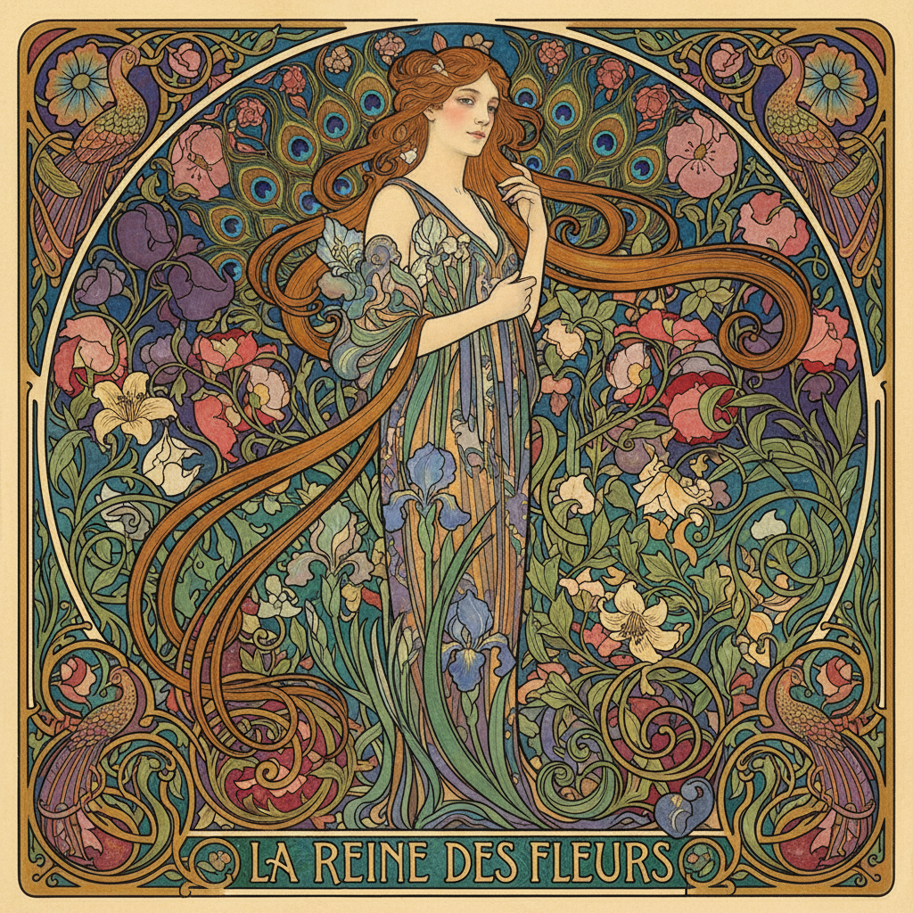

# Art Nouveau 新艺术运动



> **"藤蔓曲线、孔雀羽毛、彩色玻璃——当自然成为装饰的语法。"**

## 概述

| 维度 | 描述 |
|------|------|
| 时期 | 1890–1910 原版 / 2020s 复兴 |
| 别名 | Art Nouveau, Jugendstil, Modern Style |
| 核心色彩 | 金色、翡翠绿、孔雀蓝、紫色、象牙白 |
| 关键元素 | 有机曲线、藤蔓、花卉、彩色玻璃、女性形象 |
| 代表人物 | Alphonse Mucha、Gustav Klimt、Antoni Gaudí |
| 关联风格 | Art Deco, Dark Romantic, Fairycore, Maximalism |

---

## 历史脉络

### 从工业革命的反叛到当代复兴

| 年份 | 事件 |
|------|------|
| 1890 | Art Nouveau 在欧洲兴起 |
| 1895 | Siegfried Bing 开设 "L'Art Nouveau" 画廊 |
| 1900 | 巴黎世博会——Art Nouveau 巅峰 |
| 1910 | 被 Art Deco 取代 |
| 2020s | Mucha 风格在数字艺术中复兴 |

### 它代表什么？

| 元素 | 含义 |
|------|------|
| 有机曲线 | 反对工业的直线和机器 |
| 自然形态 | 藤蔓、花、昆虫 = 生命力 |
| 女性形象 | 自然 = 女性 = 美 |
| 整体设计 | 从建筑到门把手——一切统一 |
| 手工艺 | 反对机器生产 |

### 核心哲学

Art Nouveau 的精神是**"艺术应该存在于生活的每个角落"**：
- 没有"纯艺术"和"应用艺术"的区别
- 一把椅子可以和一幅画一样美
- 自然是最好的设计师
- 曲线 > 直线
- "总体艺术"——Gesamtkunstwerk

---

## 视觉语法

### 色彩系统

```
主色：
  金色 (#DAA520) — 装饰、奢华
  翡翠绿 (#50C878) — 自然、生命
  孔雀蓝 (#006D6F) — 深邃、神秘
  紫色 (#800080) — 贵族、花卉
  象牙白 (#FFFFF0) — 背景、纸张

辅色：
  珊瑚粉 (#FF7F50) — 花朵
  深棕 (#3D2B1F) — 木、框架
  铜色 (#B87333) — 金属装饰

质感：
  彩色玻璃 — 透光、色彩
  铸铁 — 曲线、装饰
  陶瓷 — 釉面、花卉
  丝绸 — 流动、光泽
  木雕 — 有机形态
```

### 标志性元素

| 类别 | 元素 |
|------|------|
| 线条 | 鞭形曲线（whiplash curve）、藤蔓 |
| 图案 | 花卉、孔雀、蜻蜓、女性头发 |
| 建筑 | Gaudí、Horta、巴黎地铁入口 |
| 平面 | Mucha 海报、装饰边框 |
| 工艺 | 彩色玻璃、珠宝、家具 |
| 字体 | 有机曲线字母、装饰性 |

---

## 与千禧怀旧的关系

### Mucha 风格的数字复兴
- AI 艺术生成中 "Art Nouveau style" 是热门提示词
- Mucha 的海报风格在社交媒体上广泛传播
- 与 Fairycore、Dark Romantic 的视觉交叉
- "装饰性"在极简主义疲劳后的回归

---

## 中国语境

- "新艺术风格"在插画/设计圈的讨论
- 与"国潮"中的装饰性元素交叉
- Mucha 风格在中国数字艺术中的流行
- 与中国传统工笔画的审美共鸣

---

## 设计应用

| 场景 | 应用方式 |
|------|----------|
| 插画 | 有机曲线+花卉边框+女性形象+金色 |
| 品牌 | 装饰字体+曲线+自然元素+奢华 |
| 空间 | 彩色玻璃+铸铁+花卉+曲线家具 |
| 珠宝 | 自然形态+宝石+有机曲线 |

---

## 相关风格

← [Art Deco 装饰艺术](art-deco-revival.md) | [Maximalism 极繁主义](maximalism.md) →

↑ [返回千禧怀旧目录](README.md) | [返回总目录](../README.md)
