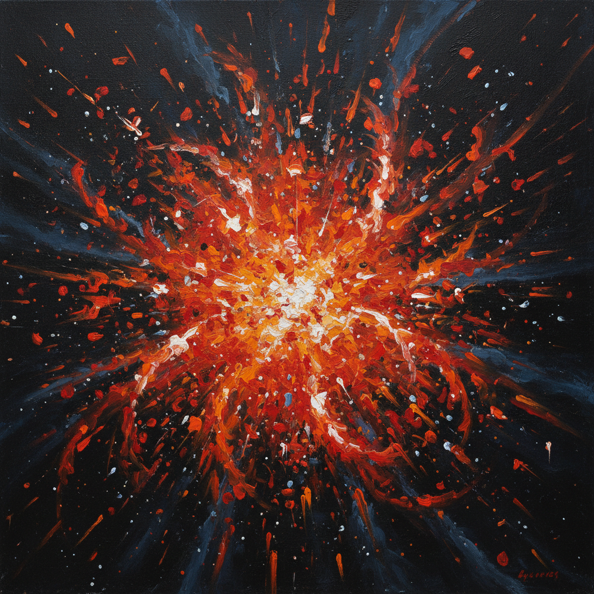

# Arte Nucleare 核艺术

> **时期：** 1951年–1960年代  
> **关键词：** 原子时代、物质分解、宇宙能量、米兰前卫、反形式

## 概述

Arte Nucleare（核艺术）是1951年由恩里科·巴伊和塞尔吉奥·丹杰洛在米兰发起的艺术运动，直接回应原子弹爆炸后的世界。他们用爆炸性的笔触、分解的形式和宇宙般的能量场来表现原子时代的焦虑和惊奇——物质不再稳固，一切都在分裂、辐射、重组。

## 风格特征

- **爆炸形式**：从中心向外辐射的构图
- **物质分解**：形象在画面中瓦解
- **宇宙意象**：星云、粒子、能量场
- **混合媒材**：颜料与非传统材料的结合
- **有机抽象**：生物形态与宇宙形态的融合

## 代表人物与作品

- 恩里科·巴伊 核构图
- 塞尔吉奥·丹杰洛 宇宙景观
- 乔·科隆博 光学装置
- 布鲁诺·穆纳里 实验作品

## 概念图

