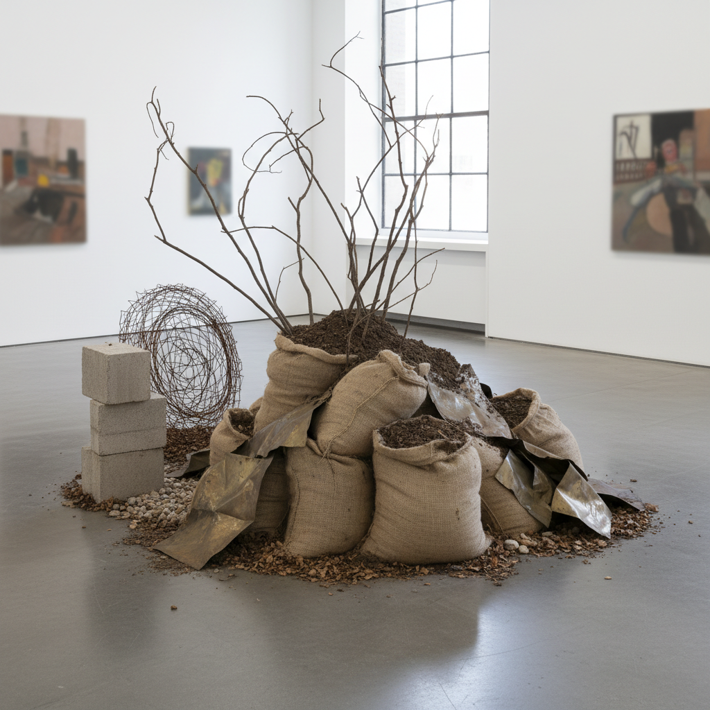

# Arte Povera Painting 贫穷艺术绘画

> **时期：** 1967年–1970年代  
> **关键词：** 意大利、日常材料、反商业、自然与工业、过程艺术

## 概述

Arte Povera（贫穷艺术）由评论家杰尔马诺·切兰特于1967年命名，描述一群意大利艺术家使用"贫穷"的日常材料——泥土、树枝、破布、铅板、蔬菜——来对抗消费社会和艺术市场的商品化。在绘画领域，它表现为对传统画材的拒绝，转而用非常规材料在画布或空间中创造诗意的物质对话。

## 风格特征

- **日常材料**：泥土、蜡、铅、布料替代颜料
- **自然元素**：植物、石头、水的直接使用
- **过程痕迹**：燃烧、氧化、腐蚀的自然过程
- **反精致**：拒绝完美表面和商业包装
- **诗意对话**：自然与人工的张力

## 代表人物与作品

- 贾尼斯·库奈利斯 煤炭与钢铁
- 马里奥·梅尔茨 霓虹与自然
- 乔瓦尼·安塞尔莫 能量与物质
- 皮耶罗·曼佐尼 无色画布

## 概念图

