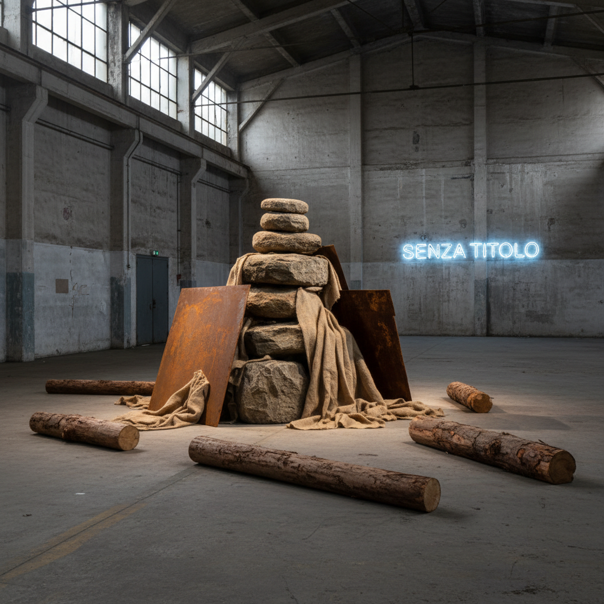

# Arte Povera 贫穷艺术



> **"用最贫穷的材料——说最富有的话。"**

## 概述

| 维度 | 描述 |
|------|------|
| 时期 | 1960s–1970s |
| 别名 | Arte Povera, 贫穷艺术, 贫困艺术 |
| 核心色彩 | 材料本色——泥土、铁锈、灰烬、石头、木头 |
| 关键元素 | 自然材料、工业废料、过程、变化、反商业 |
| 代表人物 | Michelangelo Pistoletto, Jannis Kounellis, Mario Merz, Giovanni Anselmo |
| 关联风格 | Minimalism, Land Art, Fluxus, Conceptual Art |

---

## 历史脉络

| 年份 | 事件 |
|------|------|
| 1967 | 评论家Germano Celant命名"Arte Povera" |
| 1967 | 热那亚"Arte Povera - Im Spazio"展 |
| 1969 | Kounellis在画廊里放12匹活马 |
| 1970 | Mario Merz开始"冰屋"系列 |
| 1970s | Arte Povera成为意大利最重要的当代艺术运动 |

### 核心哲学

贫穷艺术的精神是**"拒绝消费社会的奢华——用大地的材料对抗资本的逻辑"**：
- "贫穷不是贫乏——是纯粹"
- "一块石头比一幅油画更真实"
- "艺术应该像自然一样——会生长、会腐烂、会变化"
- "反对美国波普的消费主义——反对极简的工业冷漠"
- "意大利的回答：回到大地、回到手、回到过程"

---

## 视觉语法

### 材料系统

```
自然材料：
  石头 — 永恒、重量、大地
  木头 — 生命、时间、温暖
  泥土 — 起源、腐烂、循环
  水 — 流动、变化、生命
  火 — 转化、能量、毁灭

工业材料：
  铁 — 锈蚀、时间、工业
  玻璃 — 脆弱、透明、反射
  霓虹灯 — 能量、文字、光
  报纸 — 时间、信息、废弃

规则：
  - 材料必须保持本色
  - 过程和变化是作品的一部分
  - 大小不限——从口袋到建筑
  - 拒绝永久性——接受腐朽
```

### 标志性元素

| 类别 | 元素 |
|------|------|
| 材料 | 石头、铁、木、布、蜡、霓虹、活物 |
| 形式 | 装置、雕塑、行为、过程 |
| 主题 | 自然vs文化、时间、能量、变化 |
| 态度 | 反商业、反消费、回归本质 |
| 空间 | 画廊内外、自然环境、城市空间 |

---

## 对当代的影响

- **可持续设计** = Arte Povera精神的当代版本
- **Wabi-Sabi** = 日本版的"贫穷美学"
- **Raw/Brutalist设计** = 材料本色+不加修饰
- **当代装置艺术** = Arte Povera的直接继承

---

## 设计应用

| 场景 | 应用方式 |
|------|----------|
| 空间 | 自然材料+原始质感+可持续 |
| 品牌 | 环保+手工+反消费 |
| 时尚 | 天然面料+未加工+Wabi-Sabi |
| 建筑 | 清水混凝土+原始材料+时间痕迹 |

---

## 相关风格

← [Minimalism 极简主义](minimalism.md) | [Land Art 大地艺术](land-art.md) →

↑ [返回千禧怀旧目录](README.md) | [返回总目录](../README.md)
