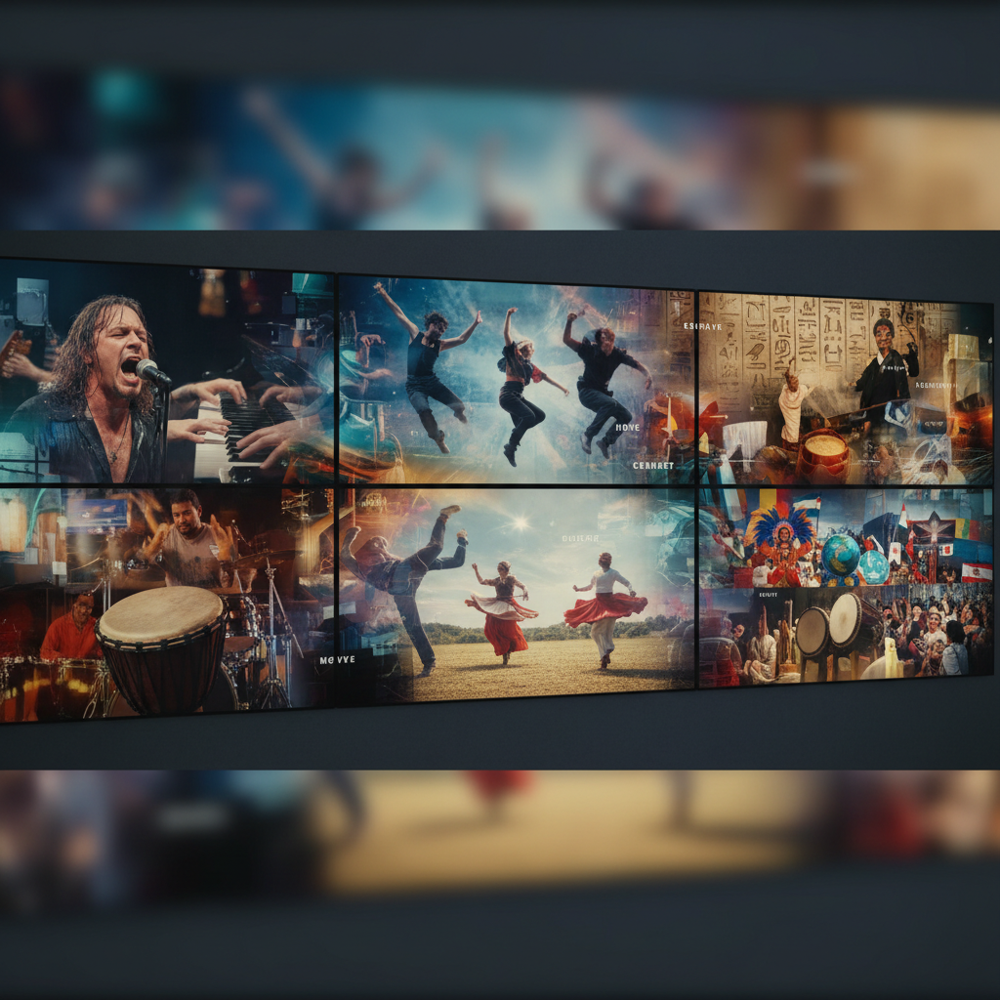

# Arthur Jafa 亚瑟·贾法

> **时期：** 1960–至今  
> **关键词：** 黑人影像、节奏蒙太奇、音乐与暴力、情感密度

## 概述

Arthur Jafa 是美国艺术家和电影摄影师，以高密度的影像蒙太奇闻名。他将YouTube视频、新闻片段、音乐录影带和手机拍摄的画面编辑在一起，配以强烈的音乐节奏，创造出关于黑人经验的情感洪流——美丽、暴力、狂喜和悲伤交织在一起。

## 风格特征

- **找到的影像**：大量使用网络视频、新闻和档案素材
- **节奏剪辑**：画面切换与音乐节拍精确同步
- **情感过载**：密集的情感信息在短时间内涌入
- **黑人美学**：探索黑人文化中的力量、美和创伤
- **音乐性**：音乐不是配乐而是结构性元素

## 代表作品

- *Love Is the Message, the Message Is Death*（2016）
- *The White Album*（2018，金狮奖）
- *APEX*（2013）
- *akingdoncomethas*（2018）

## 概念图

