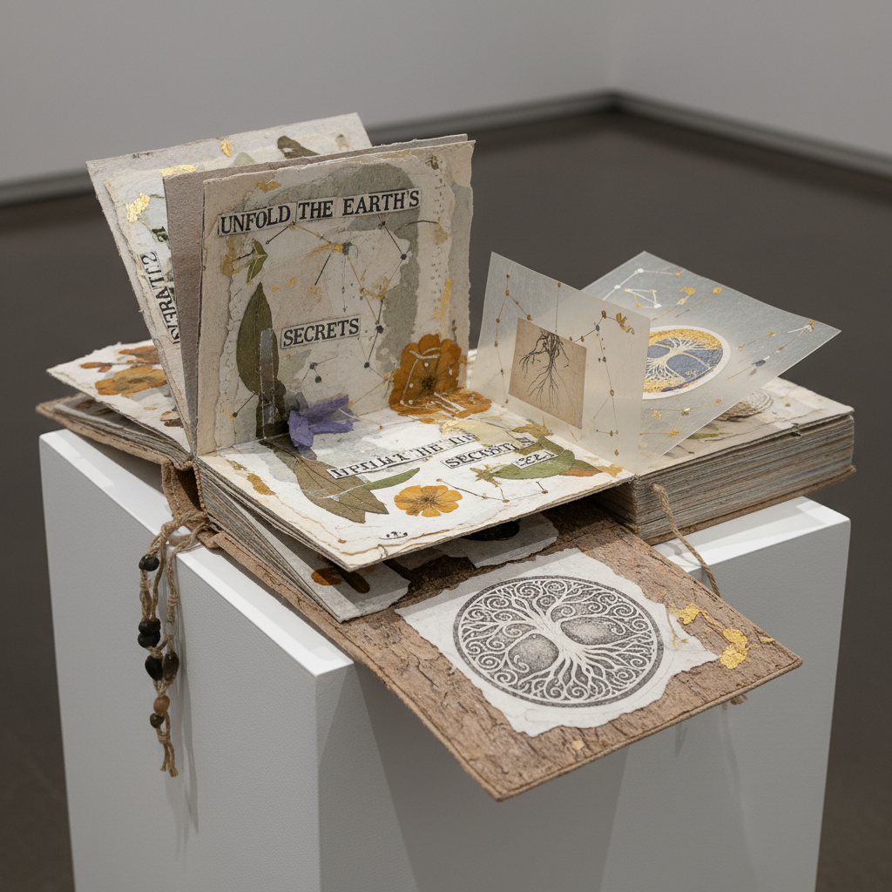

# Artist Books 艺术家书籍

> **时期：** 1960年代–至今  
> **关键词：** 书籍作为艺术、限量版、手工装帧、跨媒介、序列叙事

## 概述

Artist Books（艺术家书籍）是将书籍本身作为艺术媒介的创作形式——不是画册或图录，而是书的形态、结构、材料和翻阅体验都成为作品的一部分。从爱德华·鲁沙的摄影书到安塞姆·基弗的铅书雕塑，艺术家书籍模糊了视觉艺术、文学和雕塑的边界。

## 风格特征

- **书籍即媒介**：形态结构本身是表达
- **序列性**：翻页创造时间和叙事
- **手工制作**：独特的装帧和材料
- **限量或唯一**：非大规模复制品
- **跨感官**：触觉、视觉、嗅觉的综合

## 代表人物与作品

- 爱德华·鲁沙《二十六个加油站》
- 安塞姆·基弗 铅书系列
- 迪特·罗特 腐烂书籍
- 徐冰《天书》

## 概念图

