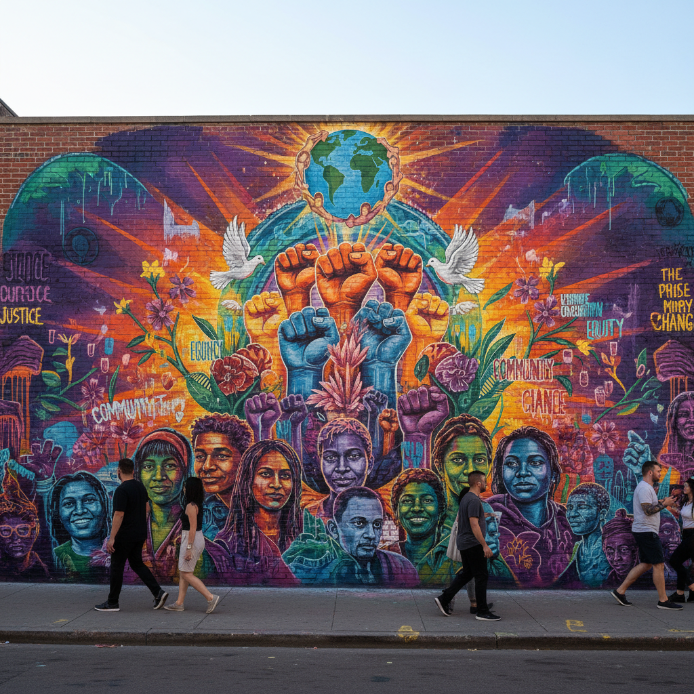

# Artivism 艺术行动主义

> **时期：** 2000年代–至今  
> **关键词：** 艺术+行动主义、社会参与、公共干预、集体创作、抗议美学

## 概述

Artivism（Art + Activism）是艺术与社会行动主义的融合，艺术家们将创作直接嵌入社会运动——用壁画、表演、装置和数字媒体来放大边缘群体的声音、记录抗议现场、创造团结的视觉符号。与画廊艺术不同，Artivism 的"展厅"是街头、社交媒体和抗议现场。

## 风格特征

- **公共性**：作品存在于公共空间而非画廊
- **集体创作**：社区参与的协作过程
- **即时性**：回应当下社会事件
- **跨媒介**：壁画、行为、视频、社交媒体并用
- **可复制性**：设计易于传播和复制的视觉符号

## 代表人物与作品

- Ai Weiwei 社会批判装置
- JR 大型摄影粘贴项目
- Tania Bruguera 行为政治学
- Occupy Wall Street 视觉文化
- Black Lives Matter 视觉运动

## 概念图

