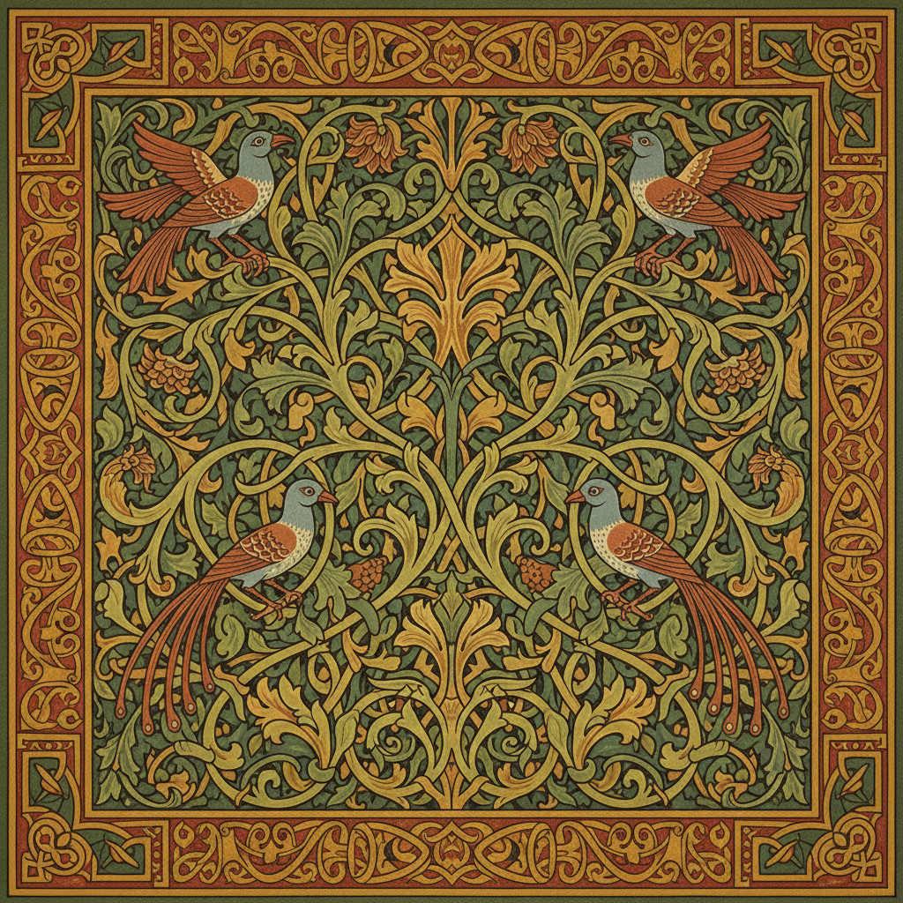

# Arts and Crafts Painting 工艺美术运动绘画

> **时期：** 1880年代–1920年代  
> **关键词：** 手工艺复兴、威廉·莫里斯、装饰统一、反工业化、中世纪理想

## 概述

Arts and Crafts Painting（工艺美术运动绘画）是威廉·莫里斯领导的反工业化运动在绘画和装饰艺术中的体现——他们相信美应该存在于日常生活的每一个角落，从壁纸到书籍插图，从彩色玻璃到挂毯。沃尔特·克兰的童话插图、莫里斯的花卉纹样——工艺美术运动追求的是艺术与生活的完全统一。

## 风格特征

- **装饰统一**：绘画与工艺品的融合
- **自然纹样**：花卉、藤蔓、鸟类的程式化
- **平面化**：强调表面装饰而非深度
- **手工质感**：拒绝机械复制的温度
- **中世纪风格**：哥特式字体和构图

## 代表人物与作品

- 威廉·莫里斯 壁纸和挂毯设计
- 沃尔特·克兰 童话插图
- 爱德华·伯恩-琼斯 彩色玻璃
- 查尔斯·沃伊西 装饰设计

## 概念图

