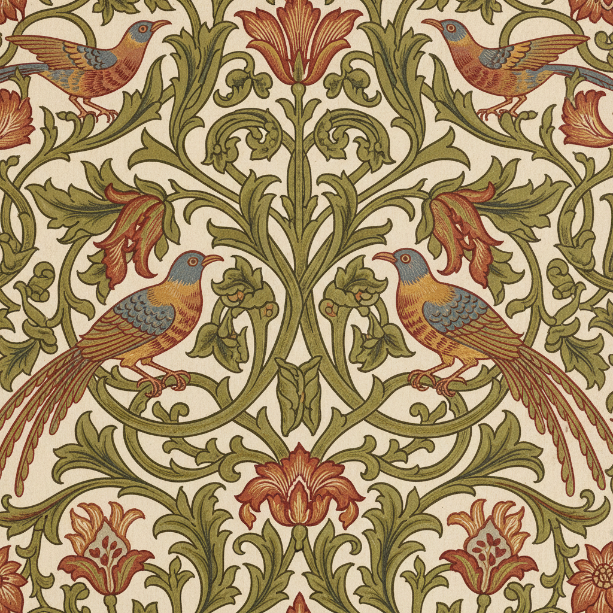

# Arts and Crafts Movement 工艺美术运动



> **"机器摧毁了美——让我们用双手把它找回来。"**

## 概述

| 维度 | 描述 |
|------|------|
| 时期 | 1860s–1910s |
| 别名 | Arts and Crafts Movement, 工艺美术运动, 美术工艺运动 |
| 核心色彩 | 自然色调——森林绿、土红、靛蓝、米白、木色 |
| 关键元素 | 手工制作、自然纹样、中世纪灵感、功能与美的统一 |
| 代表人物 | William Morris, John Ruskin, C.R. Ashbee, Gustav Stickley |
| 关联风格 | Art Nouveau, Pre-Raphaelite, Gothic Revival, Aesthetic Movement |

---

## 历史脉络

| 年份 | 事件 |
|------|------|
| 1851 | 水晶宫博览会——工业产品的丑陋引发反思 |
| 1860s | John Ruskin的美学批评——反对工业化 |
| 1861 | William Morris创立Morris, Marshall, Faulkner & Co. |
| 1880s | 工艺美术行会在英国各地成立 |
| 1890s | 运动传播到美国（Gustav Stickley） |
| 1900s | 影响Art Nouveau和现代设计运动 |

### 核心哲学

工艺美术运动的精神是**"好的设计应该是手工的、诚实的、人人可及的"**：
- Morris："我不想要任何我不认为有用或美丽的东西在我家里"
- "机器让工人变成奴隶——手工让工人成为艺术家"
- "中世纪的工匠是自由的——工业时代的工人是囚徒"
- "材料应该诚实——不要假装是别的东西"
- "美不是奢侈品——是每个人的权利"

---

## 视觉语法

### 色彩系统

```
主色：
  森林绿 (#228B22) — 自然、生长
  土红 (#8B4513) — 大地、温暖
  靛蓝 (#191970) — 深沉、手工染
  米白 (#F5F5DC) — 纸张、织物

辅色：
  金色 (#DAA520) — 装饰、中世纪
  深紫 (#4B0082) — 染料、贵族
  铜色 (#B87333) — 金属工艺

规则：
  - 色彩来自天然染料
  - 不用工业化学色
  - 和谐 > 对比
  - 温暖 > 冷酷
```

### 标志性元素

| 类别 | 元素 |
|------|------|
| 纹样 | 藤蔓、花卉、鸟类、中世纪纹饰 |
| 材料 | 手工木材、锻铁、手织布、手工纸 |
| 字体 | 手写体、中世纪字体、Kelmscott Press |
| 家具 | 橡木、榫卯结构、简洁线条 |
| 建筑 | 红砖、木构、花园城市 |
| 态度 | 反工业、手工、诚实、民主 |

---

## 与千禧怀旧/当代的关系

### 手工复兴
- Etsy/手工市集 = 工艺美术运动的当代版本
- "Maker Movement" = 数字时代的Arts and Crafts
- 手工皮具/木工/陶艺热潮 = Morris精神的延续

### William Morris壁纸的永恒
- Morris的花卉壁纸至今仍在生产和销售
- "150年后——Morris的设计仍然是最美的壁纸"
- 当代室内设计中的Morris复兴

---

## 设计应用

| 场景 | 应用方式 |
|------|----------|
| 室内 | 手工家具+天然材料+花卉壁纸 |
| 品牌 | 手工感+诚实+可持续 |
| 出版 | 手工装帧+活版印刷 |
| 时尚 | 天然面料+手工染色+传统工艺 |

---

## 相关风格

← [Gothic Art 哥特艺术](gothic-art.md) | [Art Nouveau 新艺术](art-nouveau.md) →

↑ [返回千禧怀旧目录](README.md) | [返回总目录](../README.md)
