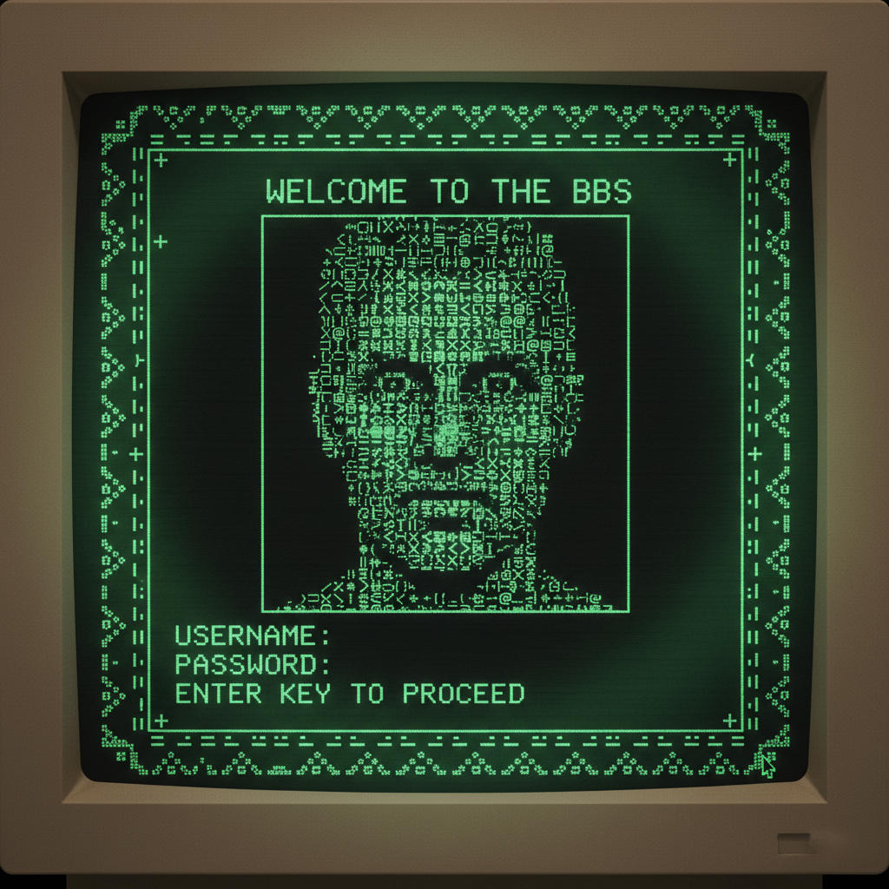

# ASCII Art 字符画艺术



> **"用键盘上的字符拼出蒙娜丽莎——最早的'像素艺术'比像素还早。"**

## 概述

| 维度 | 描述 |
|------|------|
| 时期 | 1960s–至今 |
| 别名 | ASCII Art, Text Art, ANSI Art, 字符画 |
| 核心色彩 | 绿色终端、白色文字/黑色背景、ANSI 16色 |
| 关键元素 | 纯文本字符构图、等宽字体、终端美学、BBS文化 |
| 代表人物 | Joan Stark, Normand Veilleux, BBS艺术家群体 |
| 关联风格 | Pixel Art, Retro Computing, Webcore, Hacker Culture |

---

## 历史脉络

| 年份 | 事件 |
|------|------|
| 1963 | ASCII标准发布——128个字符 |
| 1966 | 早期打印机艺术——用字符密度模拟灰度 |
| 1970s | 大型机终端上的字符画 |
| 1980s | BBS文化——ANSI Art黄金时代 |
| 1990s | Usenet/IRC——ASCII Art社区繁荣 |
| 2000s | 日本AA(Shift_JIS Art)——2ch文化 |
| 2020s | 复古计算美学复兴+AI生成ASCII |

### 核心哲学

ASCII Art的精神是**"在最严格的限制中创造最大的表现力"**：
- 限制 = 创意（"只有字符——但可以画出一切"）
- 文本 = 图像（"文字不只是用来读的——也是用来看的"）
- 终端 = 画布（"命令行是最早的创作工具"）
- 共享 = 文化（"可以复制粘贴的艺术——最早的'开源'创作"）
- "ASCII Art 证明了：创造力不需要Photoshop"

---

## 视觉语法

### 色彩系统

```
经典：
  绿色终端 (#00FF00 on #000000)
  琥珀终端 (#FFB000 on #000000)
  白色文字 (#FFFFFF on #000000)

ANSI 16色：
  黑、红、绿、黄、蓝、紫、青、白
  + 各自的亮色版本

规则：
  - 等宽字体是基础
  - 字符密度 = 灰度
  - 特殊字符 = 线条和形状
  - 空格 = 留白

质感：
  像素感 — 字符网格
  闪烁 — 光标、终端
  扫描线 — CRT显示器
  单色 — 早期终端
```

### 标志性元素

| 类别 | 元素 |
|------|------|
| 字符 | ░▒▓█ ╔═╗ ┌─┐ /\|_ @#$% |
| 风格 | 线条画、灰度画、大字体(Figlet)、签名 |
| 平台 | BBS、IRC、Usenet、终端、2ch |
| 题材 | Logo、人物、风景、动物、表情 |
| 工具 | 文本编辑器、专用ASCII编辑器 |
| 态度 | 极客、怀旧、限制中的创意、社区 |

---

## 与千禧怀旧的关系

### BBS/早期互联网的视觉记忆
- ASCII Art = "互联网还没有图片时的图片"
- BBS登录画面 = 最早的"网页设计"
- "在带宽只有14.4k的时代——字符就是一切"
- 与 Webcore/Old Web 美学的深度关联

### 当代复兴
- 终端美学在开发者文化中的流行
- neofetch, cowsay——日常使用中的ASCII Art
- "复古终端"主题的流行
- AI生成ASCII Art的新可能

---

## 中国语境

- 中国BBS时代的字符画文化
- 中国论坛签名档中的ASCII Art
- 与中国"火星文"文化的交叉
- 中国程序员文化中的终端美学

---

## 设计应用

| 场景 | 应用方式 |
|------|----------|
| 开发者 | 终端工具+CLI界面+README装饰 |
| 品牌 | 极客+复古+技术+独特 |
| 游戏 | Roguelike+终端游戏+复古 |
| 社交 | 表情+签名+评论装饰 |

---

## 相关风格

← [Pixel Art 像素艺术](pixel-art.md) | [Webcore 早期互联网美学](webcore.md) →

↑ [返回千禧怀旧目录](README.md) | [返回总目录](../README.md)
