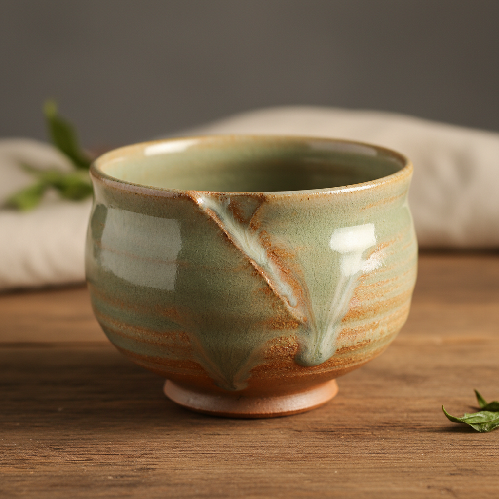

# Ash Glaze Art 灰釉陶艺术

> "Ash glaze is nature's own ceramic coating — wood ash collected from the hearth or the kiln, mixed with water and applied to a pot, melts in the fire into a glaze of subtle beauty: soft greens, warm ambers, cool grays, and milky whites, each batch unique because every tree species and every season produces ash of different chemistry, making the glaze a direct record of the landscape that fed the fire." — Unknown

## 概述

灰釉陶艺术（Ash Glaze Art）是一种使用植物灰（木灰、稻草灰等）作为主要助熔剂的釉料来装饰陶瓷的古老技法——灰釉是人类最早发明的釉料之一，因为窑内的木灰自然落在器物上熔化形成釉面而被发现。灰釉以其自然的色彩变化、质朴的美感和与自然的深层联系著称。

灰釉陶艺术的实践包括：1）收集灰——收集木灰或其他植物灰；2）处理——清洗和筛选灰料；3）配方——与粘土和其他材料混合配制釉料；4）施釉——将灰釉施加在坯体上；5）烧制——在高温下烧制使灰釉熔化；6）自然灰釉——窑内自然落灰形成的釉面；7）当代灰釉——将传统技法与现代创作结合。

## 核心特征

| 特征 | 描述 |
|------|------|
| 植物灰 | 使用植物灰作为原料 |
| 自然 | 自然的色彩和质感 |
| 古老 | 最古老的釉料之一 |
| 变化 | 每批灰的化学成分不同 |
| 质朴 | 质朴自然的美感 |
| 生态 | 与自然环境的联系 |

## 视觉特征

- **绿色**：柔和的绿色调
- **琥珀**：温暖的琥珀色
- **灰色**：冷静的灰色调
- **乳白**：乳白色的效果
- **流动**：釉料流动的痕迹
- **质朴**：质朴自然的表面

## 代表作品

| 作品 | 艺术家/文化 | 年代 | 意义 |
|------|-------------|------|------|
| *Chinese Shang Dynasty ash glaze* | 中国 | 公元前16世纪 | 商代灰釉 |
| *Korean celadon ash glaze* | 韩国 | 10-14世纪 | 韩国青瓷灰釉 |
| *Japanese Shigaraki ash glaze* | 日本 | 13世纪起 | 日本信乐灰釉 |
| *Bernard Leach ash glazes* | 英国 | 20世纪 | 伯纳德·利奇灰釉 |
| *Contemporary ash glaze* | 国际 | 当代 | 当代灰釉陶 |

## 历史时间线

| 时期 | 事件 |
|------|------|
| 公元前16世纪 | 中国商代灰釉的出现 |
| 汉代 | 中国灰釉的成熟 |
| 10世纪 | 韩国和日本灰釉的发展 |
| 20世纪 | 工作室陶艺中灰釉的复兴 |
| 当代 | 灰釉的全球实践 |

## 中国语境

灰釉在中国有极其重要的历史地位。中国是灰釉的发源地——商代的原始瓷器就使用灰釉，是世界上最早的釉料。中国的青瓷——从越窑到龙泉窑，都以灰釉为基础发展出精美的青绿色釉。中国的传统釉料——大多数传统高温釉都含有灰作为助熔剂。中国当代的陶艺家——广泛使用灰釉进行创作，探索不同植物灰的效果。中国的陶瓷教育中，灰釉作为最基本和最重要的釉料类型——在各大陶瓷院校中教授。中国的陶瓷研究中，灰釉的起源和发展——是中国陶瓷史的核心课题。

## AI生成概念图

## 与其他风格的关系

- **Celadon** → 青瓷
- **Wood Firing** → 柴烧
- **Anagama** → 穴窑
- **Natural Glaze** → 天然釉
- **Studio Pottery** → 工作室陶艺
- **Stoneware** → 炻器

---

*浮光艺志 | Chronicle of Artistry*
