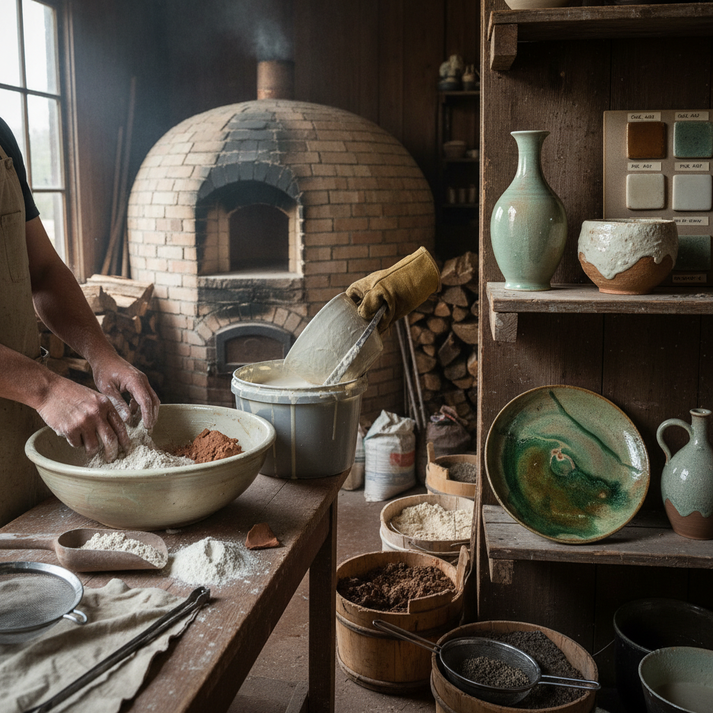

# Ash Glazing 灰釉

> "Ash glazing is the forest distilled to glass — the minerals that trees drew from the earth over decades are concentrated in their ashes, and when melted onto clay, they produce glazes of quiet complexity that no synthetic formula can fully replicate." — Unknown

## 概述

灰釉（Ash Glazing）是使用植物灰烬（wood ash、straw ash、rice hull ash等）作为主要助熔剂配制陶瓷釉料的技法。植物灰烬含有丰富的矿物质——主要是氧化钙（CaO）、氧化钾（K₂O）、二氧化硅（SiO₂）、氧化镁（MgO）等，这些成分在高温下熔融形成玻璃质釉面。

灰釉是人类最古老的陶瓷釉料之一——最早的灰釉可能是偶然形成的：柴烧窑中飘落的灰烬在陶器表面自然熔融。后来人们有意识地收集灰烬、清洗、研磨，配制成釉料使用。灰釉的魅力在于其自然的色彩和质感——不同植物的灰烬含有不同比例的矿物质，产生从青绿到棕黄、从透明到乳浊的丰富变化。

## 核心特征

| 特征 | 描述 |
|------|------|
| 植物灰 | 使用植物灰烬 |
| 天然 | 天然的矿物成分 |
| 变化 | 丰富的色彩变化 |
| 古老 | 最古老的釉料之一 |
| 不同灰 | 不同植物不同效果 |
| 质朴 | 质朴自然的美感 |

## 视觉特征

- **青绿**：经典的青绿色调
- **流淌**：自然的流淌效果
- **乳浊**：可呈乳浊效果
- **质朴**：质朴自然的美感
- **变化**：丰富的色彩变化
- **深度**：釉层的深度感

## 代表作品

| 作品 | 艺术家 | 年代 | 意义 |
|------|--------|------|------|
| *Chinese celadon* | 中国工匠 | 宋代 | 中国青瓷（灰釉） |
| *Korean celadon* | 韩国工匠 | 高丽 | 韩国青瓷 |
| *Japanese ash glazed ware* | 日本工匠 | 传统 | 日本灰釉陶 |
| *Bernard Leach ash glazes* | Bernard Leach | 20世纪 | 利奇灰釉 |
| *Contemporary ash glazed* | Various | 当代 | 当代灰釉 |

## 历史时间线

| 时期 | 事件 |
|------|------|
| 商代 | 中国最早的灰釉（原始瓷） |
| 汉代 | 灰釉的成熟 |
| 宋代 | 中国灰釉瓷器的巅峰 |
| 传统 | 日韩灰釉传统 |
| 20世纪 | 工作室陶艺中灰釉的复兴 |
| 当代 | 灰釉作为可持续陶艺实践 |

## 中国语境

灰釉在中国陶瓷史上有着核心地位——中国是世界上最早使用灰釉的国家，商代的原始瓷就使用草木灰釉。中国历史上最伟大的瓷器——宋代的青瓷（龙泉窑、汝窑、耀州窑等）都是灰釉系统。中国传统的灰釉配方使用各种植物灰：稻草灰、松木灰、竹灰、桑灰等。当代中国的陶艺家继续研究和使用灰釉——灰釉被视为最具中国特色的陶瓷釉料传统。

## AI生成概念图

## 与其他风格的关系

- **Wood Firing** → 柴烧
- **Celadon** → 青瓷
- **Salt Glazing** → 盐釉
- **Ceramics** → 陶瓷
- **Natural Glaze** → 天然釉
- **Studio Pottery** → 工作室陶艺

---

*浮光艺志 | Chronicle of Artistry*
