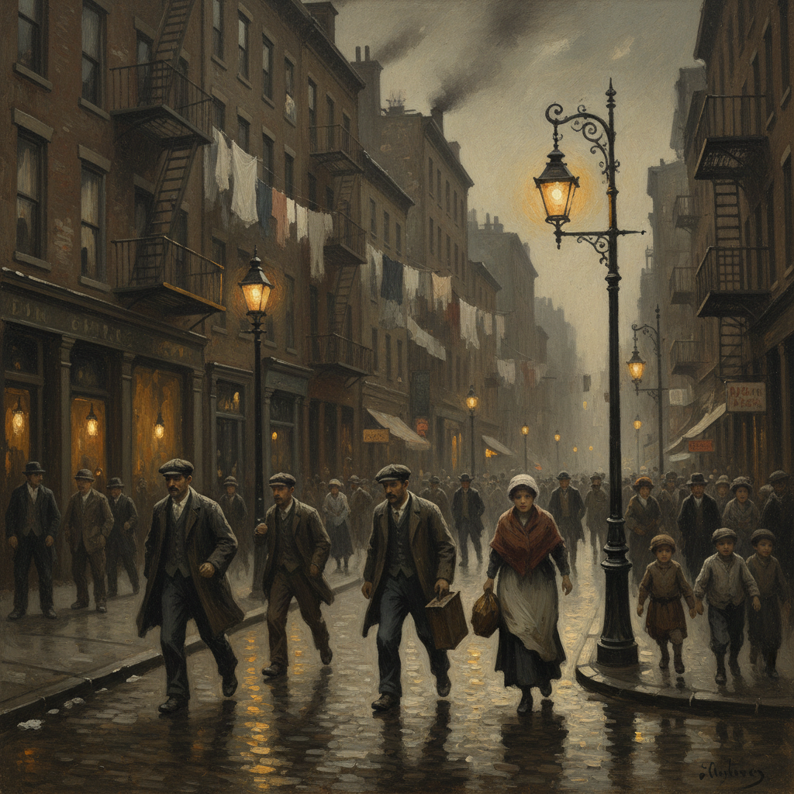

# Ashcan School 垃圾箱画派

> "Forget about art and paint pictures of what interests you in life." — Robert Henri

## 概述

垃圾箱画派（Ashcan School）是20世纪初美国的现实主义艺术运动，以描绘纽约城市底层生活——贫民窟、酒吧、拳击场、洗衣房——而得名。他们拒绝学院派的理想化，转向粗犷的、新闻报道式的城市现实。

垃圾箱画派是美国艺术独立于欧洲的重要一步——他们画的是美国自己的故事，用美国自己的视觉语言。

## 核心特征

| 特征 | 描述 |
|------|------|
| 城市现实 | 纽约底层生活的直接描绘 |
| 反学院 | 拒绝美化和理想化 |
| 新闻视角 | 许多成员曾是报纸插画师 |
| 暗色调 | 深色的、戏剧性的城市光线 |
| 快速笔触 | 速写般的、即兴的绘画方式 |
| 人文关怀 | 对普通人生活的尊重和同情 |

## 视觉特征

- **色调**：暗色为主——深褐、深灰、黑色
- **笔触**：粗犷的、快速的、速写般的
- **主题**：街道、酒吧、码头、拳击场
- **光线**：戏剧性的人工光——煤气灯、窗户光
- **人物**：工人、移民、儿童、拳击手
- **构图**：新闻摄影般的即时感

## 代表作品

| 作品 | 年代 | 意义 |
|------|------|------|
| *Stag at Sharkey's* (Bellows) | 1909 | 拳击场的暴力能量 |
| *Cliff Dwellers* (Bellows) | 1913 | 贫民窟的拥挤生活 |
| *McSorley's Bar* (Sloan) | 1912 | 纽约酒吧文化 |
| *Snow in New York* (Henri) | 1902 | 城市冬日 |
| *Forty-two Kids* (Bellows) | 1907 | 码头上的街头儿童 |

## 真实作品（公共领域）

| 作品 | 来源 |
|------|------|
| *Stag at Sharkey's* | [Cleveland Museum](https://www.clevelandart.org/art/1133.1922) |
| *Cliff Dwellers* | [LACMA](https://collections.lacma.org/node/239578) |
| *Snow in New York* | [National Gallery](https://www.nga.gov/collection/art-object-page.60851.html) |

## AI生成概念图

## 与其他风格的关系

- **Realism** → 库尔贝现实主义的美国继承
- **Social Realism** → 社会现实主义的直接先驱
- **Impressionism** → 反对美国印象派的甜美
- **Urban Photography** → 影响了纪实摄影传统
