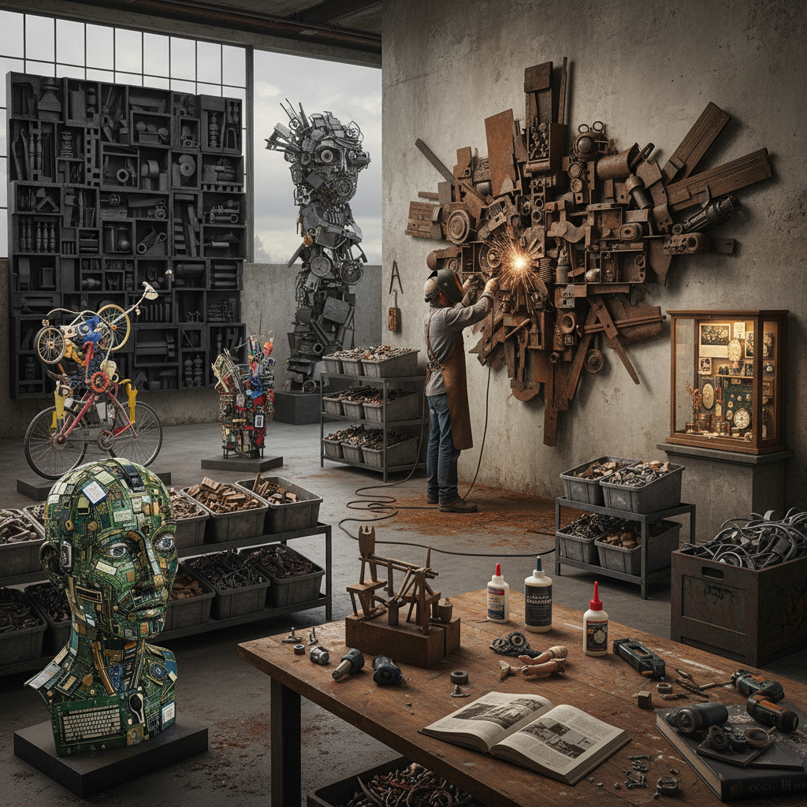

# Assemblage Art 集合艺术

> "Assemblage is sculpture made from the world's discards — broken toys, rusted metal, weathered wood, and forgotten objects gathered together into new constellations of meaning, each piece carrying its own history and patina into the collective whole, a democratic art that finds beauty and significance in what others have thrown away, transforming junk into poetry and debris into monument." — Unknown

## 概述

集合艺术（Assemblage Art）是一种使用现成的三维物品、废弃材料、日常物件等非传统艺术材料组合而成的立体艺术形式。与传统雕塑的"雕刻"或"塑造"不同，集合艺术是"组装"——将已经存在的物品收集、选择、排列和固定在一起，创造新的艺术整体。每个组成部分都保留着自己的身份和历史，同时在新的组合中获得新的意义。

"Assemblage"一词由让·杜布菲（Jean Dubuffet）在1953年首次用于描述他的蝴蝶翅膀拼贴作品。1961年，纽约现代艺术博物馆（MoMA）举办了具有里程碑意义的"集合艺术"（The Art of Assemblage）展览，由威廉·塞茨（William Seitz）策划，正式确立了assemblage作为一种独立艺术形式的地位。展览追溯了从毕加索的立体主义拼贴、杜尚的现成品、到施维特斯的Merz作品的历史脉络。

## 核心特征

| 特征 | 描述 |
|------|------|
| 组装 | 物品的组装而非雕刻 |
| 现成物 | 使用现成的物品 |
| 三维 | 三维的立体形式 |
| 废弃 | 常使用废弃材料 |
| 历史 | 物品携带自身历史 |
| 民主 | 材料的民主化 |

## 视觉特征

- **混合**：多种材料的混合
- **质感**：丰富的材料质感
- **锈蚀**：时间的痕迹
- **层叠**：物品的层叠组合
- **叙事**：物品暗示的叙事
- **立体**：三维的空间存在

## 代表作品

| 作品 | 艺术家 | 年代 | 意义 |
|------|--------|------|------|
| *Merzbau* | Kurt Schwitters | 1923-37 | 施维特斯的Merz建筑 |
| *Bull's Head* | Pablo Picasso | 1942 | 毕加索的自行车座牛头 |
| *Homage to New York* | Jean Tinguely | 1960 | 丁格利的自毁机器 |
| *Wall of Dignity* | Louise Nevelson | 1960年代 | 内维尔森的木箱墙 |
| *Watts Towers* | Simon Rodia | 1921-54 | 罗迪亚的瓦茨塔 |

## 历史时间线

| 时期 | 事件 |
|------|------|
| 1912-14 | 毕加索的立体主义拼贴 |
| 1920年代 | Schwitters的Merz作品 |
| 1953 | Dubuffet使用"assemblage"一词 |
| 1961 | MoMA"集合艺术"展览 |
| 当代 | 集合艺术的全球化发展 |

## 中国语境

集合艺术在中国当代艺术中有广泛的实践。中国的许多当代艺术家使用废弃材料和现成物品创作集合艺术——如艾未未的自行车装置、徐冰的凤凰（用建筑废料制作的巨型凤凰雕塑）等。中国快速城市化进程中产生的大量废弃物为集合艺术提供了丰富的材料来源。有趣的是，中国传统的"百宝嵌"工艺（将各种珍贵材料镶嵌在一起）可以被视为一种古老的"集合"美学。中国民间的"杂宝图"传统也体现了将不同物品组合在一起的审美趣味。

## AI生成概念图

## 与其他风格的关系

- **Found Object Art** → 现成物艺术
- **Combine Painting** → 组合绘画
- **Collage** → 拼贴艺术
- **Junk Art** → 废品艺术
- **Installation Art** → 装置艺术
- **Neo-Dada** → 新达达

---

*浮光艺志 | Chronicle of Artistry*
