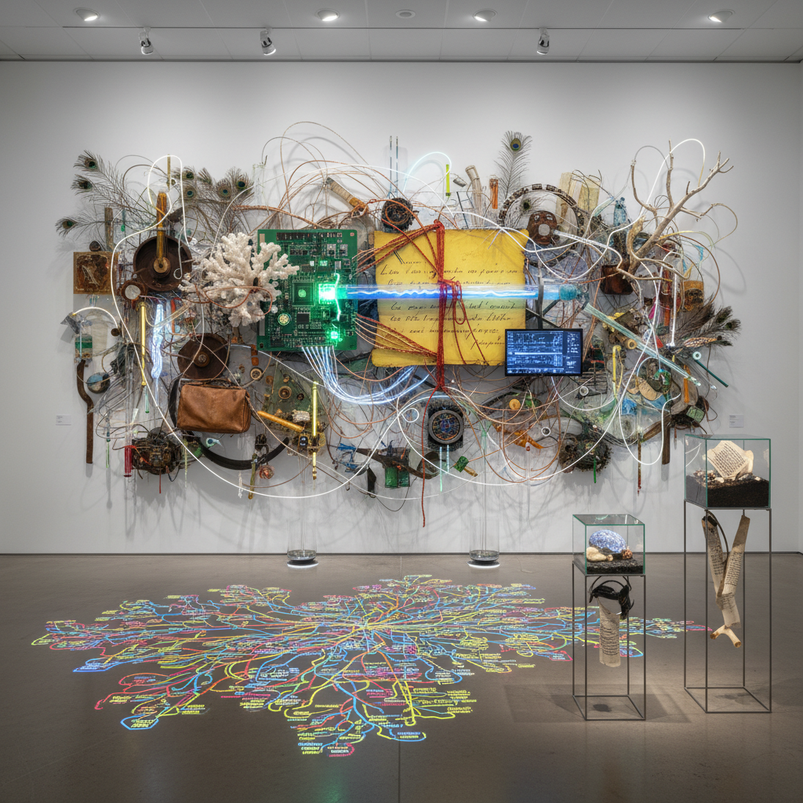

# Assemblage Theory Art 装配理论艺术

> "Assemblage theory art thinks in connections rather than essences — it sees the world not as a collection of fixed objects with inherent properties but as a dynamic field of relations, flows, and temporary stabilizations, where a body is an assemblage of organs, bacteria, and social codes, where a city is an assemblage of buildings, people, infrastructure, and desires, and where art itself is an assemblage of materials, intentions, contexts, and affects that can always be reassembled differently, proving that nothing is ever simply what it is but always what it does in relation to everything else." — Gilles Deleuze & Félix Guattari

## 概述

装配理论艺术（Assemblage Theory Art）是基于德勒兹和瓜塔里（Deleuze & Guattari）的"装配"（assemblage / agencement）概念的艺术实践。装配理论将世界理解为由异质元素临时组合而成的动态系统——这些元素可以是物质的、符号的、社会的、技术的——它们通过关系而非本质来定义。

装配理论艺术的实践包括：1）异质材料的组合——将不同来源、不同性质的材料和元素组合在一起；2）关系性的作品——强调元素之间的关系而非元素本身；3）开放性的系统——创造可以被重新组合和改变的作品；4）流动和过程——关注装配的形成、维持和解体过程；5）跨尺度的思考——从微观到宏观的装配。装配理论艺术与后结构主义、新唯物主义和系统理论有密切关联。

## 核心特征

| 特征 | 描述 |
|------|------|
| 异质 | 异质元素的组合 |
| 关系 | 关系优先于本质 |
| 动态 | 动态的系统 |
| 开放 | 开放和可变 |
| 流动 | 流动和过程 |
| 连接 | 连接和断裂 |

## 视觉特征

- **混合**：异质材料的混合
- **网络**：网络和连接
- **层叠**：多层次的叠加
- **碎片**：碎片的重组
- **流动**：流动的形态
- **开放**：开放的边界

## 代表作品

| 作品 | 艺术家 | 年代 | 意义 |
|------|--------|------|------|
| *Assemblage sculptures* | Robert Rauschenberg | 1950年代 | 早期装配艺术 |
| *Relational installations* | Various | 2000年代 | 关系性装置 |
| *Network art* | Various | 2010年代 | 网络艺术 |
| *Rhizomatic works* | Various | 2010年代 | 根茎式作品 |
| *Posthuman assemblages* | Various | 2020年代 | 后人类装配 |

## 历史时间线

| 时期 | 事件 |
|------|------|
| 1980 | 德勒兹和瓜塔里《千高原》 |
| 2006 | Manuel DeLanda《A New Philosophy of Society》 |
| 2010年代 | 装配理论在艺术中的应用 |
| 当代 | 与数字文化的融合 |

## 中国语境

装配理论艺术在中国有独特的哲学共鸣。中国传统思想中的"气"概念——万物由气的聚散而成——与装配理论的动态本体论有相似之处。中国传统的"拼贴"美学——如园林中异质元素的组合、文人书房中不同时代物件的并置——也体现了某种装配的思维。中国当代的一些艺术家在实践装配理论的艺术：将不同来源的材料和信息组合成开放性的系统、探索社会关系的装配性质、以及创造可以被观众重新组合的互动作品。中国快速变化的城市景观本身就是一种巨大的装配——传统与现代、本土与全球、物质与数字的不断重组。

## AI生成概念图

## 与其他风格的关系

- **Assemblage Art** → 集合艺术
- **New Materialism** → 新唯物主义
- **Relational Art** → 关系艺术
- **Systems Art** → 系统艺术
- **Network Art** → 网络艺术
- **Posthumanism** → 后人类主义

---

*浮光艺志 | Chronicle of Artistry*
