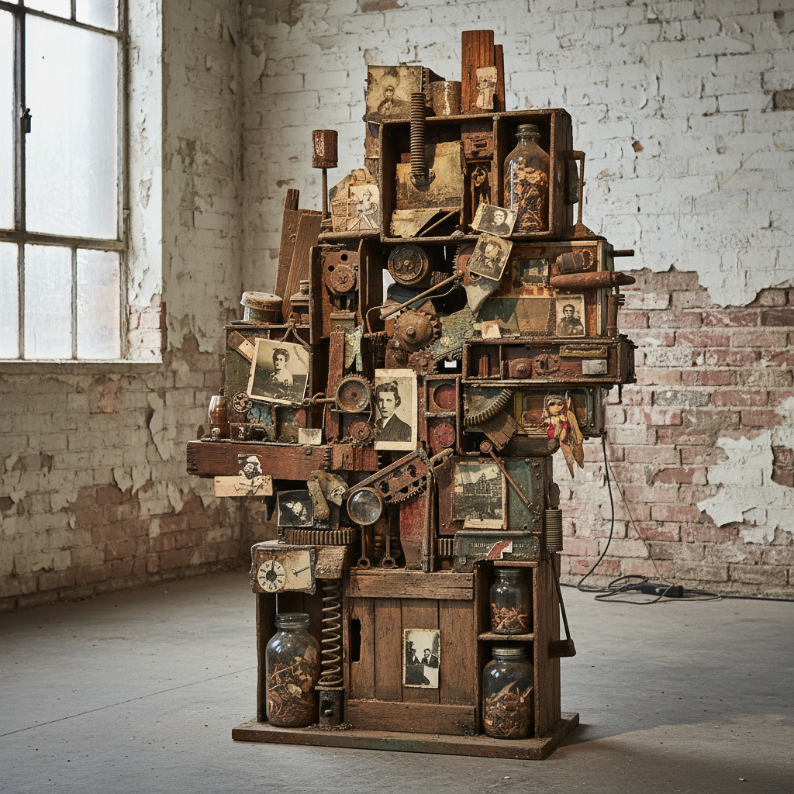

# Assemblage 集合艺术



> **"垃圾是金矿——废弃物的第二次生命，在艺术家手中重生。"**

## 概述

| 维度 | 描述 |
|------|------|
| 时期 | 1950s–至今（根源可追溯至1910s） |
| 别名 | Assemblage, 集合艺术, 综合材料, Found Object Art |
| 核心色彩 | 材料本色——锈铁、旧木、褪色纸张、氧化金属 |
| 关键元素 | 现成品组合、三维拼贴、废弃物再生、材料叙事 |
| 代表人物 | Robert Rauschenberg, Louise Nevelson, Joseph Cornell, Jean Tinguely |
| 关联风格 | Dadaism, Pop Art, Arte Povera, Junk Art, Neo-Dada |

---

## 历史脉络

| 年份 | 事件 |
|------|------|
| 1912 | Picasso第一件拼贴——Assemblage前史 |
| 1913 | Duchamp现成品——"任何东西都可以是艺术" |
| 1930s | Joseph Cornell的盒子——诗意的Assemblage |
| 1950s | Rauschenberg "Combines"——绘画+物品 |
| 1961 | MoMA "The Art of Assemblage"展——正式命名 |
| 1960s | Junk Art、Nouveau Réalisme |
| 2000s | 回收艺术、可持续Assemblage |

### 核心哲学

集合艺术的精神是**"世界充满了被遗忘的物品——艺术家给它们新的意义"**：
- "每个废弃物都有故事——Assemblage是让它们重新说话"
- "不是创造新东西——是重新组合已有的东西"
- "材料的历史痕迹是作品的一部分——锈迹、划痕、褪色"
- "Assemblage是民主的——不需要昂贵材料"
- "三维拼贴——从平面走向空间"

---

## 视觉语法

### 材料系统

```
来源：
  街头 — 废铁、旧木、碎玻璃
  家庭 — 旧照片、玩具、餐具
  工业 — 齿轮、管道、电路板
  自然 — 贝壳、骨头、树枝

技法：
  堆叠 — 垂直积累
  并置 — 不相关物品的碰撞
  封装 — 盒子、框架、容器
  悬挂 — 空间中的漂浮

美学：
  时间痕迹 — 锈蚀、磨损、褪色
  意外之美 — 非预期的和谐
  叙事性 — 物品暗示故事
  质感 — 粗糙、混合、层叠

规则：
  - 使用现成物品（found objects）
  - 保留材料的原始痕迹
  - 三维 > 平面
  - 组合产生新意义
```

---

## 与千禧怀旧/当代的关系

### 可持续设计中的Assemblage精神
- Upcycling = Assemblage的设计版本
- "废弃物不是终点——是新起点"
- 回收材料家具、时尚 = Assemblage美学的商业化

### 数字Assemblage
- 拼贴App、混搭文化 = 数字时代的Assemblage
- Moodboard = 设计师的日常Assemblage
- "互联网本身就是一个巨大的Assemblage"

---

## 设计应用

| 场景 | 应用方式 |
|------|----------|
| 空间 | 回收材料装饰+工业风 |
| 时尚 | Upcycling+混搭+解构 |
| 品牌 | 拼贴视觉+手工感+可持续 |
| 艺术 | 当代雕塑+装置+混合媒介 |

---

## 相关风格

← [Dadaism 达达主义](dadaism.md) | [Pop Art 波普艺术](pop-art.md) →

↑ [返回千禧怀旧目录](README.md) | [返回总目录](../README.md)
