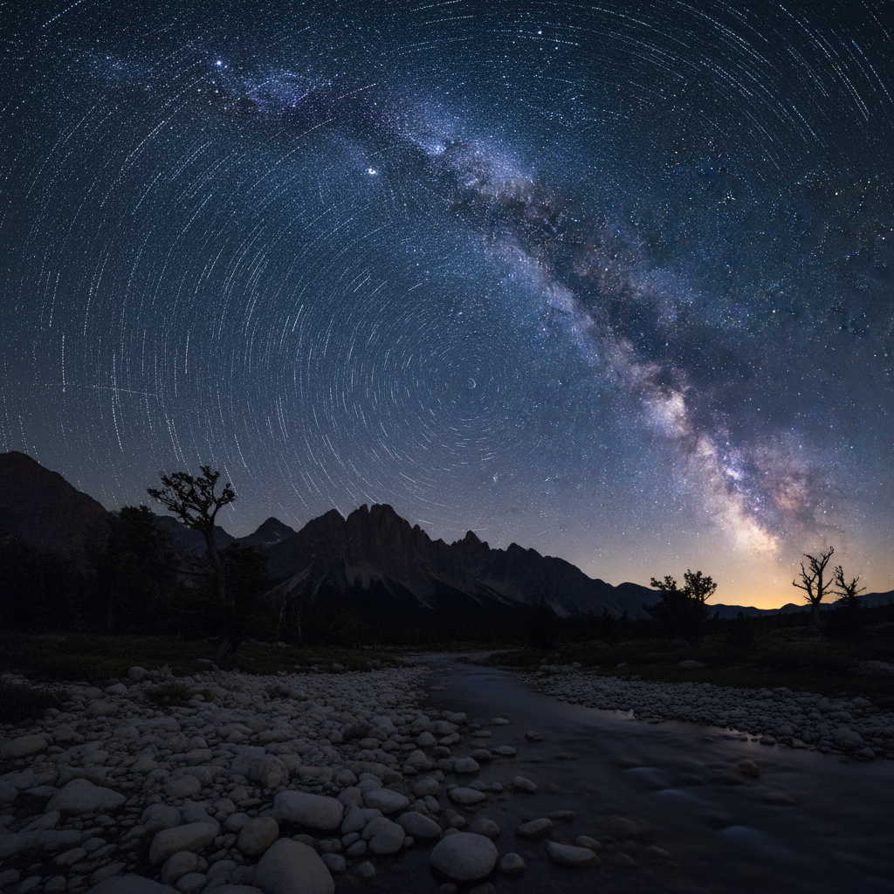

# Astrophotography 天文摄影

> **时期：** 1840年代–至今  
> **关键词：** 深空成像、长曝光、星轨、银河、科学与美学

## 概述

Astrophotography（天文摄影）是捕捉夜空天体的摄影艺术，从1840年代最早的月球照片到当代的深空星云成像。它融合了科学精确性与视觉壮美——通过长时间曝光、叠加处理和精密追踪，揭示人眼不可见的宇宙色彩和结构，将遥远的星系、星云和行星转化为令人敬畏的视觉体验。

## 风格特征

- **长曝光**：数分钟到数小时的累积曝光
- **叠加处理**：多帧合成提升信噪比
- **深空色彩**：星云的红、蓝、绿发射线
- **星轨弧线**：地球自转留下的同心圆弧
- **尺度感**：微小光点背后的宇宙尺度

## 代表人物与作品

- 哈勃太空望远镜团队（深空影像）
- 大卫·马林（天文摄影先驱）
- 林肯·哈里森（星轨摄影）
- 年度天文摄影师大赛获奖作品

## 概念图

