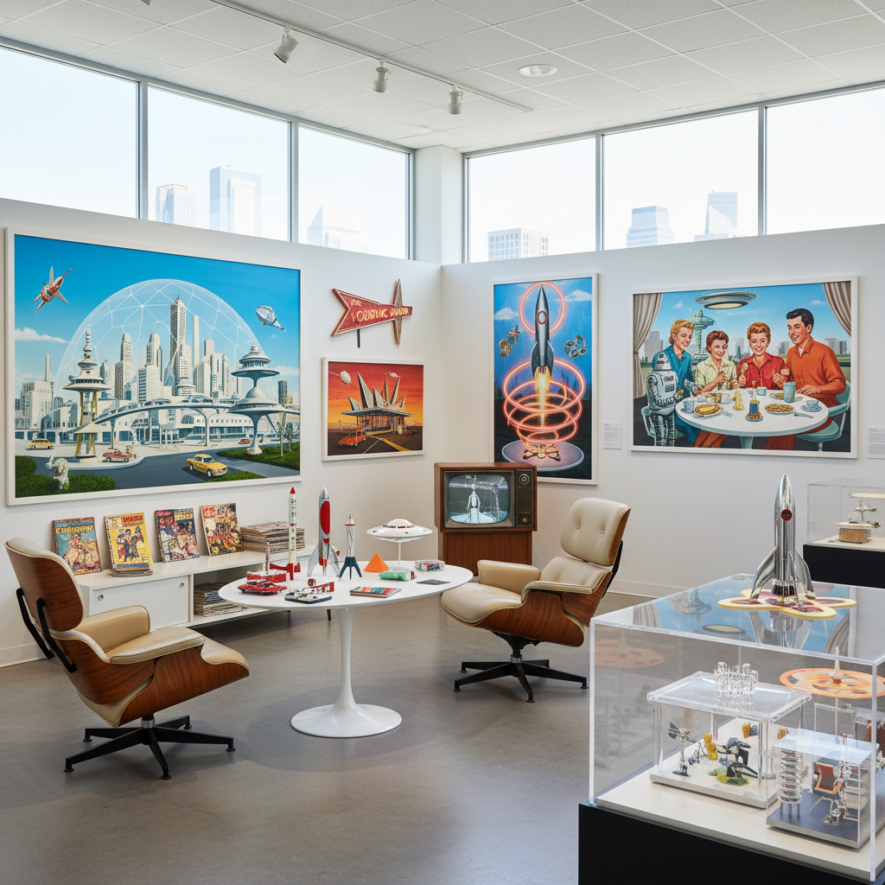

# Atompunk Art 原子朋克艺术

> "Atompunk is the Space Age dream before it soured — the boundless optimism of the 1950s-60s when atoms would power everything, rockets would take us to Mars by Tuesday, and the future was a place of flying cars, robot servants, and gleaming white cities under geodesic domes, a retro-future frozen in the moment before nuclear anxiety replaced nuclear enthusiasm, when tomorrow was always bright and always just around the corner." — Unknown

## 概述

原子朋克（Atompunk）是一种以1945-1969年（原子时代/太空时代）的美学和文化为基础的复古未来主义风格。原子朋克想象的是冷战初期那种对核能和太空探索充满乐观期待的未来——飞行汽车、机器人管家、月球基地、原子能驱动的一切、以及闪亮的白色未来城市。

原子朋克的视觉灵感来源包括：1950-60年代的科幻电影和电视（如《杰森一家》《禁忌星球》）、世界博览会的未来主义展馆、NASA的早期太空计划视觉、查尔斯·伊姆斯（Charles Eames）等设计师的中世纪现代主义家具、以及诺曼·洛克威尔（Norman Rockwell）式的美国乐观主义。原子朋克的色调通常是明亮的——粉彩色、铬银色、原子符号的蓝色光芒。

## 核心特征

| 特征 | 描述 |
|------|------|
| 原子 | 核能的乐观想象 |
| 太空 | 太空探索的热情 |
| 乐观 | 极度乐观的未来 |
| 中世纪现代 | 中世纪现代主义设计 |
| 冷战 | 冷战初期的文化 |
| 科幻 | 1950年代的科幻美学 |

## 视觉特征

- **原子**：原子符号和辐射图案
- **火箭**：尖头火箭和飞碟
- **铬**：铬银色的光泽
- **粉彩**：粉彩色的乐观色调
- **曲线**：有机的曲线造型
- **太空**：太空站和月球基地

## 代表作品

| 作品 | 艺术家 | 年代 | 意义 |
|------|--------|------|------|
| *The Jetsons* | Hanna-Barbera | 1962 | 杰森一家的原子未来 |
| *Fallout series* | Bethesda | 1997起 | 辐射系列的原子朋克 |
| *The Incredibles* | Pixar | 2004 | 超人总动员的美学 |
| *Tomorrowland (Disneyland)* | Disney | 1955 | 迪士尼的明日世界 |
| *Googie architecture* | Various | 1950-60年代 | 太空时代建筑 |

## 历史时间线

| 时期 | 事件 |
|------|------|
| 1945 | 原子时代开始 |
| 1950-60年代 | 太空时代的乐观高峰 |
| 1969 | 阿波罗登月 |
| 1997 | Fallout游戏的原子朋克美学 |
| 当代 | 原子朋克的怀旧复兴 |

## 中国语境

原子朋克在中国有独特的文化回响。中国的1950-60年代也有类似的"原子乐观主义"——"两弹一星"的成就、对科技现代化的热情、以及那个时代的宣传画美学都可以成为"中国原子朋克"的素材。中国1950-60年代的科幻连环画、科普杂志封面和工业宣传画中的未来想象与西方原子朋克有相似的乐观精神。当代中国的一些设计师和艺术家开始探索将中国"大跃进"时代的视觉美学与复古未来主义结合的可能性。

## AI生成概念图

## 与其他风格的关系

- **Dieselpunk** → 柴油朋克
- **Decopunk** → 装饰朋克
- **Retro-Futurism** → 复古未来主义
- **Mid-Century Modern** → 中世纪现代主义
- **Space Age** → 太空时代设计
- **Googie** → 太空时代建筑

---

*浮光艺志 | Chronicle of Artistry*
