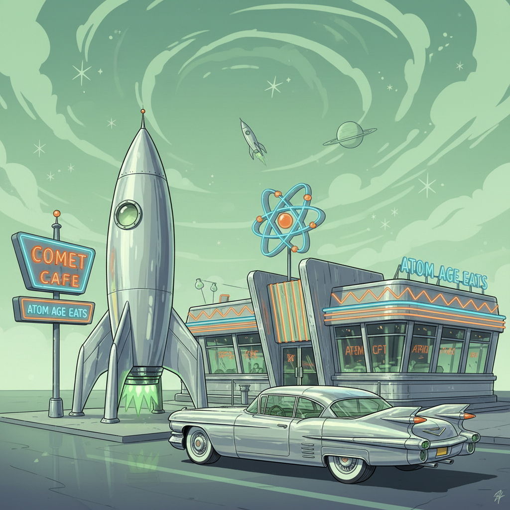

# Atompunk 原子朋克



> **"原子能、太空竞赛、镀铬火箭——1950年代相信的那个闪亮未来。"**

## 概述

| 维度 | 描述 |
|------|------|
| 时期 | 1945–1965（原始时代）/ 2000s 复兴 |
| 别名 | Atompunk, Atomic Age, Raygun Gothic, Googie |
| 核心色彩 | 镀铬银、原子绿、火箭红、天蓝、白色 |
| 关键元素 | 原子符号、火箭、飞碟、镀铬、尾翼汽车 |
| 代表人物 | The Jetsons, Fallout 游戏系列 |
| 关联风格 | Retro-Futurism, Dieselpunk, Mid-Century Modern, Googie |

---

## 历史脉络

| 年份 | 事件 |
|------|------|
| 1945 | 原子弹——"原子时代"开始 |
| 1950s | "原子能将解决一切"——乐观主义巅峰 |
| 1957 | Sputnik 发射——太空竞赛开始 |
| 1962 | 《杰森一家》——原子时代的动画未来 |
| 1997 | 《辐射》游戏——Atompunk 美学复兴 |
| 2015 | 《辐射4》——Atompunk 主流化 |

### 核心哲学

Atompunk 的精神是**"未来是闪亮的——科学将解决一切问题"**：
- 科技 = 救赎（"原子能将给每个家庭免费电力"）
- 未来 = 乐观（没有气候焦虑，只有进步）
- 设计 = 流线型（一切都像火箭）
- 太空 = 下一个前沿
- "到2000年，我们都会有飞行汽车"

---

## 视觉语法

### 色彩系统

```
主色：
  镀铬银 (#C0C0C0) — 金属、未来
  原子绿 (#39FF14) — 辐射、能量
  火箭红 (#CC0000) — 力量、速度
  天蓝 (#87CEEB) — 乐观、天空
  白色 (#FFFFFF) — 纯净、科学

辅色：
  金色 (#FFD700) — 繁荣
  黑色 (#000000) — 太空
  橙色 (#FF6600) — 火焰、推进

质感：
  镀铬 — 反光、光滑
  塑料 — Bakelite、有机形态
  玻璃 — 透明、未来
  金属 — 铝、不锈钢
```

### 标志性元素

| 类别 | 元素 |
|------|------|
| 符号 | 原子模型、辐射标志、火箭、飞碟 |
| 交通 | 尾翼汽车、火箭、飞碟、单轨列车 |
| 建筑 | Googie 风格、太空针塔、圆顶 |
| 家居 | Eames 椅、原子钟、太空灯 |
| 服装 | 太空服、银色面料、泡泡头盔 |
| 态度 | 乐观、进步、科学、繁荣 |

---

## 与千禧怀旧的关系

### 《辐射》系列的文化影响
- Fallout = "如果原子时代的乐观主义遇到核战争"
- 复古未来主义 + 末日 = 独特的美学张力
- "那个闪亮的未来从未到来"
- 怀旧 + 讽刺 = Atompunk 的当代魅力

### 与 Retro-Futurism 的关系
- Retro-Futurism = 更广泛的"过去想象的未来"
- Atompunk = 专指 1945-1965 的原子时代
- Dieselpunk = 1920s-1940s
- Cassette Futurism = 1970s-1980s

---

## 中国语境

- 中国"两弹一星"时代的视觉记忆
- 1950-60s 中国宣传画中的科技乐观主义
- 与中国"复古未来"设计的交叉
- 中国太空计划的当代视觉

---

## 设计应用

| 场景 | 应用方式 |
|------|----------|
| 游戏 | 复古未来+原子时代+末日+讽刺 |
| 品牌 | 镀铬+流线型+乐观+复古 |
| 空间 | Mid-Century+原子装饰+Googie |
| 时尚 | 银色+太空+流线型+复古未来 |

---

## 相关风格

← [Dieselpunk 柴油朋克](dieselpunk.md) | [Retro-Futurism 复古未来](retro-futurism.md) →

↑ [返回千禧怀旧目录](README.md) | [返回总目录](../README.md)
