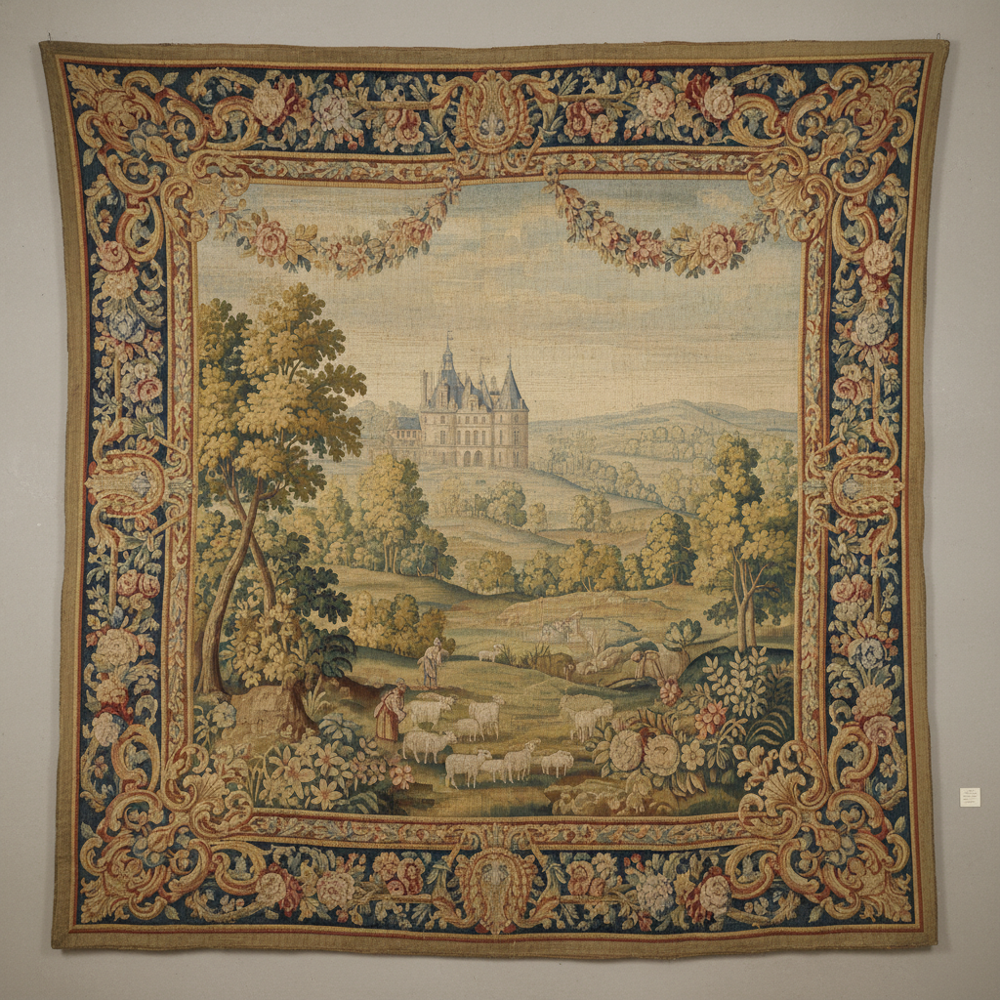

# Aubusson Art 奥比松挂毯艺术

> "Aubusson is painting woven in wool — for five centuries the looms of this small French town have translated the designs of painters into tapestries of extraordinary subtlety, their flat-woven surfaces rendering landscapes, mythologies, and decorative fantasies in a palette of hundreds of dyed yarns that blend optically like the pointillist dots of a Seurat painting." — Unknown

## 概述

奥比松挂毯艺术（Aubusson Art）是法国中部克勒兹省奥比松镇（Aubusson）五百多年来的挂毯织造传统——以其精美的平织技法、丰富的色彩和多样的题材著称。奥比松挂毯于2009年被联合国教科文组织列入人类非物质文化遗产代表作名录，是法国最重要的织物艺术传统之一。

奥比松挂毯艺术的实践包括：1）设计（carton）——画家创作全尺寸设计稿；2）染色——用天然或合成染料染制毛线；3）低经织造——在水平织机上进行低经织造；4）色彩混合——通过不同颜色纱线的并列实现光学混色；5）修复——古老挂毯的修复和保护；6）当代合作——与当代艺术家合作创作新挂毯；7）地毯——奥比松风格的地毯织造。

## 核心特征

| 特征 | 描述 |
|------|------|
| 平织 | 平织（低经）技法 |
| 色彩 | 数百种色彩的纱线 |
| 传统 | 五百年的传统 |
| 合作 | 画家与织工的合作 |
| 非遗 | 联合国非遗 |
| 法国 | 法国克勒兹省 |

## 视觉特征

- **细腻**：细腻的色彩过渡
- **平面**：平织的平面质感
- **丰富**：丰富的色彩层次
- **叙事**：叙事性的画面
- **装饰**：高度装饰性
- **柔和**：柔和的整体色调

## 代表作品

| 作品 | 艺术家/文化 | 年代 | 意义 |
|------|-------------|------|------|
| *Aubusson verdures* | 法国 | 17-18世纪 | 奥比松绿荫挂毯 |
| *Jean Lurçat tapestries* | 法国 | 20世纪 | 让·吕尔萨挂毯 |
| *Le Chant du Monde* | 让·吕尔萨 | 1957-66年 | 《世界之歌》 |
| *Contemporary Aubusson* | 法国 | 当代 | 当代奥比松挂毯 |
| *Cité internationale de la tapisserie* | 法国 | 2016年 | 国际挂毯城 |

## 历史时间线

| 时期 | 事件 |
|------|------|
| 15世纪 | 奥比松织造的开始 |
| 17世纪 | 获得皇家制造厂地位 |
| 18世纪 | 奥比松挂毯的黄金时代 |
| 20世纪 | 让·吕尔萨的现代复兴 |
| 2009年 | 列入联合国非遗名录 |

## 中国语境

奥比松挂毯与中国的传统织物艺术有一定的可比性。中国的缂丝——精细的丝织品与奥比松挂毯有相似的织造理念。中国的壁毯——在新疆等地有丰富的挂毯织造传统。中国当代的纤维艺术——有一些艺术家学习和借鉴奥比松的织造技法。中国的工艺美术教育中，奥比松挂毯作为欧洲织物艺术的代表——在相关课程中介绍。中国的室内设计中，奥比松风格的挂毯和地毯——在一些高端空间中使用。中国与法国的文化交流中，挂毯艺术——是重要的交流领域。

## AI生成概念图

## 与其他风格的关系

- **Gobelins** → 戈布兰挂毯
- **Verdure Tapestry** → 绿荫挂毯
- **Tapestry Weaving** → 挂毯织造
- **Textile Art** → 纺织艺术
- **French Decorative Arts** → 法国装饰艺术
- **Fiber Art** → 纤维艺术

---

*浮光艺志 | Chronicle of Artistry*
