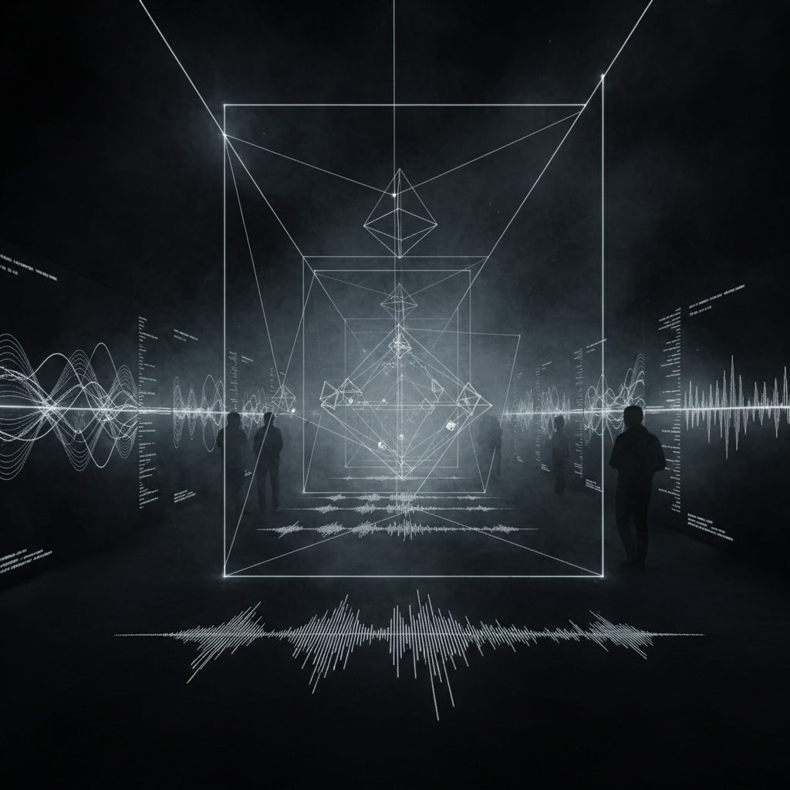

# Audiovisual Art 视听艺术

> **时期：** 1960年代–至今  
> **关键词：** 声画同步、沉浸式体验、实时生成、通感、光与声的对话

## 概述

视听艺术（Audiovisual Art / AV Art）探索声音与视觉之间的深层对应关系——不是简单的"配乐+画面"，而是声音和图像从同一数据源或同一算法中同时生成，彼此不可分割。从早期的视觉音乐（Visual Music）到当代的实时生成AV表演，这种艺术形式追求一种跨感官的"通感"体验。

## 风格特征

- **声画同步**：声音参数直接驱动视觉变化
- **实时生成**：现场演出中即时创造声画
- **沉浸式**：包围观众的多通道投影和环绕声
- **抽象性**：几何形态和纯色彩的运动
- **数据驱动**：同一数据集同时映射为声音和图像

## 代表人物与作品

- Ryoji Ikeda《datamatics》
- Carsten Nicolai/Alva Noto 声音可视化
- Robert Henke/Monolake 激光表演
- Amon Tobin ISAM 立体投影

## 概念图

