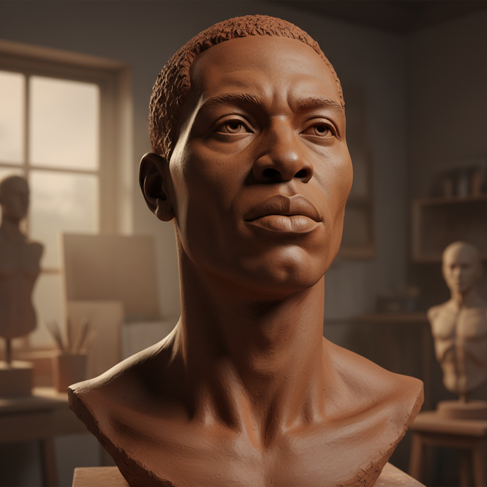

# Augusta Savage 奥古斯塔·萨维奇

> **时期：** 1892–1962  
> **关键词：** 哈莱姆文艺复兴雕塑、黑人面容尊严、艺术教育、社区赋权

## 概述

Augusta Savage 是哈莱姆文艺复兴时期最重要的雕塑家之一，以捕捉非裔美国人面容的尊严和内在生命而闻名。由于种族歧视和经济困难，她的大部分作品未能保存，但她作为教育者培养了Jacob Lawrence、Norman Lewis等下一代艺术家，其影响远超现存作品。

## 风格特征

- **肖像雕塑的心理深度**：每件肖像都捕捉到人物的内在精神状态
- **古典技法与现代感性**：学院派的技术功底服务于现代的种族意识
- **黏土的直接性**：偏好黏土和石膏的直接塑造，保持即兴的生命力
- **纪念碑性构思**：即使小型作品也具有放大为纪念碑的潜力
- **社区导向**：作品面向普通黑人社区，而非精英收藏家

## 代表作品

- *Gamin*（1929）
- *The Harp / Lift Every Voice and Sing*（1939）
- *Realization*（1938）
- *Head of a Woman*（约1930s）

## 历史意义

Savage 是哈莱姆文艺复兴的核心组织者和教育者，她创办的Savage Studio of Arts and Crafts培养了整整一代非裔美国艺术家。她为1939年纽约世博会创作的《竖琴》是当时最大的非裔美国人委托公共雕塑。

## 概念图

