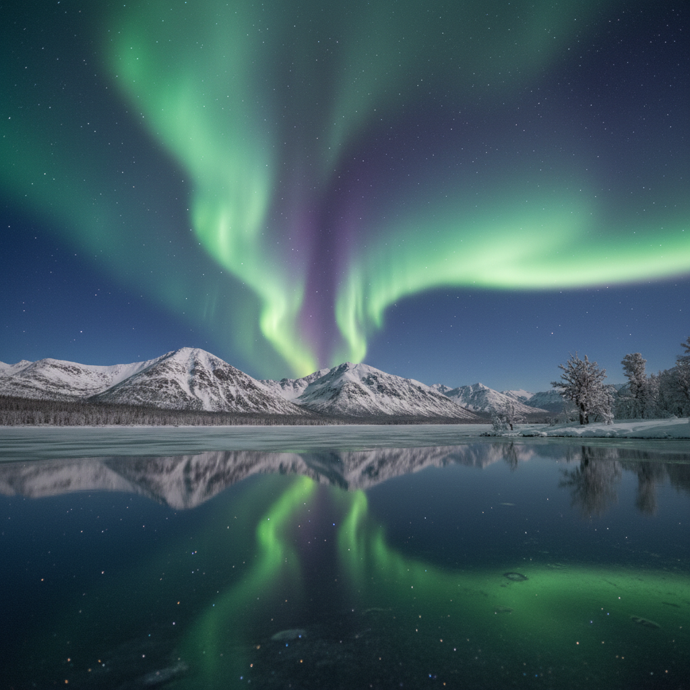
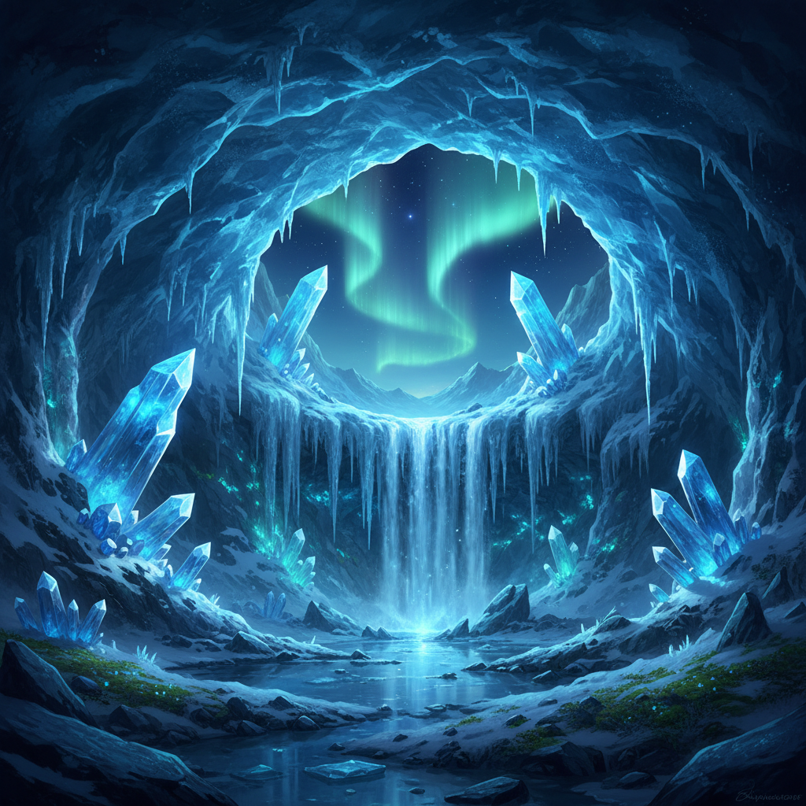

# Auroracore 极光核





> **"北极光的色彩、冰晶的质感和永恒冬夜的宁静——一种来自极地的超自然美学。"**

## 概述

| 维度 | 描述 |
|------|------|
| 时期 | 2021–至今 |
| 别名 | Auroracore, Northern Lights Aesthetic, Arctic Aesthetic |
| 核心色彩 | 极光绿、极光紫、冰蓝、深夜蓝、星光白 |
| 关键元素 | 北极光、冰晶、星空、雪原、极地动物 |
| 代表人物 | 冰岛音乐(Björk, Sigur Rós)、北欧设计 |
| 关联风格 | Vaporwave (色彩), Dreamcore (超现实), Witchcore (神秘) |

---

## 历史脉络

### 2021：Pinterest/Tumblr 的极地幻想

Auroracore 在 2021 年左右作为一种视觉美学标签出现，是对**极地自然现象的美学化**：

- 北极光的渐变色彩成为设计灵感
- 冰岛/挪威/芬兰旅行内容的视觉影响
- 与"冷色调"美学趋势的交汇
- Björk 和 Sigur Rós 的音乐视觉世界

### 文化基因

| 来源 | 贡献 |
|------|------|
| 北极光自然现象 | 绿-紫-蓝的渐变色彩 |
| 北欧神话 | 彩虹桥(Bifröst)、极地精灵 |
| 冰岛音乐 | Sigur Rós 的空灵音景 |
| 北欧设计 | 极简+自然材质+冷色调 |
| 科幻美学 | 外星球表面、冰冻星球 |

### 核心吸引力

Auroracore 的吸引力在于它代表了一种**超越人类尺度的美**：
- 北极光是人类无法控制的自然奇观
- 极地景观是"人类缺席"的空间
- 冰晶的几何完美是自然的数学
- 这种美学提供了一种"渺小感"的安慰

---

## 视觉语法

### 色彩系统

```
主色（全部取自极光和极地）：
  极光绿 (#00FF7F) — 最常见的极光色
  极光紫 (#9400D3) — 高能极光
  冰蓝 (#B0E0E6) — 冰川、冰晶
  深夜蓝 (#191970) — 极地夜空
  星光白 (#F8F8FF) — 雪、星星

辅色：
  极光粉 (#FF69B4) — 罕见的粉色极光
  冰川灰 (#708090) — 岩石、冰碛
  金色 (#FFD700) — 日出/日落时的极光

质感：
  透明/半透明 — 冰、极光
  闪烁/流动 — 极光的运动
  结晶 — 冰晶、雪花
  光滑 — 冰面
  深邃 — 夜空
```

### 标志性元素

| 类别 | 元素 |
|------|------|
| 天象 | 北极光、星空、银河、流星 |
| 地貌 | 冰川、雪原、冻湖、冰洞 |
| 生物 | 北极狐、驯鹿、鲸鱼、海豹 |
| 植物 | 苔原苔藓、冰花、霜冻树枝 |
| 建筑 | 玻璃穹顶小屋、冰屋、北欧木屋 |
| 材质 | 冰晶、雪花、霜、极光光幕 |

---

## 与千禧怀旧的关系

### 数字时代的自然崇拜
- 在屏幕前生活的人们，通过极光图片/视频获得"自然连接"
- 北极光成为"bucket list"体验——一种消费主义化的自然崇拜
- 与 Cottagecore 共享"逃离数字世界"的冲动，但方向不同：
  - Cottagecore → 逃向温暖的田园
  - Auroracore → 逃向冷寂的极地

### 色彩与 Vaporwave 的交叉
- Vaporwave 的粉-紫-蓝渐变 ≈ 极光的绿-紫-蓝渐变
- 两者都使用"不自然的"渐变色彩
- 但情绪完全不同：Vaporwave = 人工/消费；Auroracore = 自然/宁静

---

## 中国语境

- 漠河/呼伦贝尔极光旅行热潮
- 小红书上的"极光色"妆容/穿搭
- 冰雪旅游（哈尔滨冰雪大世界）的视觉美学
- 与"仙侠"美学中冰雪场景的交叉
- 极光色渐变在UI/品牌设计中的流行

---

## 设计应用

| 场景 | 应用方式 |
|------|----------|
| 品牌设计 | 极光渐变+深色背景+细线条字体 |
| 包装 | 全息/极光色材质+深蓝底色 |
| 空间 | 冷色调照明+透明材质+极简 |
| UI | 深色模式+极光渐变+微动效 |

---

## 延伸阅读

- Aesthetics Wiki: [Auroracore](https://aesthetics.fandom.com/wiki/Auroracore)
- 北极光的物理学与美学
- 北欧设计与极地美学的关系

---

## 相关风格

← [Dreamcore 梦核](dreamcore-weirdcore.md) | [Vaporwave 蒸汽波](vaporwave.md) →

↑ [返回千禧怀旧目录](README.md) | [返回总目录](../README.md)
