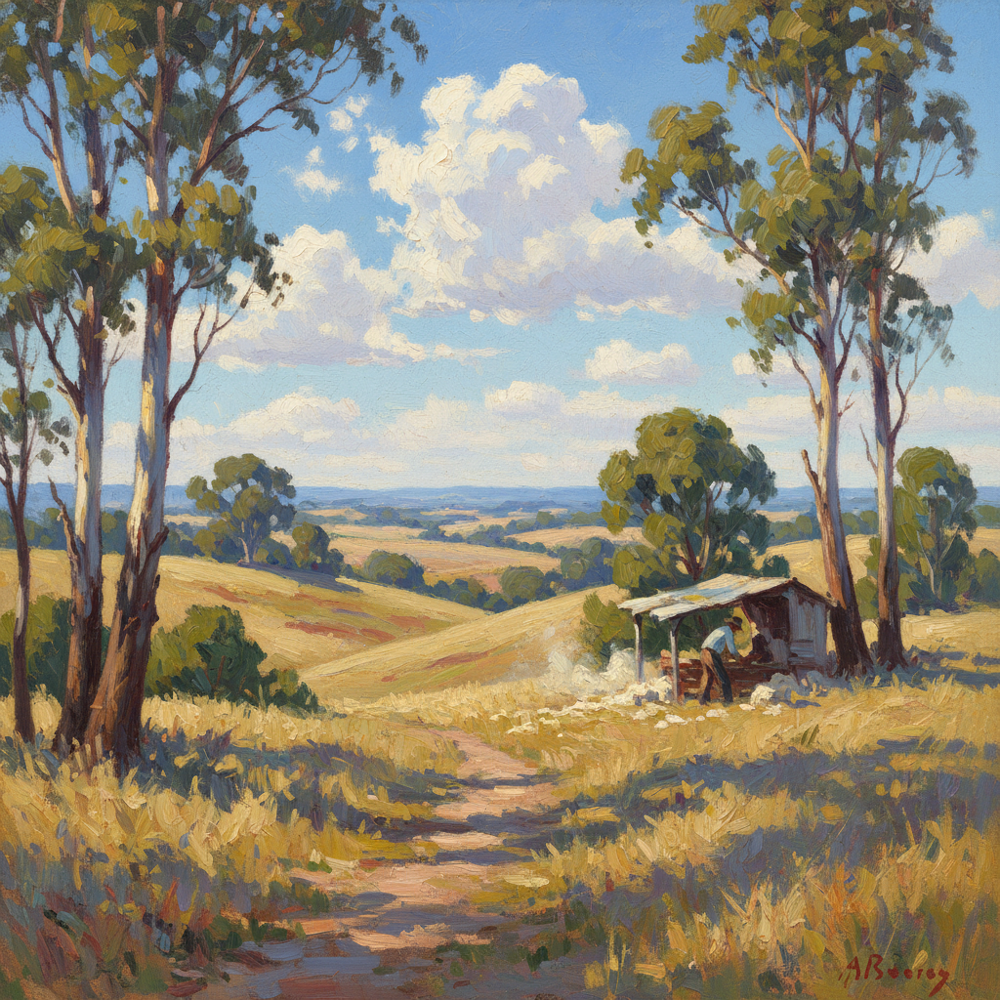

# Australian Impressionism 澳大利亚印象派（海德堡画派）

> "The bush has never yet been painted." — Tom Roberts

## 概述

澳大利亚印象派（Australian Impressionism），又称海德堡画派（Heidelberg School），是1880年代末至1900年代初在墨尔本周边发展起来的澳大利亚本土艺术运动。画家们将法国印象派的外光写生技法带到澳大利亚独特的阳光和灌木丛（bush）环境中，创造了第一个真正的澳大利亚民族艺术风格。

这一运动恰逢澳大利亚联邦成立（1901年），画家们对澳大利亚风景和劳动者的描绘成为新生国家认同的视觉基础。

## 核心特征

| 特征 | 描述 |
|------|------|
| 澳洲光线 | 表现南半球独特的强烈、刺眼阳光 |
| 灌木丛风景 | 桉树林、金色草地、蓝色远山 |
| 外光写生 | 在户外直接完成作品 |
| 民族认同 | 描绘澳大利亚劳动者和拓荒生活 |
| 印象派技法 | 可见笔触、光色分析、瞬间捕捉 |
| 9×5 英寸 | 标志性的小尺幅雪茄盒盖画 |

## 视觉特征

- **光线**：强烈的澳洲阳光，高对比度
- **色调**：金色、赭石、蓝灰色的澳洲色彩
- **天空**：广阔的蓝天，白色积云
- **植被**：银绿色桉树叶、金色干草
- **人物**：剪羊毛工、牧民、拓荒者
- **笔触**：快速的印象派笔触，捕捉光线变化

## 代表人物

| 画家 | 代表作 | 特点 |
|------|--------|------|
| Tom Roberts | *Shearing the Rams* (1890) | 澳洲劳动者的史诗 |
| Arthur Streeton | *Golden Summer, Eaglemont* (1889) | 金色澳洲风景 |
| Frederick McCubbin | *The Pioneer* (1904) | 拓荒叙事三联画 |
| Charles Conder | *Departure of the Orient* (1888) | 城市印象派 |
| Clara Southern | 乡村风景 | 女性画家代表 |

## 历史背景

1. **1885年**：Roberts 从欧洲归来，带回印象派技法
2. **1888-89年**：画家们在海德堡和 Box Hill 露营写生
3. **1889年**："9×5 印象展"在墨尔本举办，引发争议
4. **1890年代**：运动鼎盛期，创作大量标志性作品
5. **1901年**：澳大利亚联邦成立，画派作品成为国家象征

## 与其他风格的关系

- **Impressionism** → 直接继承法国印象派技法
- **Plein Air** → 外光写生的澳洲实践
- **Barbizon School** → 对乡村生活的关注
- **Newlyn School** → 同为英语世界的外光画运动
- **Social Realism** → 对劳动者生活的描绘

## 概念图

---

*浮光艺志 | Chronicle of Artistry*
