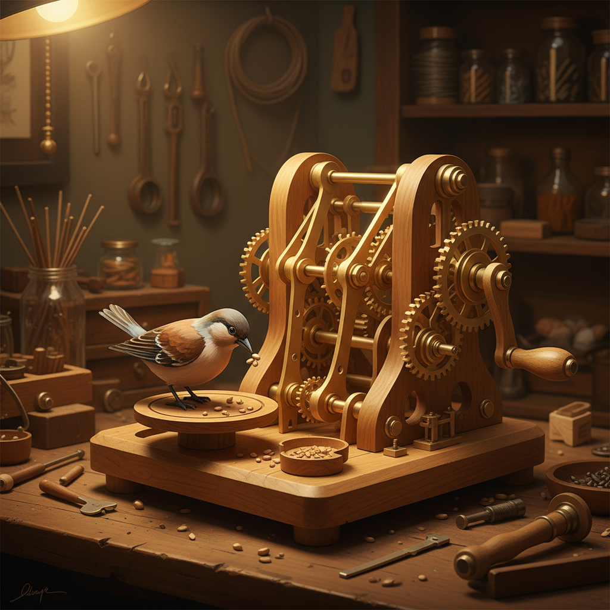

# Automata Art 自动机艺术

> "An automaton is a poem written in metal and wood." — Pierre Jaquet-Droz

## 概述

自动机艺术（Automata Art）是创造能够自主运动的机械装置的艺术形式。从古希腊的机械鸟到18世纪的精密钟表人偶，从维多利亚时代的机械玩具到当代的动力雕塑，自动机艺术融合了工程精密性和艺术想象力。

自动机的魅力在于它赋予无生命的材料以生命的幻觉——齿轮和凸轮的精确配合创造出流畅的、仿佛有灵魂的运动。

## 核心特征

| 特征 | 描述 |
|------|------|
| 自主运动 | 装置能够自主运动 |
| 机械驱动 | 通常由齿轮、凸轮等机械驱动 |
| 精密性 | 需要极高的机械精度 |
| 叙事性 | 运动讲述一个故事或场景 |
| 惊奇感 | 创造惊奇和愉悦 |
| 跨学科 | 融合工程、艺术和表演 |

## 视觉特征

- **运动**：流畅的、有节奏的机械运动
- **材料**：木头、金属、纸板
- **机构**：可见或隐藏的齿轮和连杆
- **人偶**：模仿人或动物的运动
- **循环**：重复的、循环的动作
- **手工**：精细的手工制作

## 代表作品

| 作品 | 创作者 | 年代 | 意义 |
|------|--------|------|------|
| *The Writer* | Jaquet-Droz | 1774 | 能写字的机械人偶——AI的先驱 |
| *Silver Swan* | James Cox | 1773 | 能"吃鱼"的银天鹅 |
| *Cabaret Mechanical Theatre* | 多位艺术家 | 1979+ | 当代自动机艺术的中心 |
| *Kinetic sculptures* | Theo Jansen | 1990s+ | 风力驱动的海滩生物 |
| *Automata* | Keith Newstead | 1980s+ | 幽默的手摇自动机 |
| *Marble machines* | Wintergatan | 2016 | 弹珠音乐机器 |

## 历史时间线

| 时期 | 事件 |
|------|------|
| 古希腊 | 希罗的机械装置 |
| 中世纪 | 伊斯兰世界的精密自动机 |
| 18世纪 | Jaquet-Droz——钟表自动机的巅峰 |
| 19世纪 | 维多利亚时代的机械玩具 |
| 1979 | Cabaret Mechanical Theatre成立 |
| 1990s | Theo Jansen的Strandbeest |
| 2010s-至今 | 当代动力雕塑和弹珠机器 |

## 中国语境

中国古代有丰富的自动机传统——从诸葛亮的"木牛流马"传说到宋代的水运仪象台，从清代宫廷的西洋钟表到当代的机械艺术。中国的传统木工和机械技术为自动机提供了基础。当代中国的创客文化和STEAM教育推动了自动机艺术的普及。

## AI生成概念图

## 与其他风格的关系

- **Kinetic Art** → 动态艺术是自动机的当代形式
- **Robotic Art** → 机器人艺术是自动机的电子化延伸
- **Sculpture** → 自动机是会动的雕塑
- **Clockwork** → 钟表技术是自动机的基础
- **Steampunk** → 蒸汽朋克美学借鉴自动机
- **Toy Art** → 机械玩具是自动机的大众形式

---

*浮光艺志 | Chronicle of Artistry*
