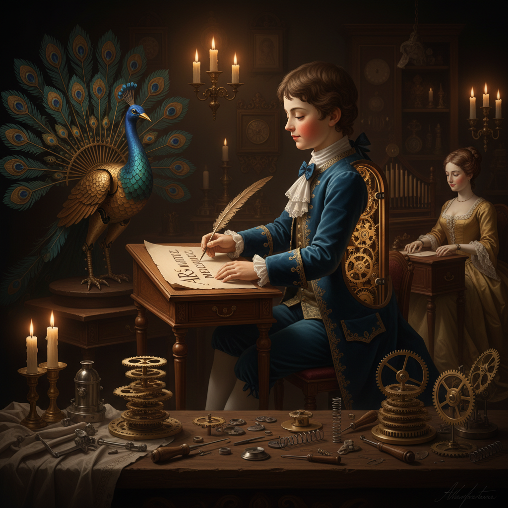

# Automaton Art 自动机艺术

> "An automaton is a mechanical dream made real — gears and cams and springs conspiring to simulate life itself. Before electricity, before computers, before robots, craftsmen built figures that could write, draw, play music, and even seem to think. Each automaton is a philosophical argument in brass and steel: that life might be mechanism, that beauty can be engineered, that the boundary between the living and the made is thinner than we imagine." — Unknown

## 概述

自动机艺术（Automaton Art）是设计和制造能够自主运动的机械装置的艺术形式——通过精密的齿轮、凸轮、弹簧和连杆机构，创造出能模拟生命动作的机械人偶、动物和场景。自动机艺术是机械工程、雕塑和表演艺术的完美结合。

自动机艺术的实践包括：1）书写自动机——能够书写文字的机械人偶；2）音乐自动机——能演奏乐器的机械装置；3）动物自动机——模拟动物动作的机械造型；4）场景自动机——展示完整场景的机械装置；5）当代动力雕塑——受自动机启发的当代艺术；6）木制自动机——用木材制作的手摇自动机；7）钟表自动机——与钟表结合的自动机械装置。

## 核心特征

| 特征 | 描述 |
|------|------|
| 机械 | 纯机械驱动 |
| 模拟 | 模拟生命动作 |
| 精密 | 极其精密的工艺 |
| 自主 | 自主运动 |
| 叙事 | 讲述故事或场景 |
| 惊奇 | 令人惊奇的效果 |

## 视觉特征

- **金属**：黄铜、钢铁的光泽
- **齿轮**：可见的齿轮机构
- **人偶**：精致的人偶造型
- **运动**：流畅的机械运动
- **细节**：极其精细的细节
- **古典**：古典的美学风格

## 代表作品

| 作品 | 艺术家 | 年代 | 意义 |
|------|--------|------|------|
| *The Writer* | Jaquet-Droz | 1774 | 能书写的自动机 |
| *The Musician* | Jaquet-Droz | 1774 | 能弹琴的自动机 |
| *Silver Swan* | James Cox | 1773 | 银天鹅自动机 |
| *Maillardet's Automaton* | Henri Maillardet | 1800 | 能绘画的自动机 |
| *Contemporary automata* | Cabaret Mechanical Theatre | 当代 | 当代木制自动机 |

## 历史时间线

| 时期 | 事件 |
|------|------|
| 古希腊 | 希罗的自动装置 |
| 中世纪 | 伊斯兰世界的自动机 |
| 18世纪 | 欧洲自动机的黄金时代 |
| 19世纪 | 工业化的自动机玩具 |
| 当代 | 当代动力雕塑和木制自动机 |

## 中国语境

自动机艺术在中国有悠久的历史。中国古代的机械发明令人惊叹——《列子》记载的偃师造人、诸葛亮的木牛流马、张衡的地动仪和浑天仪、苏颂的水运仪象台，都展示了中国古代精密机械的高超水平。中国古代的"自动"装置包括：能自动报时的水钟、能自动演奏的机械乐器、以及各种巧妙的机关装置。中国当代的一些艺术家和工匠在复兴和创新自动机艺术——将中国传统的机械智慧与当代艺术结合。中国的一些博物馆收藏有珍贵的欧洲古董自动机。中国的木工和金属工艺传统也为当代自动机创作提供了技术基础。

## AI生成概念图

## 与其他风格的关系

- **Clockwork Art** → 钟表艺术
- **Kinetic Art** → 动态艺术
- **Mechanical Art** → 机械艺术
- **Sculpture** → 雕塑
- **Robotics Art** → 机器人艺术
- **Steampunk** → 蒸汽朋克

---

*浮光艺志 | Chronicle of Artistry*
