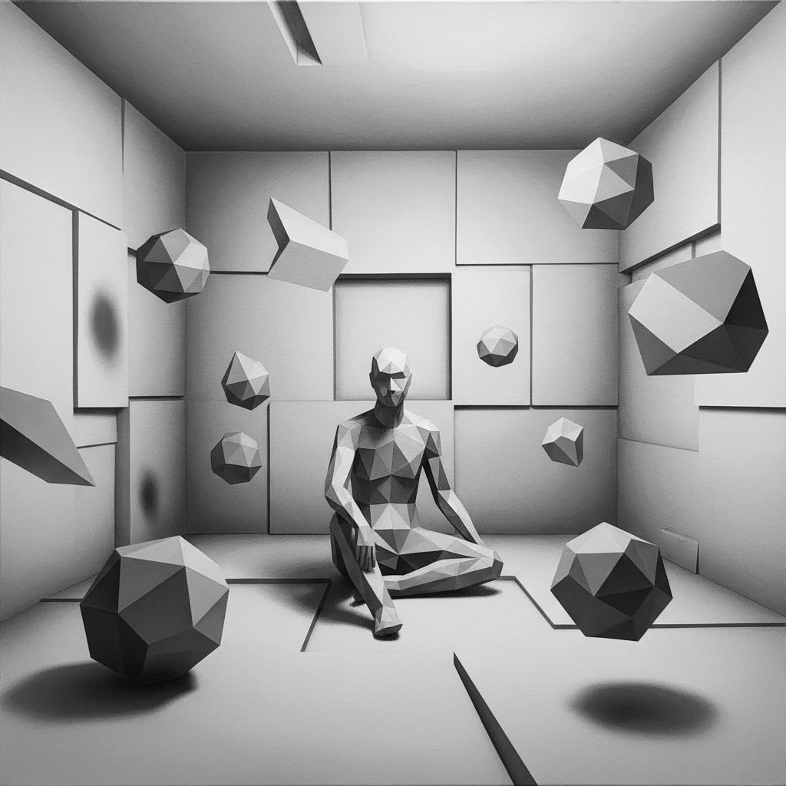

# Avery Singer 艾弗里·辛格

> **时期：** 1987–至今  
> **关键词：** 3D建模绘画、喷枪灰度、数字与手工混合、后网络艺术

## 概述

Avery Singer 是美国当代画家，以将3D建模软件（SketchUp）生成的构图转化为喷枪灰度绘画的独特方法闻名。她的作品模糊了数字渲染与手工绘画的界限，用看似机械的灰色调描绘艺术世界的社交场景和日常生活。

## 风格特征

- **3D建模起点**：使用SketchUp等软件构建场景，再投影到画布上
- **喷枪技法**：以喷枪而非画笔上色，表面均匀无笔触，如同打印输出
- **灰度为主**：早期作品几乎全为黑白灰，近期引入有限色彩
- **几何化空间**：人物和环境呈现低多边形的数字建模质感
- **元叙事**：画面常描绘艺术家工作室、画廊开幕等艺术世界内部场景

## 代表作品

- *Happening*（2014）
- *Studio*（2014）
- *Sculptor*（2015）
- *The Year Ahead*（2018）

## 历史意义

Singer 代表了"后网络"一代画家对绘画媒介的重新定义——绘画不再是手眼协调的产物，而是数字工作流的物理输出。她的方法论挑战了"什么算绘画"的根本问题。

## 概念图

