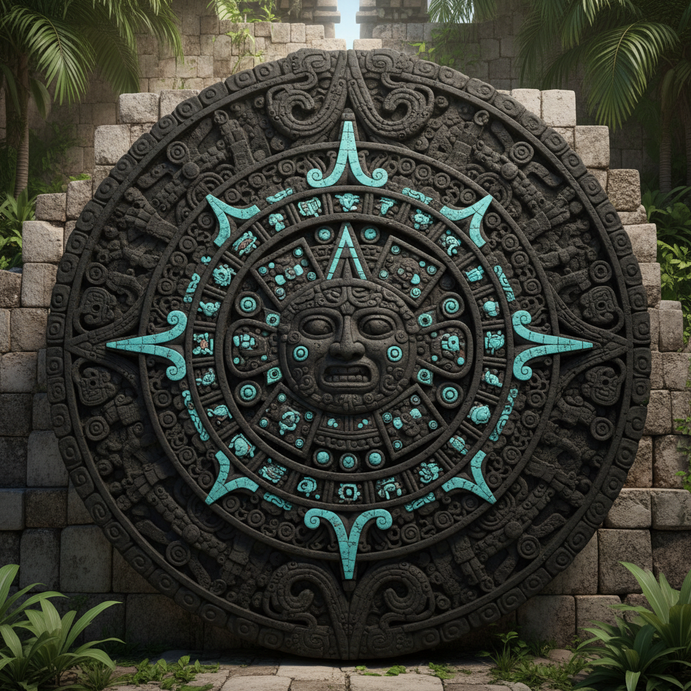

# 阿兹特克艺术 · Aztec Art

> "太阳石上刻着五个纪元的记忆，每一圈都是一个世界的终结与重生。" —— 阿兹特克神话

## 概述

阿兹特克艺术（Aztec Art）是14世纪至16世纪墨西哥中部阿兹特克帝国（墨西加人）发展出的宏伟视觉艺术体系。以特诺奇蒂特兰（今墨西哥城）为中心，阿兹特克艺术融合了中美洲数千年的文明传统——奥尔梅克、特奥蒂瓦坎、托尔特克——并将其推向帝国规模的纪念碑性表达。巨型石雕、彩色壁画、羽毛镶嵌、金银工艺和抄本绘画构成了一个服务于宗教仪式和帝国权力的完整视觉宇宙。

## 核心特征

| 特征 | 描述 |
|------|------|
| 时期 | 约1325年–1521年 |
| 地域 | 墨西哥中部（墨西哥谷地） |
| 媒介 | 石雕、壁画、羽毛工艺、金银、陶器、抄本 |
| 核心理念 | 以视觉艺术维系宇宙秩序与帝国权威 |
| 色彩 | 绿松石蓝、血红、黑曜石黑、金色、翠绿 |

## 视觉特征

- **纪念碑石雕**：巨型圆形或方形石刻，如太阳石
- **几何化人形**：神灵和人物的高度程式化表现
- **宇宙图式**：四方位、五太阳等宇宙观的视觉编码
- **羽毛镶嵌**：以珍贵鸟羽（格查尔鸟）制作的华丽装饰
- **抄本绘画**：折叠式树皮纸上的象形文字和图像叙事

## 代表作品

| 作品 | 年代 | 类型 | 说明 |
|------|------|------|------|
| 太阳石（阿兹特克历法石） | 约1479 | 石雕 | 直径3.6米的宇宙图 |
| 科亚特利库埃女神像 | 约1500 | 石雕 | 高2.5米的大地女神 |
| 蒙特祖马羽冠 | 约1500 | 羽毛工艺 | 格查尔鸟羽制作 |
| 特诺奇蒂特兰大神庙浮雕 | 14-16世纪 | 建筑浮雕 | 神庙装饰 |
| 博尔博尼库斯抄本 | 约1500 | 抄本绘画 | 仪式历法 |

## 发展时间线

| 时期 | 事件 |
|------|------|
| 1325 | 特诺奇蒂特兰建城 |
| 1428 | 三城同盟建立，阿兹特克帝国扩张 |
| 1440-1469 | 蒙特祖马一世时期，大规模建筑和雕刻 |
| 1479 | 太阳石雕刻完成 |
| 1487 | 大神庙扩建完成，大规模献祭仪式 |
| 1502-1520 | 蒙特祖马二世时期，帝国艺术巅峰 |
| 1521 | 西班牙征服，阿兹特克文明终结 |
| 当代 | 阿兹特克视觉遗产在墨西哥当代艺术中复兴 |

## 中国语境

阿兹特克艺术与中国古代艺术有令人惊叹的平行性。两者都发展出了以玉石为最高贵材料的传统（阿兹特克的绿松石/翡翠与中国的和田玉）；都有精密的历法系统和宇宙图式的视觉表达；都以纪念碑性石雕彰显权力。中国商周青铜器的饕餮纹与阿兹特克石雕的神灵面具在"威慑性装饰"的功能上异曲同工。当代中墨文化交流中，两国古代文明的视觉对话是重要议题。

## AI 概念图

*AI 生成概念图：阿兹特克艺术风格*

## 关联词条

- [[persian-miniature-art]] - 波斯细密画
- [[celtic-art]] - 凯尔特艺术
- [[maori-art]] - 毛利艺术

---

*浮光艺志 · Chronicle of Artistry*
