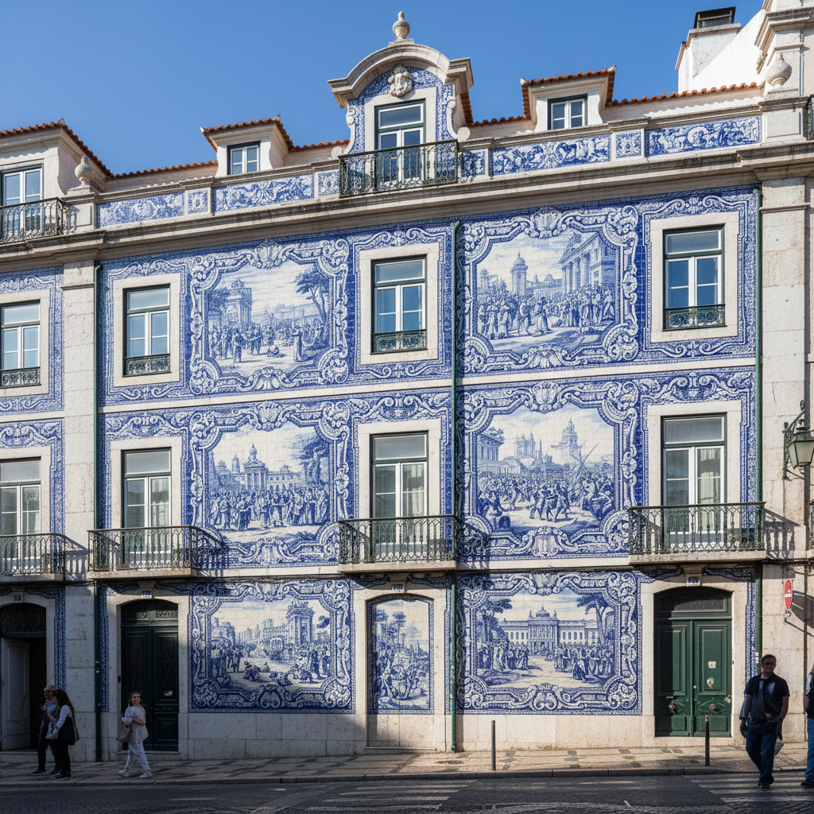

# Azulejo 阿苏莱霍瓷砖 | Azulejo Português

> **"蓝与白铺满整座城市——里斯本的墙壁是一本打开的书。"**

## 概述

阿苏莱霍（Azulejo）是伊比利亚半岛（葡萄牙和西班牙）的传统彩绘瓷砖艺术，源自阿拉伯语"az-zulayj"（抛光的小石头）。这种装饰瓷砖艺术在葡萄牙发展到极致——从15世纪摩尔人引入，到18世纪成为葡萄牙国家视觉身份的核心。里斯本的教堂、宫殿、车站甚至普通住宅的外墙都覆盖着精美的蓝白瓷砖画，讲述着宗教故事、历史事件和日常生活。

## 历史发展

| 时期 | 特征 |
|------|------|
| 15世纪 | 摩尔几何图案引入伊比利亚 |
| 16世纪 | 意大利马约利卡技法影响，彩色叙事 |
| 17世纪 | 荷兰代尔夫特蓝白风格影响 |
| 18世纪 | 葡萄牙蓝白风格的黄金时代 |
| 19世纪 | 工业化生产，外墙大面积应用 |
| 当代 | 当代艺术家的创新诠释 |

## 核心特征

- **蓝白配色**：最经典的葡萄牙azulejo是钴蓝色在白色锡釉上
- **叙事性**：大面积瓷砖画讲述完整故事
- **建筑整合**：与建筑表面完全融合
- **模块化**：单块瓷砖组合成大型图案
- **重复图案**：几何和植物纹样的无限重复
- **室内外通用**：从教堂内部到街道外墙

## 主要类型

| 类型 | 特征 |
|------|------|
| Padrão（图案砖） | 重复几何/植物纹样 |
| Historiado（叙事砖） | 大型叙事场景 |
| Figura avulsa（独立图案） | 单块砖上的独立图案 |
| Tapete（地毯式） | 模拟织物图案 |
| Frontaria（外墙砖） | 建筑外立面装饰 |

## 视觉特征

- 钴蓝色在白色底上的经典配色
- 精细的手绘笔触
- 大面积的叙事场景
- 几何和植物纹样的精确重复
- 巴洛克式的装饰边框
- 建筑尺度的视觉冲击

## 与其他风格的关系

| 风格 | 关系 |
|------|------|
| 伊斯兰几何艺术 | 直接源流，摩尔人引入 |
| 荷兰代尔夫特蓝 | 17世纪互相影响 |
| 中国青花瓷 | 共享蓝白美学，贸易影响 |
| 意大利马约利卡 | 技法传播 |
| 墨西哥Talavera | 殖民时期传播到美洲 |
| 当代街头艺术 | 瓷砖作为公共艺术媒介 |

## 概念图

---

*浮光艺志 | Chronicle of Artistry*
