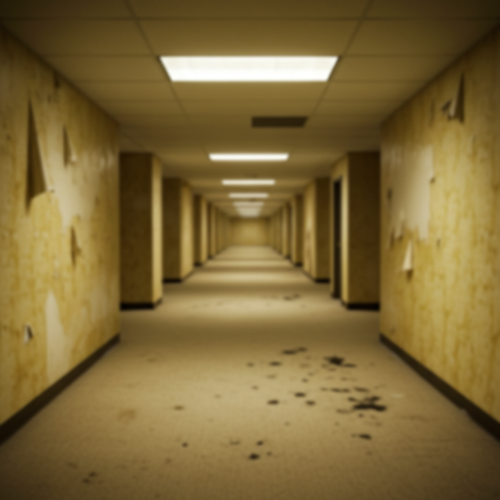

# Backrooms Art 后室艺术

> **时期：** 2019–至今  
> **关键词：** 无限空间、荧光灯、黄色墙纸、恐怖留白、程序生成恐惧

## 概述

Backrooms 起源于2019年4chan上的一张图片——一个无限延伸的、铺着黄色地毯和墙纸的办公空间，荧光灯嗡嗡作响，没有出口。这个概念迅速演变为一个庞大的互联网创作宇宙：无数"层级"的异常空间，每一层都有自己的规则和恐怖。它代表了一种新型的集体创作恐怖美学。

## 风格特征

- **无限重复**：相同空间无尽延伸
- **荧光灯光**：惨白的人工照明
- **黄色调**：标志性的发黄墙纸和地毯
- **空旷**：没有人但暗示有"东西"存在
- **日常恐怖**：办公室、商场、泳池等日常空间的异化

## 代表作品与平台

- 原始Backrooms图片（2019）
- Kane Pixels《The Backrooms》系列短片
- Backrooms Wiki 集体创作
- 相关独立恐怖游戏

## 概念图

