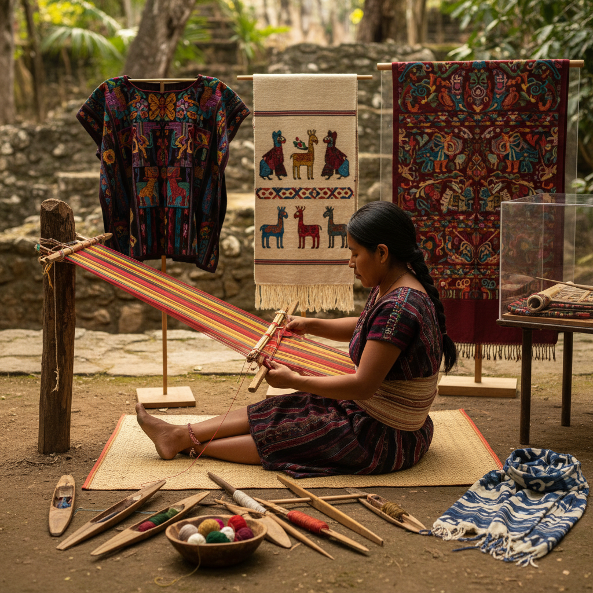

# Backstrap Weaving 腰机编织

> "Backstrap weaving is the body as loom — one end tied to a tree, the other to the weaver's waist, tension controlled by leaning back, making the human body an integral part of the machine that creates cloth." — Unknown

## 概述

腰机编织（Backstrap Weaving / Backstrap Loom Weaving）是使用腰机（backstrap loom）进行编织的古老技法。腰机是最简单的织机之一——经线的一端固定在柱子或树上，另一端通过一根带子（backstrap）绑在织工的腰部。织工通过前倾或后仰来控制经线的张力。这种织机不需要任何框架结构，极其便携，可以随时随地编织。

腰机编织在中美洲（玛雅、阿兹特克）、南美洲（安第斯）、东南亚和东亚有着深厚的传统。尽管设备简单，腰机可以编织出极其复杂的图案——包括提花、锦缎、双面织等高级技法。腰机编织至今仍在许多传统社区中活跃使用。

## 核心特征

| 特征 | 描述 |
|------|------|
| 腰带 | 经线系于腰部 |
| 身体 | 身体控制张力 |
| 便携 | 极其便携 |
| 简单 | 设备极其简单 |
| 古老 | 极其古老的技法 |
| 复杂 | 可织复杂图案 |

## 视觉特征

- **图案**：复杂的几何图案
- **色彩**：鲜艳的色彩
- **密实**：密实的织物
- **条纹**：经向的条纹
- **对称**：对称的图案
- **文化**：文化符号的表达

## 代表作品

| 作品 | 艺术家 | 年代 | 意义 |
|------|--------|------|------|
| *Maya huipil textiles* | 玛雅织工 | 传统 | 玛雅腰机织物 |
| *Andean textiles* | 安第斯织工 | 传统 | 安第斯腰机织物 |
| *Bhutanese textiles* | 不丹织工 | 传统 | 不丹腰机织物 |
| *Japanese obi* | 日本织工 | 传统 | 日本腰机 |
| *Contemporary backstrap* | Various | 当代 | 当代腰机艺术 |

## 历史时间线

| 时期 | 事件 |
|------|------|
| 公元前5000年+ | 最早的腰机证据 |
| 古代 | 全球范围的腰机使用 |
| 玛雅文明 | 中美洲腰机的高峰 |
| 印加帝国 | 安第斯腰机的精湛技艺 |
| 传统 | 东南亚和东亚的腰机传统 |
| 当代 | 腰机编织的文化保护 |

## 中国语境

腰机编织在中国有着悠久的历史——中国的许多少数民族（如黎族、傣族、苗族、藏族、佤族等）至今仍使用腰机编织。海南黎族的腰机编织技艺被列为国家级非物质文化遗产——黎锦的精美图案全部由腰机织成。中国西南地区的少数民族妇女使用腰机编织日常服装和仪式用品。当代中国的纺织研究者和文化保护工作者正在记录和保护这些濒危的腰机编织传统。一些中国的设计师也在探索将传统腰机织物融入现代时装设计。

## AI生成概念图

## 与其他风格的关系

- **Weaving** → 编织
- **Tablet Weaving** → 织带
- **Tapestry Weaving** → 挂毯编织
- **Ikat** → 经纬染
- **Textile Art** → 纺织艺术
- **Indigenous Craft** → 原住民工艺

---

*浮光艺志 | Chronicle of Artistry*
