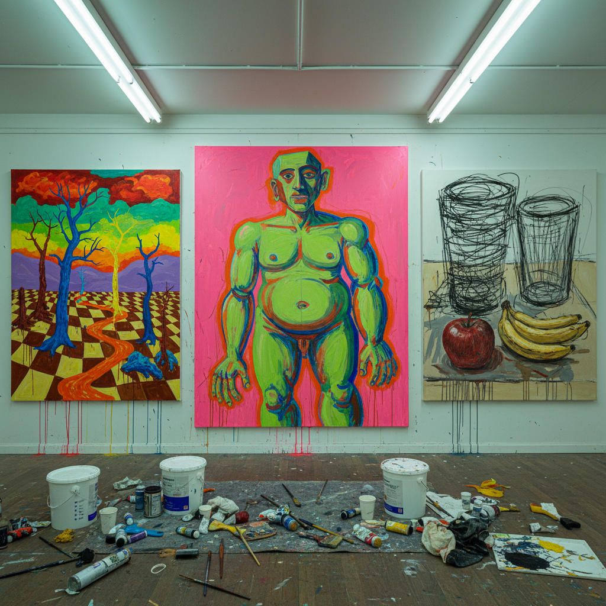

# Bad Painting Art 坏画艺术

> "Bad Painting is the liberation of painting from good taste — the deliberate embrace of awkwardness, clumsiness, and aesthetic failure as strategies of resistance against the tyranny of skill, the recognition that technical virtuosity can become its own prison, that the most interesting paintings are often the ones that break the rules they clearly know, that ugliness pursued with intelligence is more alive than beauty achieved through formula, and that sometimes the worst thing you can do to a painting is make it look good." — Unknown

## 概述

坏画（Bad Painting）是一种故意违反"好品味"和技术规范的绘画策略，通过笨拙的构图、不协调的色彩、粗糙的笔触和"业余"的外观来挑战艺术的等级制度和审美标准。"Bad Painting"作为术语最早由策展人Marcia Tucker在1978年的新当代艺术博物馆（New Museum）展览中使用。

坏画不是真正的"画得不好"——它是一种自觉的策略，通常由受过良好训练的艺术家实践。坏画的目的包括：挑战"好品味"的阶级性和排他性、打破绘画的学院规范、创造一种更直接和原始的表达方式、以及质疑"什么是好艺术"的标准本身。坏画与新表现主义、朋克美学和后现代主义有密切关联。当代的"坏画"实践者包括：Albert Oehlen、Tal R、Dana Schutz、Nicole Eisenman等。

## 核心特征

| 特征 | 描述 |
|------|------|
| 笨拙 | 故意的笨拙 |
| 违规 | 违反审美规范 |
| 自觉 | 自觉的策略 |
| 直接 | 直接和原始 |
| 幽默 | 黑色幽默 |
| 反叛 | 对好品味的反叛 |

## 视觉特征

- **笨拙**：笨拙的构图和比例
- **色彩**：不协调的色彩搭配
- **笔触**：粗糙的笔触
- **业余**：故意的"业余"外观
- **混乱**：混乱的画面组织
- **丑陋**：拥抱丑陋

## 代表作品

| 作品 | 艺术家 | 年代 | 意义 |
|------|--------|------|------|
| *Bad Painting* exhibition | Various | 1978 | 术语的确立 |
| *Abstract paintings* | Albert Oehlen | 1990年代 | 当代坏画的代表 |
| *Colorful paintings* | Tal R | 2000年代 | 丹麦坏画 |
| *Figurative works* | Dana Schutz | 2000年代 | 美国坏画 |
| *Genre paintings* | Nicole Eisenman | 2010年代 | 政治性坏画 |

## 历史时间线

| 时期 | 事件 |
|------|------|
| 1978 | Marcia Tucker的"Bad Painting"展览 |
| 1980年代 | 新表现主义中的坏画元素 |
| 1990年代 | Albert Oehlen的影响 |
| 2000年代 | 坏画的国际化 |
| 当代 | 坏画作为主流策略 |

## 中国语境

坏画在中国当代艺术中有一定的实践，虽然不一定使用这个标签。中国的美术教育传统强调严格的写实训练和技术规范，这使得"坏画"策略在中国语境中具有特殊的颠覆性——它直接挑战了学院体系的权威。一些中国当代画家在实践着某种"坏画"精神——故意放弃精致的技巧，追求更直接、更原始的表达。中国的"卡通一代"和一些年轻画家的作品中也有坏画的元素——用看似幼稚或业余的风格来表达当代中国的生活经验。然而，在中国的艺术市场中，"技术"仍然被高度重视，这使得坏画策略面临着不同于西方的接受环境。

## AI生成概念图

## 与其他风格的关系

- **Neo-Expressionism** → 新表现主义
- **Punk Aesthetics** → 朋克美学
- **Outsider Art** → 局外人艺术
- **Naive Art** → 素人艺术
- **Anti-Art** → 反艺术
- **Postmodernism** → 后现代主义

---

*浮光艺志 | Chronicle of Artistry*
