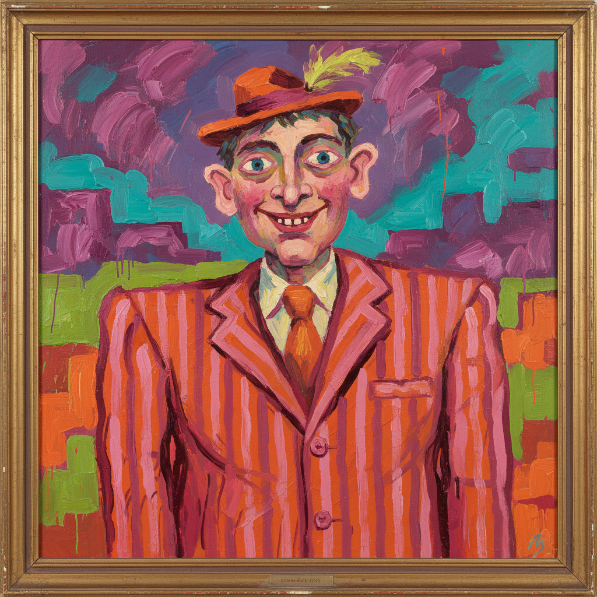

# Bad Painting 坏画

> **时期：** 1978–1980年代  
> **关键词：** 故意粗糙、反技巧、怪诞幽默、业余美学、反讽

## 概述

"坏画"（Bad Painting）一词来自1978年马西亚·塔克（Marcia Tucker）在新当代艺术博物馆策划的同名展览。这些艺术家故意采用"画得不好"的方式——粗糙的笔触、怪异的比例、俗气的色彩和荒诞的主题——来反抗当时主流的极简主义和观念艺术的智识优越感，重新拥抱绘画的快感和叙事性。

## 风格特征

- **故意笨拙**：拒绝技术完美，拥抱"画不好"
- **怪诞主题**：荒诞、幽默、日常生活的扭曲
- **俗气色彩**：故意使用被认为"品味不好"的配色
- **叙事性**：重新引入人物和故事
- **反讽**：对艺术世界的自我嘲讽

## 代表人物与作品

- Neil Jenney 早期"坏画"系列
- Joan Brown 自传性绘画
- James Albertson 怪诞人物
- William Wegman 早期绘画

## 概念图

