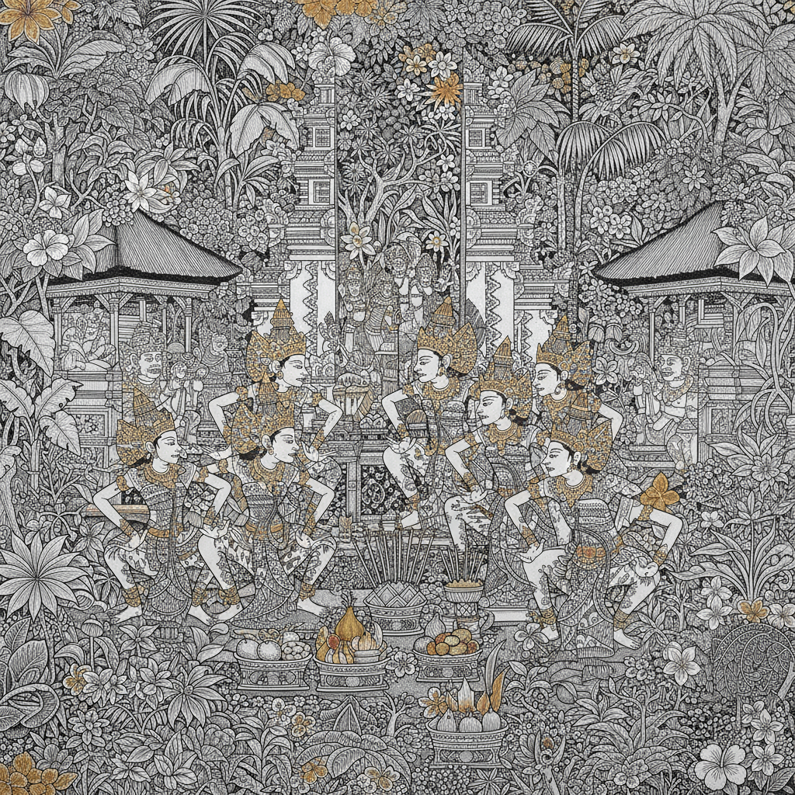

# Balinese Painting 巴厘岛绘画

> **"神话在画布上跳舞——每一片叶子都藏着精灵。"**

## 概述

巴厘岛绘画（Seni Lukis Bali / Balinese Painting）是印度尼西亚巴厘岛独特的视觉艺术传统，根植于印度教-佛教文化和巴厘岛本土信仰。传统巴厘绘画以乌布（Ubud）和卡马桑（Kamasan）为中心，描绘印度教史诗《罗摩衍那》和《摩诃婆罗多》的场景。20世纪30年代，德国画家Walter Spies和荷兰画家Rudolf Bonnet的到来催生了现代巴厘绘画运动，将传统叙事与西方技法融合。

## 主要流派

| 流派 | 时期 | 特征 |
|------|------|------|
| 卡马桑 Kamasan | 12世纪–至今 | 传统wayang风格，平面化，线描 |
| 乌布 Ubud | 1930s–至今 | 密集的自然场景，每寸都填满 |
| 巴图安 Batuan | 1930s–至今 | 极密集构图，暗色调，超现实 |
| 青年艺术家 Young Artists | 1960s–至今 | 鲜艳色彩，天真风格 |
| 学院派 Academic | 1970s–至今 | 西方技法与巴厘主题结合 |

## 核心特征

- **Horror Vacui**：填满画面每一寸空间
- **叙事性**：讲述印度教神话和日常生活故事
- **自然密度**：热带植物、动物充满画面
- **仪式主题**：寺庙祭典、舞蹈、供品
- **精细线描**：极其细腻的墨线勾勒
- **层次分明**：前景、中景、背景的叙事层次

## 视觉特征

- 极其密集的构图，无留白
- 精细的黑色线描轮廓
- 热带绿色和金色的丰富层次
- 程式化的人物造型（类似皮影戏）
- 热带植物的装饰性描绘
- 多场景叙事在同一画面中展开

## 传统材料与技法

| 材料 | 用途 |
|------|------|
| 树皮布/棉布 | 传统画布 |
| 天然颜料 | 骨粉白、烟灰黑、赭石 |
| 竹笔 | 精细线描工具 |
| 金箔 | 神圣人物和装饰 |
| 现代丙烯 | 当代作品 |

## 代表艺术家

| 艺术家 | 流派 | 特征 |
|--------|------|------|
| I Gusti Nyoman Lempad | 传统/现代过渡 | 优雅线描 |
| Ida Bagus Made | 巴图安 | 密集超现实 |
| I Ketut Kobot | 乌布 | 自然场景 |
| Anak Agung Gde Sobrat | 乌布 | 日常生活 |

## 与其他风格的关系

| 风格 | 关系 |
|------|------|
| 印度细密画 | 共享印度教叙事传统 |
| 泰国寺庙壁画 | 共享东南亚佛教/印度教视觉传统 |
| 爪哇蜡染 | 共享印尼装饰传统 |
| 超现实主义 | 巴图安画派的梦幻品质 |
| 素人艺术 | 青年艺术家画派的天真风格 |

## 概念图

---

*浮光艺志 | Chronicle of Artistry*
