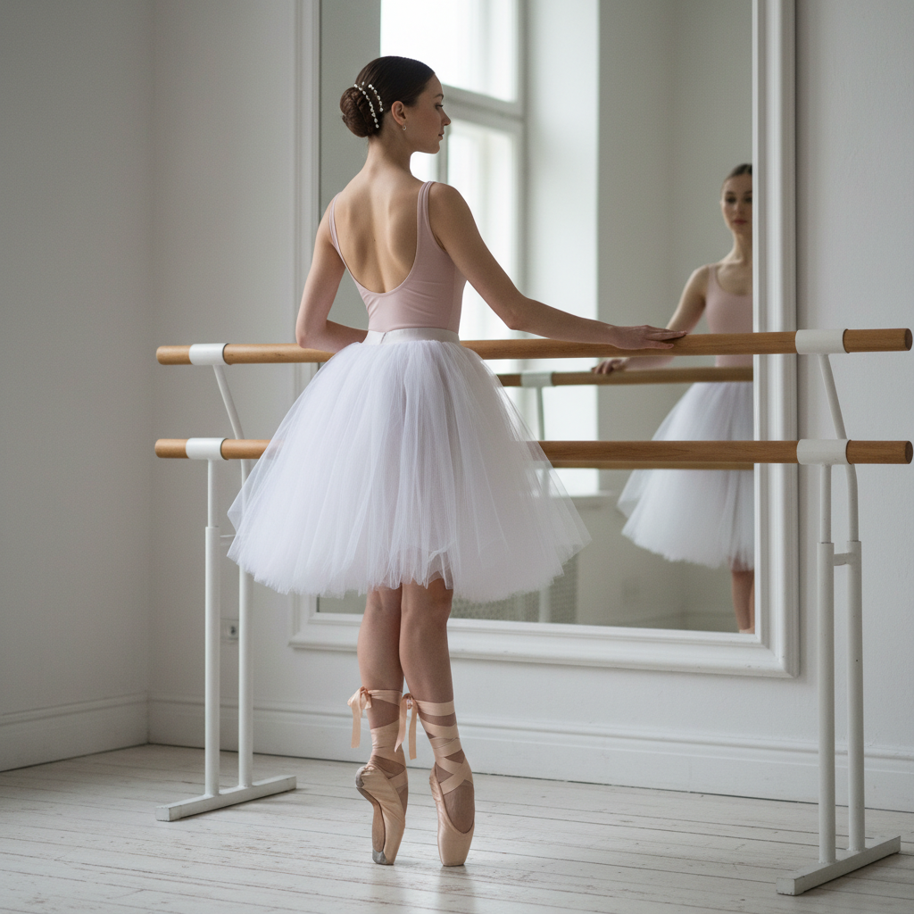

# Balletcore 芭蕾核



> **"缎面芭蕾鞋、薄纱裙、发髻——把练功房的优雅穿到日常生活中。"**

## 概述

| 维度 | 描述 |
|------|------|
| 时期 | 2022–至今 |
| 别名 | Balletcore, Ballet Aesthetic, Dancer Chic |
| 核心色彩 | 裸粉、白色、淡紫、黑色、银色 |
| 关键元素 | 芭蕾平底鞋、薄纱、紧身衣、发髻、缎面 |
| 代表人物 | Miu Miu、《黑天鹅》、Degas 画作 |
| 关联风格 | Coquette, Clean Girl, Regencycore, Soft Girl |

---

## 历史脉络

### 从练功房到T台

| 年份 | 事件 |
|------|------|
| 2010 | 《黑天鹅》电影 |
| 2022 | Miu Miu 芭蕾元素系列 |
| 2022 | TikTok #Balletcore 标签爆发 |
| 2023 | 芭蕾平底鞋成为年度鞋款 |
| 2023–至今 | 从时尚扩展到生活方式 |

### 它代表什么？

| 元素 | 含义 |
|------|------|
| 芭蕾鞋 | 优雅但不高跟——舒适的女性化 |
| 薄纱 | 轻盈、梦幻、脆弱的美 |
| 紧身衣 | 身体意识、自律 |
| 发髻 | 整洁、专注、"准备好了" |
| 练功房 | 努力、纪律、完美主义 |

### 核心哲学

Balletcore 的精神是**"优雅来自纪律"**：
- 美是练出来的，不是天生的
- 简单的动作可以无限精致
- 身体是表达的工具
- 脆弱和力量可以共存
- "看起来毫不费力"需要最大的努力

---

## 视觉语法

### 色彩系统

```
主色：
  裸粉 (#FADADD) — 芭蕾鞋、紧身衣
  白色 (#FFFFFF) — 薄纱、天鹅
  淡紫 (#E6E6FA) — 梦幻
  黑色 (#000000) — 黑天鹅、练功服
  银色 (#C0C0C0) — 镜子、舞台

辅色：
  肉色 (#FFCBA4) — 紧身衣
  玫瑰金 (#B76E79) — 配饰
  灰色 (#D3D3D3) — 练功房地板

规则：
  - 柔和、低饱和
  - 裸色系为主
  - 黑白对比（白天鹅/黑天鹅）
  - 光泽感（缎面）
  - 透明感（薄纱）

质感：
  缎面 — 芭蕾鞋、缎带
  薄纱 — 裙摆、覆盖层
  针织 — 暖腿套、紧身衣
  木地板 — 练功房
  镜面 — 练功房墙面
```

### 标志性元素

| 类别 | 元素 |
|------|------|
| 鞋 | 芭蕾平底鞋、足尖鞋、缎带绑带 |
| 服装 | 紧身衣、薄纱裙、裹身上衣、暖腿套 |
| 发型 | 低发髻、高发髻、缎带 |
| 配饰 | 珍珠、缎带、极简珠宝 |
| 空间 | 练功房、镜子、把杆 |
| 态度 | 优雅、自律、轻盈 |

---

## 与千禧怀旧的关系

### 《黑天鹅》的记忆
- 2010年的《黑天鹅》= 千禧一代的文化记忆
- Natalie Portman 的芭蕾形象
- "完美主义"的美丽与恐怖
- 2022年的 Balletcore = 这个记忆的"温柔版"

### 与 Coquette 的交叉
- 两者都热爱蝴蝶结、粉色、女性化
- Balletcore = 纪律版的女性美
- Coquette = 放纵版的女性美
- 共同点：缎带、薄纱、柔和色调

---

## 中国语境

- "芭蕾风"/"芭蕾核"在小红书的流行
- 芭蕾平底鞋成为中国市场热门单品
- 与"法式优雅"的交叉
- 成人芭蕾课程的流行
- "体态管理"/"仪态训练"的文化

---

## 设计应用

| 场景 | 应用方式 |
|------|----------|
| 时尚 | 芭蕾鞋+薄纱+缎面+裸色系 |
| 空间 | 镜面+木地板+极简+柔和光线 |
| 品牌 | 优雅字体+裸色+缎面质感+极简 |
| 数字 | 轻盈动效+裸色UI+优雅排版 |

---

## 相关风格

← [Coquette Y2K 媚态千禧](coquette-y2k.md) | [Clean Girl 干净女孩](clean-girl.md) →

↑ [返回千禧怀旧目录](README.md) | [返回总目录](../README.md)
