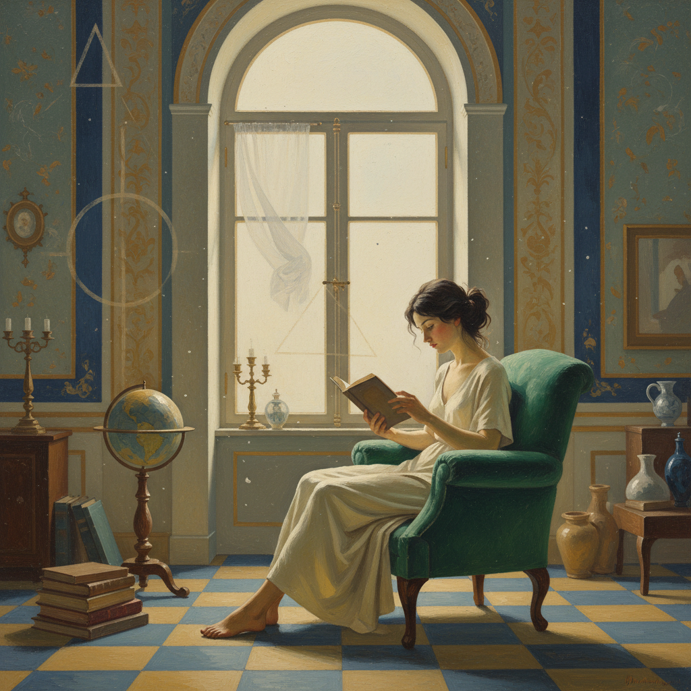

# Balthus 巴尔蒂斯

> **流派**: 具象绘画 · 新古典主义  
> **时期**: 1908–2001 法国/瑞士  
> **关键词**: 神秘少女、静止时间、古典构图、梦境氛围

## 概述

巴尔蒂斯是20世纪最神秘的具象画家之一。他拒绝一切现代主义潮流，坚持用古典技法描绘充满暧昧张力的室内场景。他的作品时间仿佛凝固，人物处于一种介于清醒与梦境之间的状态。

## 视觉特征

- **静止时间**: 画面中的一切仿佛被冻结在某个瞬间
- **古典构图**: 严谨的几何结构，继承文艺复兴传统
- **柔和光线**: 均匀的室内光，没有戏剧性的明暗
- **平面化倾向**: 虽然写实，但空间被有意压缩
- **神秘氛围**: 日常场景中弥漫着不可言说的张力

## 代表作品

- 《街道》(1933)
- 《国王的游戏》(1966)
- 《金色的下午》(1957)
- 《土耳其房间》(1963–1966)

## 历史影响

巴尔蒂斯证明了具象绘画在抽象主义盛行的时代仍有深刻的表达空间。他对静止与神秘感的营造影响了后来的摄影和电影美学。

## 相关风格

- [Giorgio Morandi 乔治·莫兰迪](giorgio-morandi.md)
- [Edward Hopper 爱德华·霍珀](edward-hopper.md)
- [Amedeo Modigliani 阿梅代奥·莫迪利亚尼](amedeo-modigliani.md)
