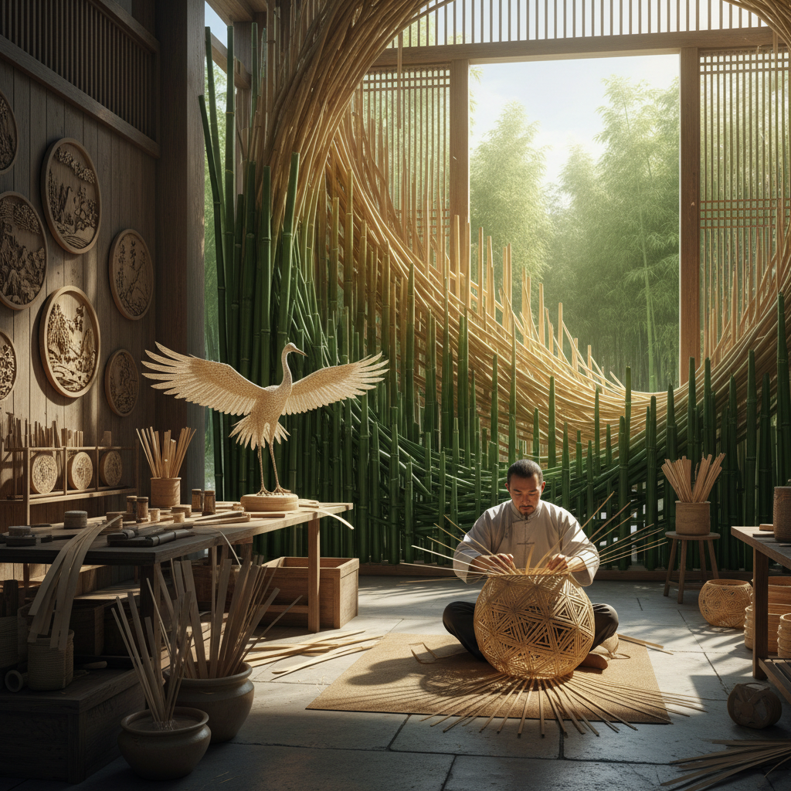

# Bamboo Art 竹艺术

> "Bamboo art works with the most versatile plant on Earth — a grass that grows faster than any tree, stronger than steel by weight, flexible enough to bend without breaking, and beautiful enough to inspire poets and painters for millennia. Bamboo is simultaneously structural and decorative, utilitarian and spiritual, ancient and futuristic. In East Asia, bamboo is not merely a material but a philosophy — it teaches resilience through flexibility, strength through emptiness, and grace through simplicity." — Unknown

## 概述

竹艺术（Bamboo Art）是以竹子——世界上生长最快的植物之一——为主要创作材料的艺术实践。竹子具有独特的物理特性：中空的管状结构、极高的抗拉强度、天然的弹性、优美的节段形态，以及可以被劈、编、弯、雕的多种加工方式。

竹艺术的实践包括：1）竹编——将竹子劈成细条编织成器物和艺术品；2）竹雕——在竹子表面或竹根上进行雕刻；3）竹建筑——用竹子建造建筑和空间结构；4）竹装置——用竹子创作大型装置艺术；5）竹乐器——用竹子制作乐器（笛、箫、笙）；6）竹园林——以竹子为主题的园林设计。

## 核心特征

| 特征 | 描述 |
|------|------|
| 中空 | 中空的管状结构 |
| 弹性 | 极强的弹性 |
| 速生 | 生长极快 |
| 可持续 | 高度可持续 |
| 多用 | 用途极广 |
| 文化 | 深厚的文化象征 |

## 视觉特征

- **节段**：竹节的韵律
- **绿色**：新竹的翠绿
- **金黄**：老竹的金黄
- **线条**：竹竿的直线
- **编织**：竹编的精密图案
- **弯曲**：弯竹的优美弧线

## 代表作品

| 作品 | 艺术家 | 年代 | 意义 |
|------|--------|------|------|
| *竹编艺术* | 中国传统 | 古代至今 | 竹编工艺 |
| *Bamboo architecture* | Simon Vélez | 2000年代 | 竹建筑 |
| *竹雕* | 中国传统 | 明清至今 | 竹雕艺术 |
| *Bamboo installations* | Various | 2010年代 | 竹装置 |
| *Green School Bali* | John Hardy | 2008 | 竹建筑学校 |

## 历史时间线

| 时期 | 事件 |
|------|------|
| 远古 | 竹子在东亚的使用 |
| 商周 | 竹简（最早的书写材料之一） |
| 明清 | 竹雕艺术的高峰 |
| 2000年代 | 当代竹建筑运动 |
| 当代 | 竹子作为可持续材料的复兴 |

## 中国语境

竹艺术在中国有极其深厚的文化传统——中国被称为"竹子文明"。竹子在中国文化中的地位无与伦比：它是"岁寒三友"（松竹梅）之一、"四君子"（梅兰竹菊）之一，象征着正直、谦虚、坚韧和高洁。中国有超过500种竹子，竹林面积居世界第一。中国的竹艺术传统极其丰富——竹编（四川青神竹编、浙江东阳竹编）、竹雕（嘉定竹刻）、竹纸（四川夹江竹纸）、竹乐器（笛、箫）、竹建筑、竹家具等。中国传统绘画中竹是最重要的题材之一——从文同到郑板桥，画竹成为文人画的核心传统。中国当代的一些艺术家在探索竹艺术：将中国传统竹编工艺与当代装置结合、用竹子建造当代建筑、以及将中国传统的"竹文化"精神与当代可持续设计对话。

## AI生成概念图

## 与其他风格的关系

- **Weaving Art** → 编织艺术
- **Architecture** → 建筑
- **Sculpture** → 雕塑
- **Sustainable Design** → 可持续设计
- **East Asian Art** → 东亚艺术
- **Natural Material Art** → 自然材料艺术

---

*浮光艺志 | Chronicle of Artistry*
