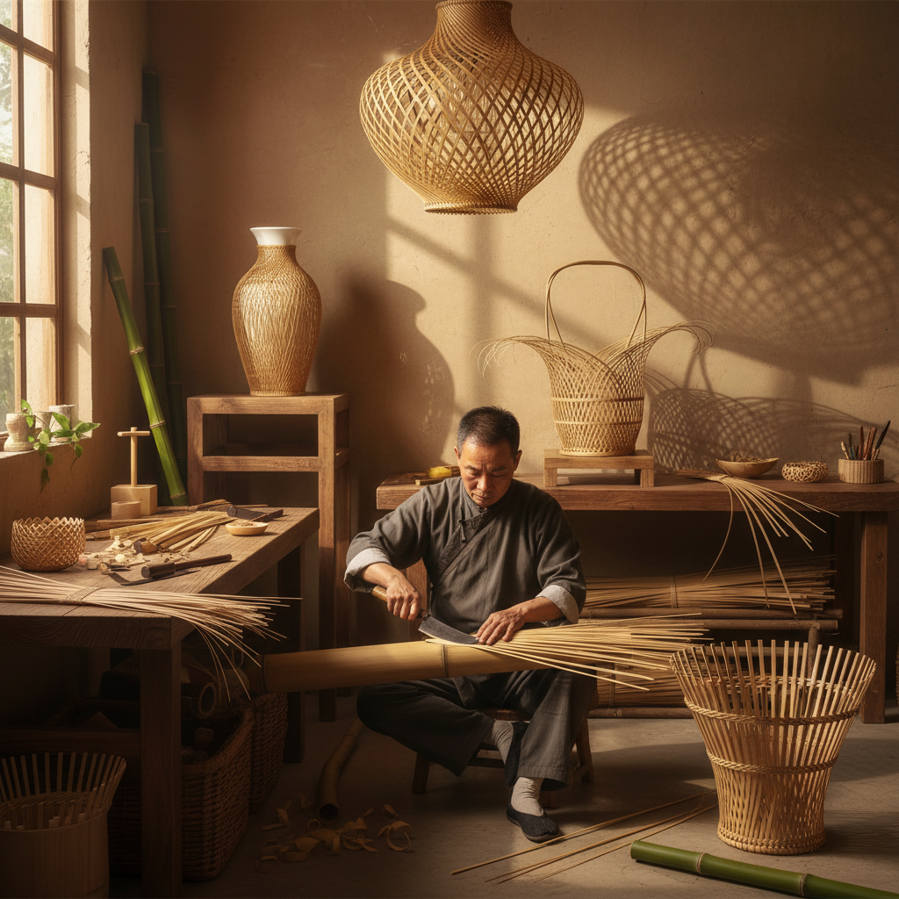

# Bamboo Weaving Art 竹编艺术

> "Bamboo is the perfect weaving material — strong as steel in tension, flexible as a whip when split thin, light as a feather when dried, and beautiful in its natural pale gold. A master bamboo weaver splits a single culm into strips thinner than paper, then interlaces them with such precision that the finished basket holds water. It is engineering disguised as craft, mathematics expressed as beauty, and patience made visible." — Unknown

## 概述

竹编艺术（Bamboo Weaving Art）是以竹子为原材料，通过劈篾、编织等工序创造器物和艺术品的传统工艺——将竹子劈成细薄的竹篾（竹丝），然后通过各种编织技法创造出从日用器具到纯艺术品的广泛作品。竹编是东亚和东南亚最重要的传统工艺之一。

竹编艺术的实践包括：1）日用竹编——篮、筐、筛、笼等日用器具；2）艺术竹编——以艺术表达为目的的精细竹编；3）竹编花器——用于插花的竹编容器（日本花篮）；4）竹编建筑——用竹编技法创造的建筑结构；5）竹编家具——竹编的椅子、灯具等家具；6）微型竹编——极其精细的微型竹编作品；7）当代竹编——将传统竹编与现代设计结合。

## 核心特征

| 特征 | 描述 |
|------|------|
| 精细 | 极其精细的篾丝 |
| 韧性 | 竹材的韧性和弹性 |
| 图案 | 编织产生的图案 |
| 轻盈 | 轻盈的质感 |
| 天然 | 天然的材料色泽 |
| 功能 | 功能与美的统一 |

## 视觉特征

- **金色**：竹材的天然金色
- **纹理**：精细的编织纹理
- **曲面**：优美的三维曲面
- **透光**：编织间隙的透光
- **规律**：规律的几何图案
- **光泽**：竹材的自然光泽

## 代表作品

| 作品 | 艺术家 | 年代 | 意义 |
|------|--------|------|------|
| *瓷胎竹编* | 四川传统 | 清代至今 | 竹编包裹瓷器 |
| *日本竹花篮* | Various | 古代至今 | 日本竹编花器 |
| *竹编建筑* | Various | 当代 | 当代竹编建筑 |
| *精细竹编* | Various | 当代 | 艺术竹编 |
| *竹编灯具* | Various | 当代 | 当代竹编设计 |

## 历史时间线

| 时期 | 事件 |
|------|------|
| 新石器时代 | 最早的竹编遗存 |
| 商周 | 竹编技术的成熟 |
| 唐宋 | 竹编工艺的繁荣 |
| 明清 | 精细竹编的发展 |
| 当代 | 竹编的现代化和国际化 |

## 中国语境

竹编艺术是中国最重要的传统工艺之一。中国是竹子的故乡——中国有500多种竹子，竹编文化有数千年历史。中国各地有丰富的竹编传统——四川的瓷胎竹编（将极细的竹丝编织在瓷器表面）是国家级非物质文化遗产，以其"薄如蝉翼、细如发丝"的精细著称；浙江东阳的竹编以精美的图案闻名；福建的竹编以实用性著称；贵州的竹编以民族特色见长。中国的竹编大师能将竹篾劈到0.5毫米以下的宽度，编织出如丝绸般细腻的作品。中国当代的一些设计师和建筑师在探索竹编的现代应用——从竹编家具、灯具到竹编建筑结构。中国的竹编产品在国际设计界获得了广泛认可。

## AI生成概念图

## 与其他风格的关系

- **Basket Weaving** → 编篮艺术
- **Rattan Art** → 藤编艺术
- **Japanese Craft** → 日本工艺
- **Architecture** → 建筑
- **Furniture Design** → 家具设计
- **Chinese Traditional Craft** → 中国传统工艺

---

*浮光艺志 | Chronicle of Artistry*
