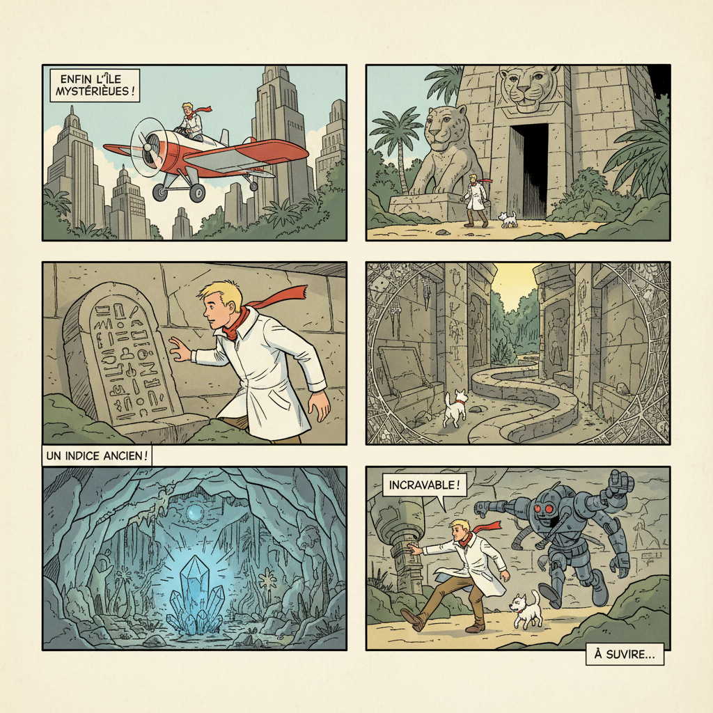

# Bande Dessinée 法比漫画

> **时期：** 1930年代–至今  
> **关键词：** 清线风格、精致上色、大开本、欧洲叙事、艺术地位

## 概述

Bande Dessinée（BD，法语"画带"）是法国-比利时漫画传统，在欧洲享有"第九艺术"的崇高地位。从《丁丁历险记》的清线风格到莫比乌斯的科幻史诗，BD以精致的绘画品质、成熟的叙事和大开本精装出版著称，是与日本漫画、美国漫画并列的世界三大漫画传统之一。

## 风格特征

- **清线风格（Ligne Claire）**：均匀线条、平涂色彩、无阴影
- **精致上色**：水彩或数字的细腻色彩层次
- **大开本**：A4尺寸精装，每页约12格
- **写实背景**：建筑和环境的精确描绘
- **叙事节奏**：欧洲文学式的从容叙事

## 代表人物与作品

- 埃尔热《丁丁历险记》
- 莫比乌斯《密封车库》
- 恩基·比拉《尼科波尔三部曲》
- 弗朗索瓦·史乔顿《暗黑城市》

## 概念图

