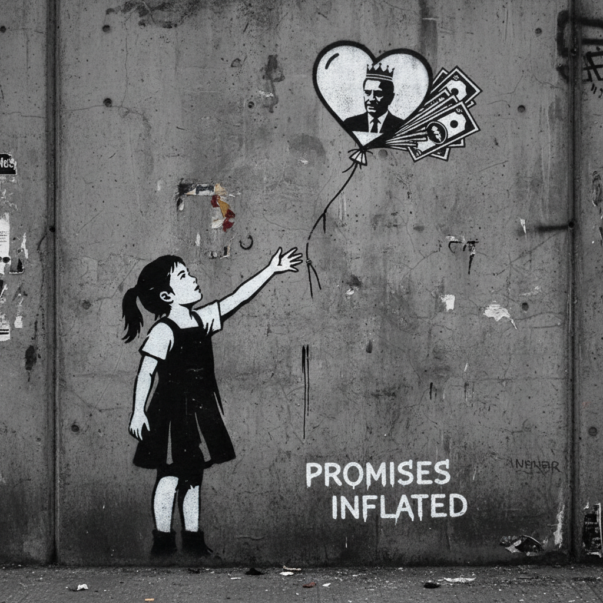

# Banksy 班克斯

> "Art should comfort the disturbed and disturb the comfortable." — Banksy

## 概述

班克斯（Banksy，身份不明，活跃于1990年代至今）是英国匿名街头艺术家，以讽刺性的模板涂鸦闻名于世。他的作品出现在世界各地的墙壁上——用黑色幽默和视觉双关批判战争、消费主义、权力和社会不公，同时挑战艺术市场本身的规则。

## 核心特征

| 特征 | 描述 |
|------|------|
| 模板涂鸦 | 精确的黑白模板喷绘 |
| 讽刺幽默 | 黑色幽默的社会批判 |
| 视觉双关 | 图像与环境的巧妙互动 |
| 匿名身份 | 神秘的创作者身份 |
| 反体制 | 挑战艺术市场和权力 |
| 全球墙壁 | 作品遍布世界各地街头 |

## 代表作品

| 作品 | 年代 | 意义 |
|------|------|------|
| *Girl with Balloon* | 2002 | 最具辨识度的街头作品 |
| *Love is in the Bin* | 2018 | 拍卖会上自毁的画作 |
| *Flower Thrower* | 2003 | 和平抗议的标志 |
| *Dismaland* | 2015 | 反迪士尼的暗黑主题公园 |

## AI生成概念图

## 与其他风格的关系

- **Street Art** → 当代街头艺术的代名词
- **Stencil Art** → 模板涂鸦的最高成就
- **Pop Art** → 波普的讽刺精神延续
- **Situationism** → 情境主义的当代实践
