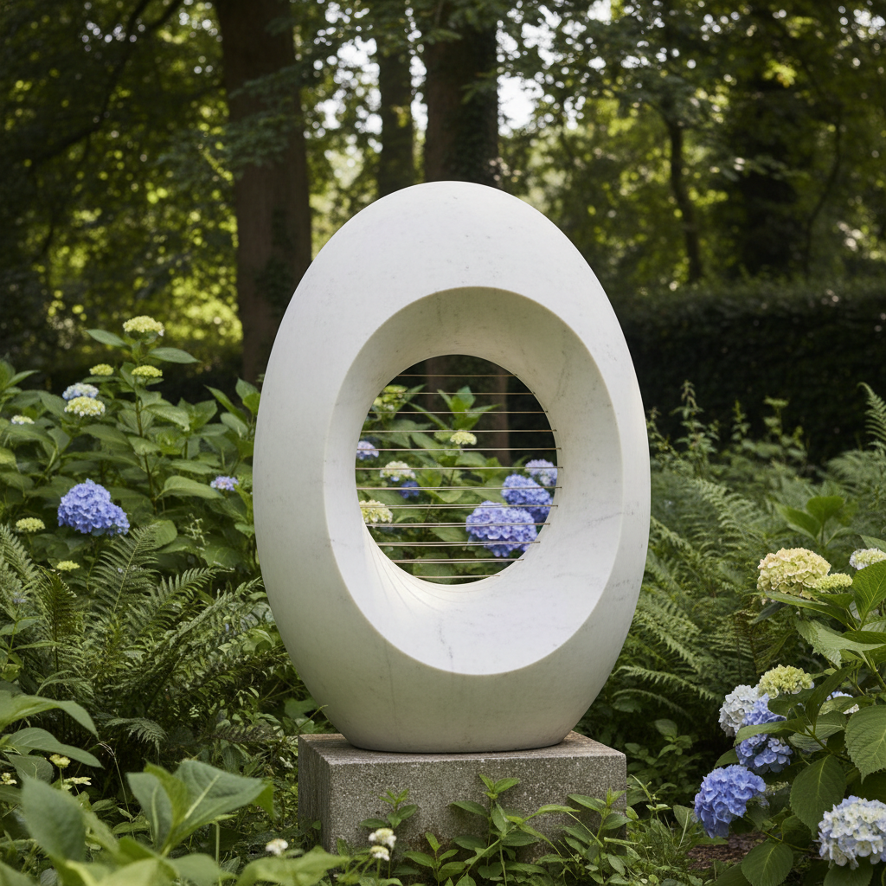

# Barbara Hepworth 芭芭拉·赫普沃斯

> **流派**: 现代主义雕塑 · 有机抽象  
> **时期**: 1903–1975 英国  
> **关键词**: 穿孔形态、弦线张力、康沃尔风景、直刻技法

## 概述

芭芭拉·赫普沃斯是20世纪最重要的英国雕塑家之一，与亨利·摩尔并列为英国现代雕塑的双峰。她以优雅的穿孔形态和内部张弦的抽象雕塑闻名，作品融合了康沃尔海岸的自然形态与纯粹的几何美学。

## 视觉特征

- **穿孔形态**: 雕塑中心的空洞让光线和空间穿透
- **弦线张力**: 在空洞中拉紧的金属弦线创造内部韵律
- **光滑曲面**: 精心打磨的石材或青铜表面
- **内外对比**: 外部光滑、内部着色或纹理不同
- **有机几何**: 自然形态与几何纯粹性的平衡

## 代表作品

- 《单一形式》(1961–64) 联合国总部
- 《穿孔的形式》系列 (1930s–60s)
- 《佩拉戈斯》(1946)
- 圣艾夫斯花园雕塑群

## 历史影响

赫普沃斯证明了抽象雕塑可以同时是亲密的和纪念性的。她对材料的尊重和对自然形态的抽象影响了后来的环境雕塑和公共艺术。

## 相关风格

- [Henry Moore 亨利·摩尔](henry-moore.md)
- [Constantin Brancusi 康斯坦丁·布朗库西](constantin-brancusi.md)
- [Isamu Noguchi 野口勇](isamu-noguchi.md)
